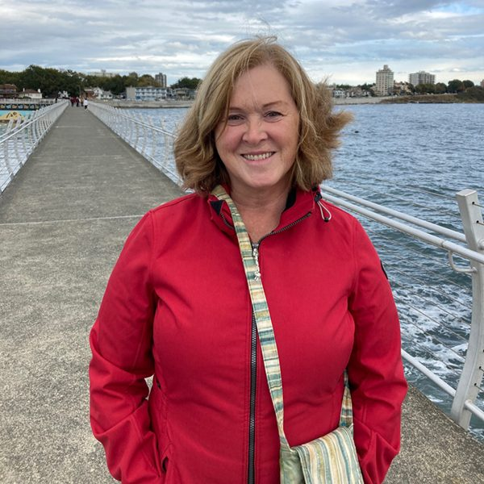

In November, the Salt Spring Centre of Yoga hosted the Ayurveda & Yoga "I Want More from Life" Retreat with Natasha (Jyoti) Samson.
One of the retreat attendees, Shelley Robinson, was kind enough to share her musings about her experience following the retreat.

 

*"You know that serendipity is at play when something like this happens.  About two weeks ago, I started writing a short story (with a deadline in mind) about Sariswati, the Hindu Goddess of knowledge, art and science. The idea just popped into my head. The theme was a bit alien to me, but I wanted to give it a go.  As I spent time on it, and was enjoying it, I could not think of the ending.  I set it aside knowing that it was going to need more time and reflection. (I usually finish my stories, and I am not normally stumped by them).*

*This weekend, at my yoga retreat on Salt Spring Island, I participated in a spiritual and physical life revival with like-minded 50-something women exploring the Eastern Ayurvedic traditions. On the last day, after really working at participating with a tricky knee, I looked up and realized that the woman in the painting on the wall where we had spent the entire weekend together was Sariswati.*

*There she was, standing on top of a book, playing her music and watching over us. I looked around and saw another picture that I had failed to pay attention to until now. It was another version of her four-armed beauty reaching out to cover all aspects of learning. In the corner was a sculpture of her and I then figured out that I was sitting in the yoga centre’s Sariswati Room filled with strong female energy.*

*In that moment, I realized the ending to my short story. I also figured out some of my own story amidst others’ stories who were vulnerable and generous in our candid discussions about life over the three days. I wish my schooling in life with family, work and education had included more about my body and how to take care of it. It was the second time being at the Salt Spring Yoga Centre (with the Sariswati Swan out front) and, once again, it felt like home. I will be spending more time there."*

~ Shelley Robinson
