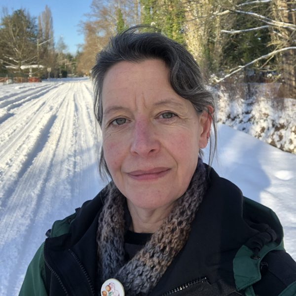

Following the letter from Dharma Sara Satsang Society's new President, Clare Cullen, please be sure to read the Board update at this [bottom of this page](https://saltspringcentre.com/message-from-the-dsss-president/#update) for more information about the current state of the Centre.

---

Dearest Satsang,
I write this message a few days into December, the darkest month that encourages us and all living things to slow down, get cozy, spend time at home and focus inward. Even during its darkest days, December is also filled with the promise of light returning and reminds us to be patient, hold on to hope and keep our inner light bright while looking ahead. For me, this may be a perfect metaphor for us caring for the Salt Spring Centre of Yoga (SSCY) and Dharma Sara Satsang Society (DSSS) at this time: we have gone through some challenging times together and things felt a bit dark and uncertain but, with a little faith, patience, and not a small amount of inner work, wait for it…the light will return. As it does.
I have the honour to be the President of the Board for DSSS. At the AGM in late October, Chetna Boyd kindly stepped up to take on the President role; however, after a few weeks she realized that this is no longer the work she was called to do and asked to step down. We are so grateful for the hard work and service she has provided for Dharma Sara and the Centre, not just recently but over many, many years. We’re very glad she will continue to support the Board as well as our staff on site. As the Vice President, I stepped into Chetna’s role in order to “keep us calm and carry on” and to ensure the Board could continue supporting the vision for the Centre outlined at the AGM: a simple, pared back operations plan that honours the teachings of Babaji, honours the community, both on and off the land, and keeps peace, kindness, and caring as our guiding stars.
I am humbled to be on the Board with four other wonderful people: Laura Dear; Sienna Hamilton; Carolyn McBain; and Natasha (Jyoti) Samson. We are a small and dedicated group, who could use a little more support, so we are actively seeking a Secretary for the Board, as well as one or two members at large. If you are interested in serving in this way, please contact [board@saltspringcentre.com](mailto:board@saltspringcentre.com) and we would be happy to connect with you.
To get to know me a bit better, please take a moment to read my bio on the [Board page](https://saltspringcentre.com/about-us/board-of-directors/). While I have lived in Vancouver for many years, this month I am in the process of moving back to Salt Spring with my husband and various pets. From there I will continue to work at UBC (thanks to the miracle of Zoom) while being based in the island community that I love. I look forward to reconnecting with friends new and old, particularly at the Centre, and can’t wait to see what 2023 brings us all. May it be bright!

 
 
 
 
In peace,
Clare Cullen
DSSS Board President

---

### Brief Update from the Board

#### Operations Plan

We are excited that, at our Board meeting on November 27, 2022, we approved the [2023 Operations Plan](https://saltspringcentre.com/2023-centre-operations-plan-summary/) which was diligently worked on by our Administration staff – Kristin, Jimena and Anuradha. As mentioned above, this plan is simple and pared back, yet you will still recognize the Centre that we know and love: many programs and classes will be running, along with opportunities for healing treatments. Accommodations will be offered for those visiting the island and wanting a peaceful spot to spend time and rest. The kitchen will have a new schedule – at times with SSCY staff, karma yogis – and also available for groups to use themselves for rentals and events. While Yoga Teacher Training will be on hold this year, YSSI and ACYR are back, as well as other opportunities to gather, practice, and be in service together.

#### Committees

Thanks to Kris Cox, a former Centre Manager and Board member, for her work drafting a committee structure for DS: these committees let us share the work and responsibility of many areas and, more importantly, to invite satsang members to deepen their connection by offering time and expertise. While there are several committees proposed, early in 2023 we would like to get the Fund Development Committee up and running in order to secure donations and grant funding for next year and beyond. If you enjoy and have interest in fundraising and/or grant writing, please consider joining this committee by contacting [board@saltspringcentre.com](mailto:board@saltspringcentre.com)

#### Relationships

As a Board, we are open to considering various pathways to stability for the Centre and DS, ones that serve the satsang and support the committed team working on the land. Right now, “simplicity” and “calm” seem to really resonate so we hope to bring these into all discussions, decisions, and relationships.
We will continue to work with conservation experts on protecting the ‘Dandaka’ forest as we know this is important to the satsang as an exceptional ecosystem and wetlands filter for Cushion Lake water. We’ll continue our long-standing relationship with the Ganges Educational Society (i.e. the school) in order to strengthen both organizations founded by Babaji. We will work to deepen our connection with Indigenous community members, on whose unceded land the Centre is located. And we will stay grounded in service of the satsang, both on the island and off, by practicing listening, sharing, humility, and “ahimsa” (non-harming / reverence for life).
Thank you for your support as we aim to move in a good direction.
We will offer regular updates and welcome hearing from you so please feel free to email [board@saltspringcentre.com](mailto:board@saltspringcentre.com)
