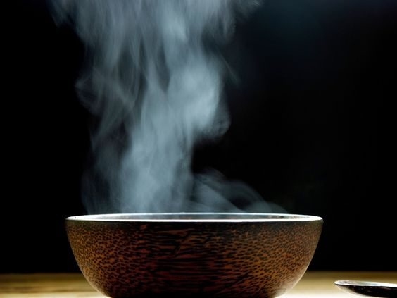

*Originally published on Dec 31, 2013*
The Vedic sages understood that the great rhythms and forces of nature—the alternation of day and night, the rhythmic cycle of the seasons — affect our wellness, as do the seasons and cycles of this human life. Living in tune with nature, they taught, allows us to also be in tune with our individual constitution which comprises three subtle energies of vata (movement), pitta (digestion and metabolism) and kapha (structure and lubrication).

### The Best Ways to Adapt to Winter

Staying healthy all year long requires living in harmony with these natural cycles, adjusting to changes in the environment through the food we eat, the type and amount of exercise we do, the herbs we ingest, and so on. While you can’t control the weather, you can control these factors, which either build your health, vitality, and resistance to disease, or wear you down. Ayurveda’s view on winter, the kapha season, includes the weather factor.
In winter, the sky is often cloudy and grey, the weather is cold, damp, and heavy, and life moves more slowly. When balanced, kapha supplies strength, vigor, and stability to both body and mind. This subtle energy is responsible for lubricating the joints, moisturizing the skin, and maintaining immunity. But in excess, it can lead to sluggishness, mucus-related illnesses, excess weight, and negative emotions such as attachment, envy, and greed.
In general, we should follow a kapha-pacifying routine in the winter. But dry, cold, windy weather can provoke vata, too, and can lead to arthritis, indigestion, and other problems. So to keep both vata and kapha balanced when temperatures drop, here are a few lifestyle suggestions:
 

#### Morning routine

Ayurveda suggests waking up a bit later in the winter (7 a.m.) than you would in other seasons. Upon rising, scrape your tongue to remove the excess kapha and ama; then brush your teeth. Next, drink a cup of warm water to stimulate the movement of the bowels. And treat yourself to a quick massage ([Abhyanga](https://saltspringcentre.com/abhyanga-the-ayurvedic-art-of-self-massage/)). Rub warmed sesame oil all over your entire body (it’s heating and good for all body types in the winter). Let the oil soak in for 5 to 10 minutes, then take a hot shower and rub the skin vigorously as you dry off.
Conclude your morning regimen with pranayama, meditation and asana. A few rounds of kapal bhati or bhastrika will help stoke your inner heat. Surya namaskara (sun salutation) and poses that open the chest, throat, and sinuses remove congestion in the respiratory organs. Kapha balancing poses include the [fish](https://saltspringcentre.com/fish-pose-matsyasana/), boat, [bow](https://saltspringcentre.com/asana-of-the-month-dhanurasana/), locust, lion, and camel poses, along with the shoulder stand.
After morning sadhana, it’s important to eat a nutritious breakfast. If you don’t feed your digestive fire in the morning, it will dry up bodily tissues and provoke vata. Enjoy a bowl of oatmeal, barley, cornmeal, or buckwheat (or a mixture) mildly spiced with cinnamon. An hour after breakfast, boil 1/2 teaspoon of fresh or powdered ginger, 1/2 teaspoon of cinnamon, and a pinch of ground clove in a cup of hot water for 5 minutes. Drink this tea\* to increase your digestive fire, improve circulation, and reduce excess mucus.
*\*Skip the tea if you have an ulcer or another inflammation-oriented problem*

---

#### Exercise (even indoors!)

Dr. Lad suggests that if we don’t want to brave the cold, then we can join a gym, do a workout video, or use a stationary bike to increase circulation. Soak up sunlight, too. Walk outdoors when the sun’s out or sit by a window to bathe in early morning sunlight. Sun rays relax the muscles, produce vitamin D, soothe Seasonal Affective Disorder, and help the body maintain healthy sleep rhythms.
 
 

---

#### Dietary Guidelines

In response to cold weather, the body constricts the skin pores and superficial connective tissue to prevent heat loss, which directs the heat away from the peripheral tissues and into the body’s core, including the stomach. Agni (and, therefore, your appetite) becomes stronger in winter. However, if kapha or vata are provoked, agni burns low, leaving you more susceptible to colds, poor circulation, joint pains, and negative emotions.
Incorporate more whole grains, dairy products, steamed root vegetables, warm soup (cooked with ghee), and spicy food into your meals. Because your appetite is heartier in the winter, eat more protein—beans, tofu, eggs—and if you’re not a strict vegetarian, chicken, turkey, and fish. Add warming spices such as cinnamon, cloves, and black pepper to promote digestion. Drinking a few ounces of sweet or dry wine with your meals will stoke your agni (digestive fire), improve your appetite, and increase circulation.
Avoid cold drinks (they aggravate both kapha and vata); choose hot water instead, or hot tea, and occasionally, hot cocoa or chai.

---

#### When a Cold Comes On

Ayurvedically speaking, colds are a kapha-vata disorder. The body builds up an excess of cool and moist kapha qualities, resulting in congestion and a runny nose, and at the same time it may suffer from excess vata, which reduces agni, leading to chills, loss of appetite, and poor digestion.
Here’s help:

- **Stay warm.** Avoid cold drafts, wear warm clothes, and don’t forget to wear a hat outside. Also, cover your ears and neck to keep vata and kapha in check.
- **Ginger.** Ginger is the best remedy for colds. Drink ginger tea, take a bath infused with ginger and baking soda (put 1/3 cup of baking soda and 1/3 cup of powdered ginger into a hot tub and then soak the body from the neck down), or try a ginger steam treatment. (Boil one teaspoon powdered ginger in a pint of water. Turn off the stove, put a towel over your head, and inhale the steam through your nostrils for about 5 minutes. This will help relieve congestion and soothe dry membranes. Also include 500 mg Vitamin C daily during the cold winter months. Drinking hot water several times a day removes toxins from the system and speeds up your recovery time.
- **Use natural nose drops.** Lubricate the nasal passages and relieve the irritation and sneezing of a cold with nasya. Lie on your back, face up, with a pillow under your shoulders and your head tilted back, so your nostrils are facing the ceiling. Put 3 to 5 drops liquefied ghee in each nostril and gently sniff the oil upward into the nose. You can do nasya in the morning and night (on an empty stomach and at least one hour before or after showering).
- **Reduce dairy products.** Strictly avoid dairy products when you have a cold, including yogurt, cheese, milk, and ice cream, until your congestion clears up.

May your agni stay strong, your immunity high, and your spirits bright!
Peace,
Pratibha
 

 
 

**Pratibha Queen** is a yoga instructor and Ayurvedic practitioner, who attends Salt Spring Center of Yoga retreats on a regular basis.
