We have had an amazing year, finishing out with a full calendar of programs and rentals ending November 30, 2022.
As always, highlights include:

### **The beauty of the seasons**

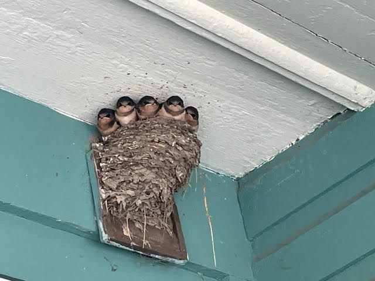
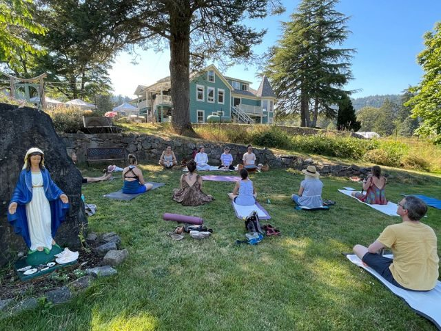
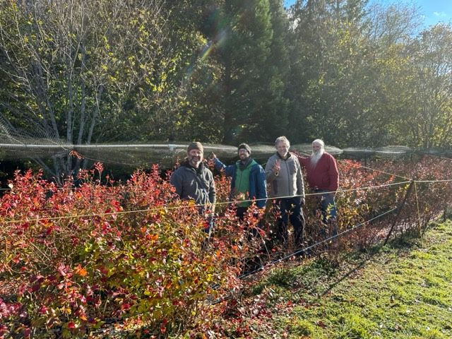
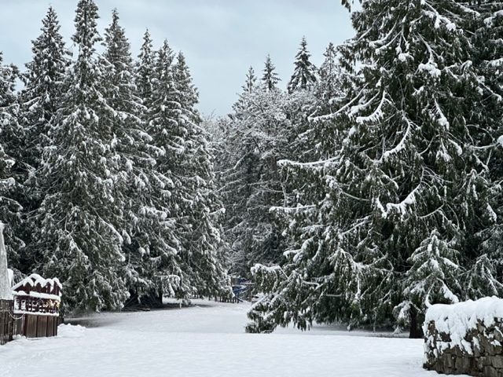

### Early morning aratis at the temples and full moon yajnas

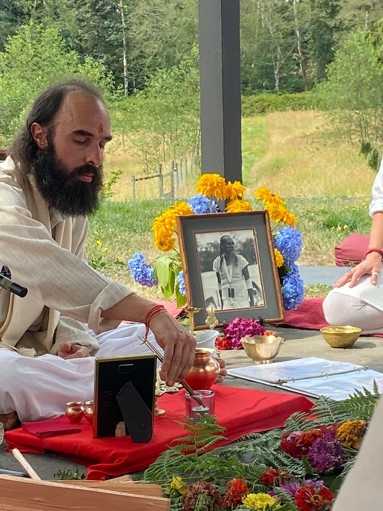
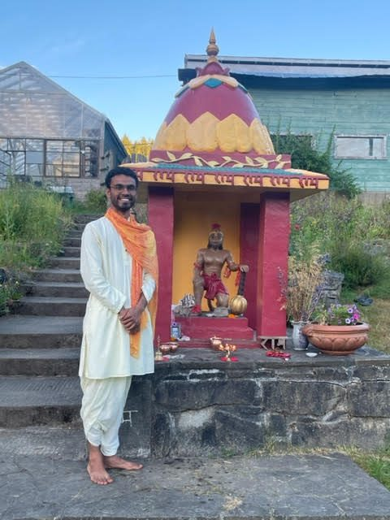

### The Annual Community Yoga Retreat

[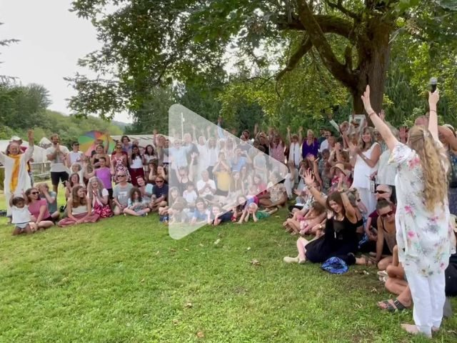](https://youtu.be/uLwDGKXXaYE)
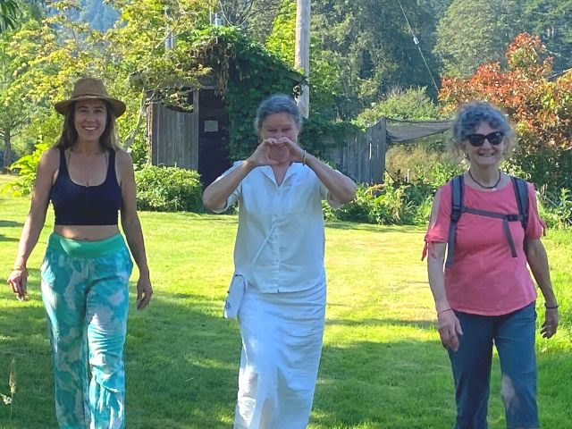

### The Residential Yoga Study and Service Immersion program

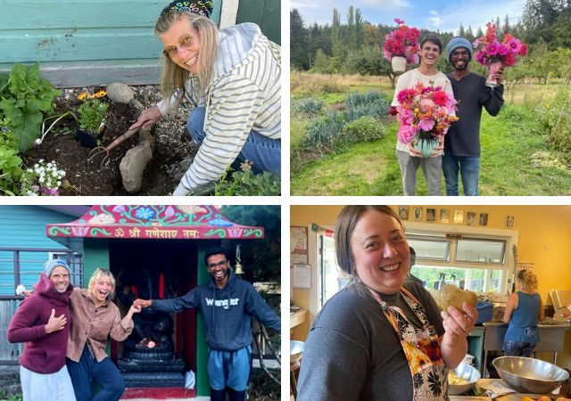

### The Garden team and abundance for Centre and Farm Stand

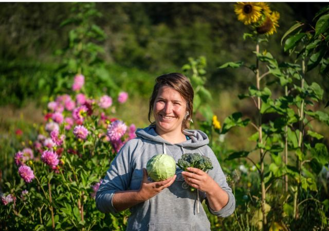
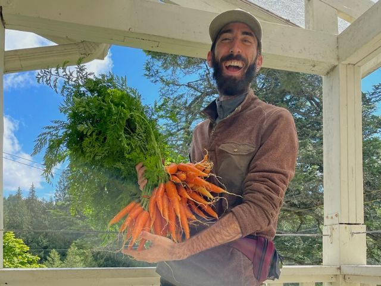

### The Kitchen team and all of the incredible meals - including our fundraising dinners

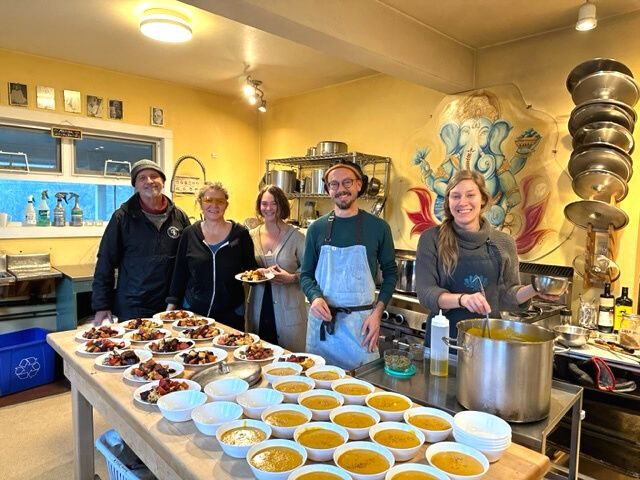
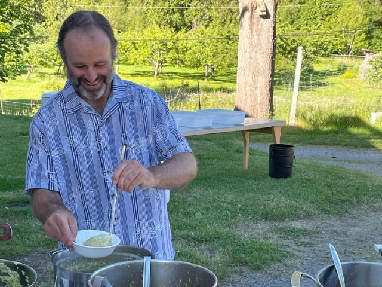

### Ongoing maintenance, grounds and our beautiful art additions

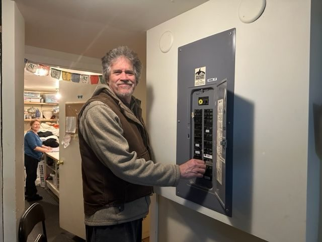
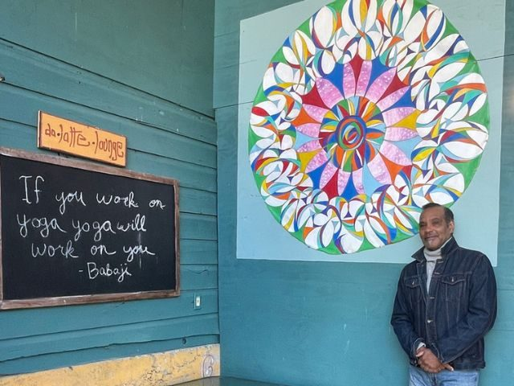

### Programs and rentals - both presenters and participants

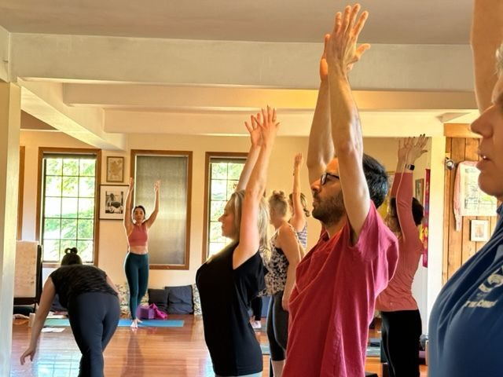
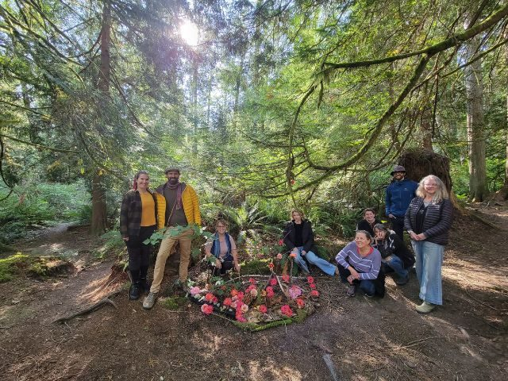

### The new addition of Airbnb bookings during non-program times - introducing others to the Centre

### The Housekeeping team

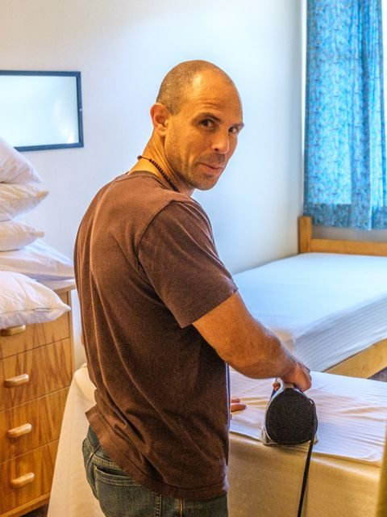

### All of the incredible staff, and volunteers, together creating an amazing collective energy of hope and possibilities!
