*Centre community news from December 2022 and January 2023*

### The Residential Community

Who is still here since the end of November?
The residential community is Sharada, Suneel, Mahavir, Ana, Mayana, and Anuradha, with Kristin and Jimena joining the on-land community Monday to Friday. We continue to take care of class preparations, any events, rituals, maintenance, upgrades/painting, and housekeeping, along with our meals and clean ups. Lunches are prepared by community and shared together Monday through Friday. Babaji always encouraged us to eat together for community-building. On the weekends, we are on our own.

### Centre School

Many activities happened with the Centre School before Christmas holidays.
The Advent Celebration of Light with Usha that she started in ’84, in the early school years, was so great. Thank you, Usha. Alumni attend and remember walking the spiral and lighting their candles when they were in kindergarten. This year was very special, as two Centre School alumni who married, came to watch their kids now walk the spiral and share the light.
We also had Winterfest weekend, set up in the Satsang room by the school, to create play and craft activities for the kids. There was also an amazing lunch and concession for all.
The following week, families filled the Satsang room again for the School Concert. It was nice to be together in person for these special celebrations after not being able to share them due to Covid.
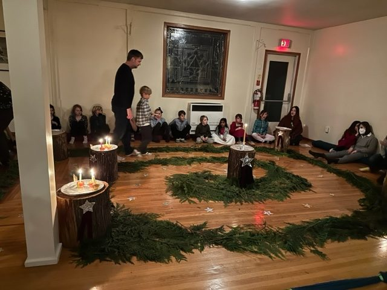 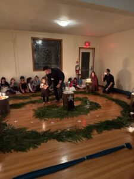

### Winter Maintenance

Major snowfall gave us a magical white Christmas…. lots of snow removal of paths, sidewalks, stairs, driveways, and parking lots. Thank you to Suneel and Mahavir. Also feeding the birds was a daily activity. Thanks to OmPk for continued maintenance of the driveways and parking lots, and tractor. He and Rajani will again look after the orchard and garden berries.
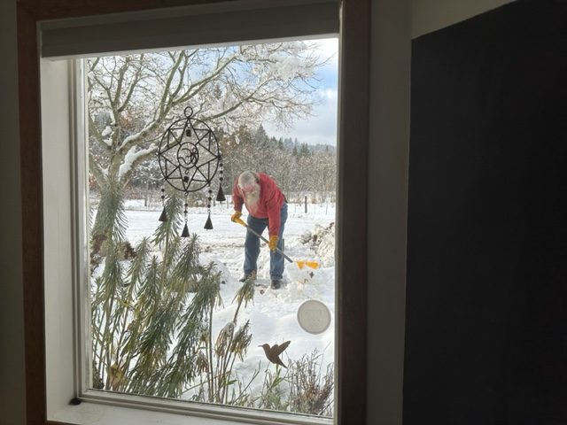 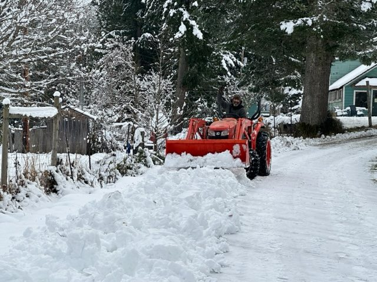

### Winter Solstice

Solstice was celebrated in the Satsang room with the community and on zoom. Usha came to set up the mini spiral and gnomes she uses to teach the kids how it is done. It was the first time to be done as a Centre event, it has always happened with the school. Mostly we would go to that and even though we did this year, it seemed time to bring it into Centre ritual as well. Just before Christmas we shared an afternoon of singing Christmas carols together, with community here and family and friends on Zoom.
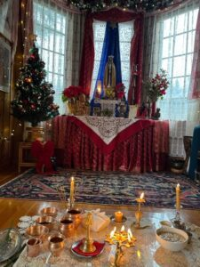 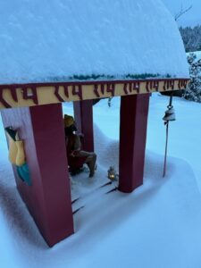

### Weekly Offerings

Classes continued through until Christmas and started again in January. We’ve seen an increase in in-person attendance at Satsang and we continue to be together with those on Zoom. It’s wonderful to hear and feel the power of kirtan together, sitting in silent meditation, chanting the healing mantra, and feeling Babaji’s continuous Grace for us all!! It’s a highlight of the week. We are excited about 2023, wishing you all a Happy, Healthy New Year!!
 Credit: [Huang Xiaoxiao](https://m.weibo.cn/detail/4861000500644295)

### Community Life

Since the end of November, the community has been buying their own food to support the Centre’s financial situation. We will review this as we get into program season and see how we will continue. Our work exchange hours are less due to reflect food not being provided. We still are doing everything that needs to be done. Karma Yoga always and we will see what’s needed as we go on. Without a paid Kitchen Coordinator (a change to also support the budget), a Kitchen Team has been formed and Mayana has taken on the Kitchen Manager responsibilities.

### Kitchen Refresh

A big thank you to Suneel, Savita, and Ana for the major kitchen clear and clean with TSP of the walls and ceiling and moving everything out except the stove, fridges, and centre table in preparation for Painter Bob. We painted the kitchen and Bob also painted some KY housing. Big thank you! We were so busy; I never got any photos. Freshly washed and varathaned, Ganesh oversees the kitchen. As things were moved back in, changes were made to support the kitchen work areas and flow. Thank you everyone!!
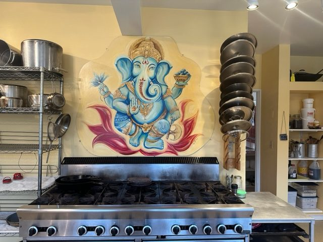

### Incoming Volunteers

We are excited about the arrival of volunteers joining the community at the beginning of February. We posted HK (housekeeping) work exchange positions on a yoga site geared towards certified teachers. It was amazing how great the response has been. The new arrivals will also teach classes at Centre and be available for personal retreat classes. Bringing in HK support ahead of programs starting, we are hoping for BnB bookings when the weather warms. Plus, there is so much to do to be ready in all areas by April when programs begin. We need everybody. Thanks to those on Island who also continue to come and help us out when needed or possible.
We now have interviewed volunteers who will be joining us throughout the year for our program season. Each intake is for 3 months, a review, and possible extensions to stay longer. Our first group arriving is a couple from Quebec, Michael is maintenance support, and Elise with HK/Kitchen, Ocean from New Zealand is visiting family in Canada, also HK/Kitchen. Joe is returning from his house-sit, and Kai is also joining us again from YSSI the year before last, supporting HK and Kitchen. There will also be some grounds work and ongoing work parties, and soon we’ll be ready to start seeds for the garden in the glass greenhouse. Welcoming, training, and orientations will start this week.
More than ever, so important to be growing our own food and having sales for the farmstand. Thanks Clare, for beginning this and starting to get a Farm Team together organically :-)
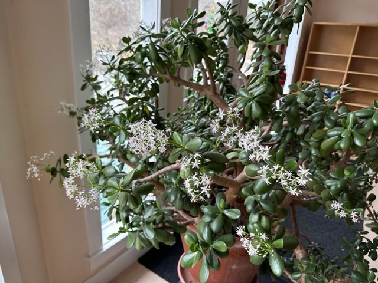

### Office Team

We’ve been busy in the office, opening the registrations for programs and rentals. There have been good numbers for registrations already for April and May dates. Rentals are starting to book. A big thank you to Kristin and Jimena for all they are taking care of, to Kumiko for looking after the books and accounts, to Suneel for the extra support, to Janell working remotely with the office/programs, in all areas for social media and communications and keeping us all on track. To Chetna, who continues to volunteer as office support. We are so delighted that Trish will rejoin the office team in early February 4 days a week. Thank you all!!

### Fundraising

Thank you to the Board, the Land, and extended community, near and far, friends and family of the Satsang and those networking together. This includes all of us!! And what an amazing gift was the $96,924.50 that was raised in donations in 2022!! Challenge on - let’s do it again this year!!
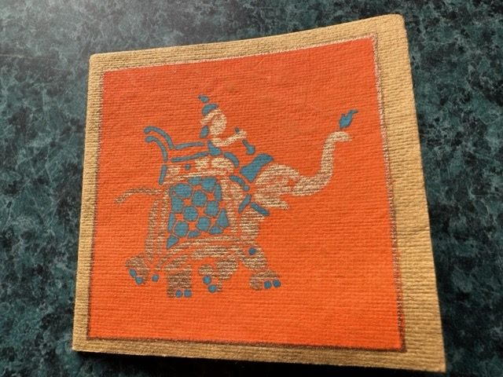

### India Trip

I will be heading to India to see the kids at Sri Ram Ashram and be there for Babita’s wedding. As with all the kids, it’s such a joy to be part of the family and their growing up. Chetna and Jyoti are also making the trip and we will do Babaji’s Kumaon pilgrimage in March. Om Gurudev! Jai ashram family.
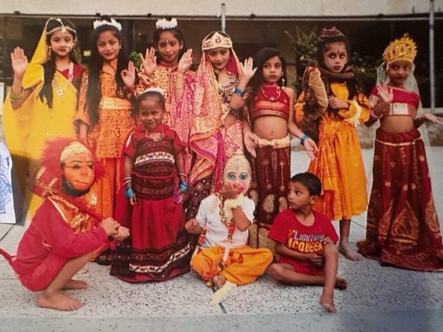

### Shiva Ratri

Wishing all a wonderful Shiva Ratri. We are excited that it is in person this year, February 18-19!! It will be amazing!! All [event information](https://saltspringcentre.com/events/shiva-ratri-2023/) is on the website. You can contact [Mahavir](mailto:theseentheseen@yahoo.com) for participation in preparation and for the ceremonies. Contact [Anuradha](mailto:anuradhaom@gmail.com) for rooms for those coming from off island to make lingams early Saturday morning. Mahavir has collected the clay from our field and gets it ready for Lingams.
*For those unable to attend in-person at the Centre, Mount Madonna is again [live streaming from the Temples](https://temple.mountmadonna.org/events-page).*
(Photo of Babaji at Sri Ram Ashram Shiva Ratri)
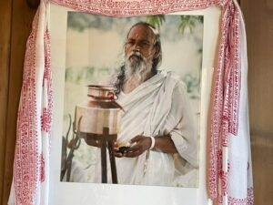 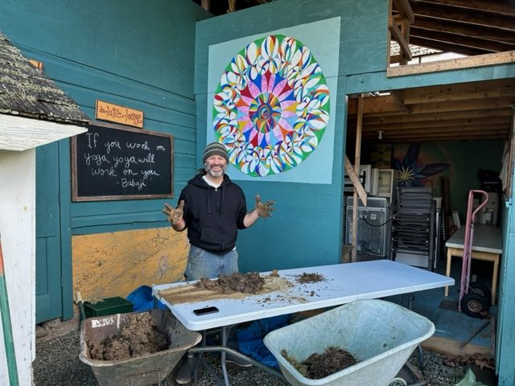

### Birthdays

End of January birthday celebration for Sharada and Mayana. We had a bowl of rose petals (thank you, Kishori!). Here Mahesh is offering the rose petals with prayers and well wishes.
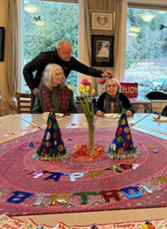 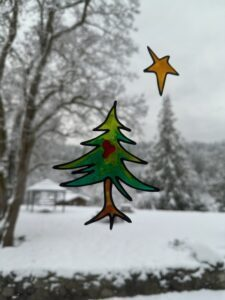
We are blessed!!
Jai Babaji!! Jai Satsang!! Jai Shiva Shambho!!
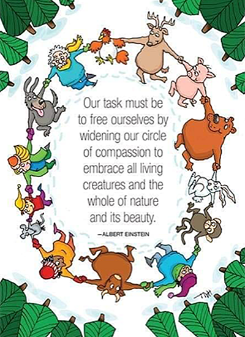
OMMMM love, peace and gratitude,
Anuradha
