“*The spirit of Karma Yoga is performing duty with love, compassion, and enthusiasm. There is no end to selfless service, the more you give the more you want to give….How you do makes it Karma Yoga and not what you do*.” - Babaji

### The Salt Spring Centre of Yoga Community

We welcomed the beginning of February with snow, and welcomed our new volunteers to the community. They are here as the first intake, from February through April, possibly extending their time. The first two weeks included welcome time, getting to know each other, orientations in all areas, work/play parties, demo yoga classes, and Centre activities. They were invited to attend ongoing yoga classes, Satsang, morning Arati, and Kirtan night to get a sense of offerings at the Centre. Joe and Kai, returning Karma Yogis, joined the Centre mid Feb. Thanks to all!!
[caption id="attachment\_30264" align="aligncenter" width="480"]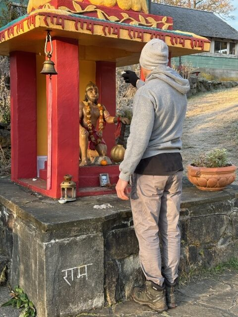 Joe lighting a deepam for Hanumanji[/caption]
Our first work party was moving firewood from the main woodshed to the storage area under the back deck. We had a beautiful sunny day and ‘many hands make light work’. We were done in no time. Thanks to Suneel for keeping the firewood supplied for the woodstove, and Michael for making sure all classes and Centre programs/events have a good fire when needed. Joe, Ana, and Elise keep on top of all the HK (housekeeping) needs for classes and the Airbnb rooms, keeping everything ready. We are now starting to get a few bookings for accommodations.
[caption id="attachment\_30265" align="aligncenter" width="720"]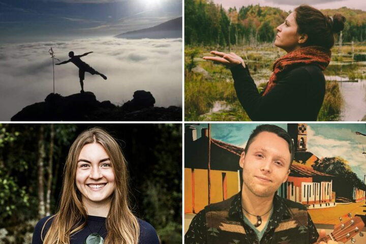 New volunteer yoga teachers - Michael, Elise, Ocean, and Kai[/caption]
Jimena has created new weekly yoga class offerings with the new teachers at the Centre. Check out the [Yoga Class schedule page](https://saltspringcentre.com/programs-retreats/yoga-classes/) for details. Also, we are getting the schedules, teachers, and staff in place for this year’s programs beginning mid-April.
[caption id="attachment\_30266" align="aligncenter" width="640"]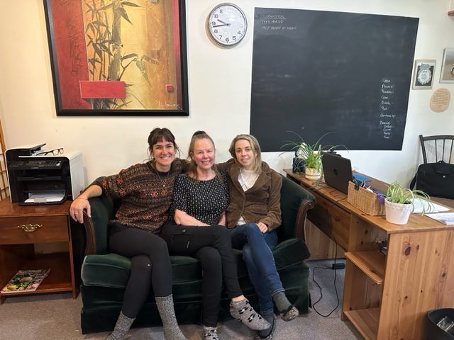 Jimena Trish and Kristin in the office[/caption]
Trish returned to the Centre for 4 days/week. We are so pleased she is back. She is a valued player for the office team and Centre support, as well as community member. Kristin and Jimena are full-on with the daily jobs, as well as future plans/ bookings and conversations with ‘to be’ renters and participants about programs. The Covid Recovery Grant application was submitted on Feb. 20th. Thanks to Padma for getting it started and all the hours and research put into it, to Kristin and Janell for completing and submitting!! It will be wonderful support for fundraising, which again this year, is so necessary to keep the Centre moving forward!!
[caption id="attachment\_30267" align="aligncenter" width="640"]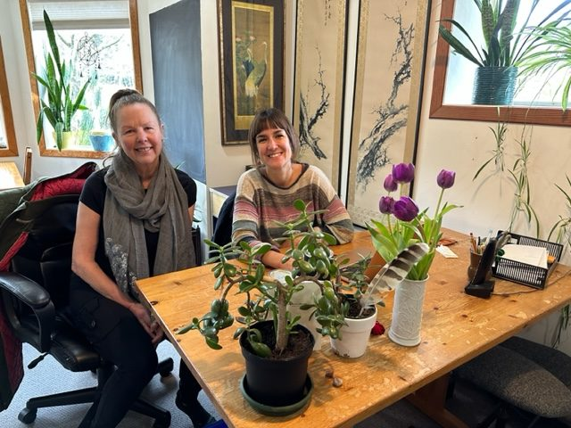 Trish and Jimena in the office[/caption]
A kitchen team has been created with volunteers; Mayana is overseeing the kitchen/food budget and staffing for programs. Sharada is helping with menus and consultation, OmPk and Rajani for sourcing and ordering. For our daily community meals, each community member puts money in for the month’s groceries, Suneel buys the groceries, we take turns cooking; Ana, Mahavir, Osh, and Kai, are the main folks on community meal preps.
[caption id="attachment\_30268" align="aligncenter" width="640"]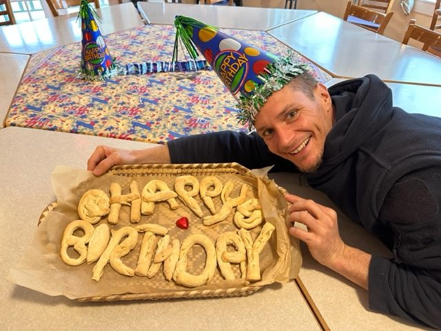 Michael's Birthday - Suneel's Happy Birthday Pretzel Bread[/caption]
We are eagerly waiting for the weather to warm up for Spring temperatures and wanting to plant seeds to get started in the glass greenhouse. Dan Jason is providing the seeds and potting soil. He hopes to come down and work with us through the season as time permits. Thanks very much Dan!! We also have the application from the Young Agrarians, the farming program that has come to us through Clare and UBC. We are looking forward to working out the details with Michael and having more land growing food as we work together on the Farm and Garden projects.
The Centre hosted Shiva Ratri on the night of February 18. Several hearty souls stayed awake through the whole night, with others joining Friday evening or Saturday morning.
[caption id="attachment\_30307" align="aligncenter" width="600"]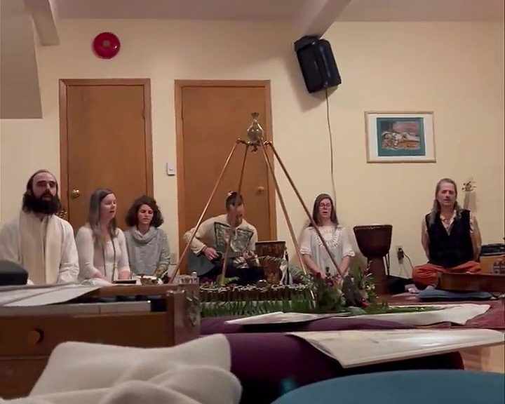 Shiva Ratri[/caption]
With January winter storms knocking down the fence around the sauna, the effects of time and weather became readily apparent. While inspecting the damage, floorboards creaked and broke. Thus, it was time to replace the sauna deck. Work began on the new sauna deck with the removal of the old one. But the month decided to depart with a bang and the sauna work site is now under water, as over a foot of snow fell in one day. Construction of the new sauna deck will have to wait for fairer and dryer weather.
[caption id="attachment\_30309" align="alignnone" width="980"]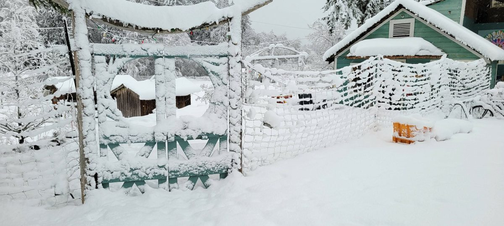 Snowy February weather![/caption]
[caption id="attachment\_30311" align="alignnone" width="980"]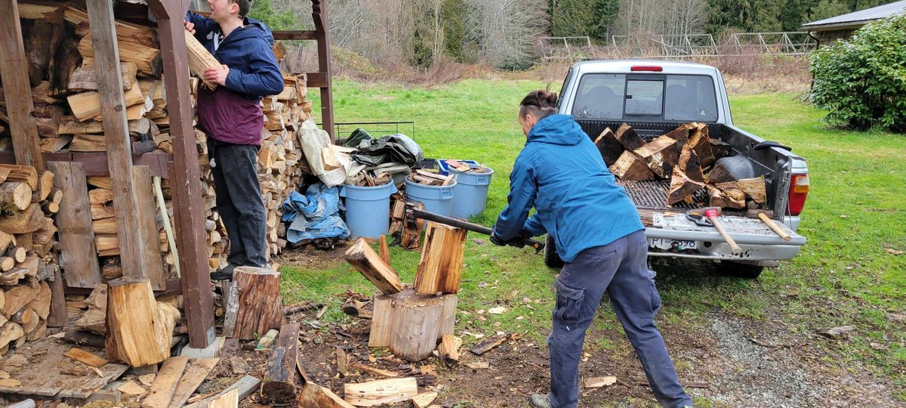 Volunteers chopping wood for the woodstove[/caption]
[caption id="attachment\_30310" align="alignnone" width="980"]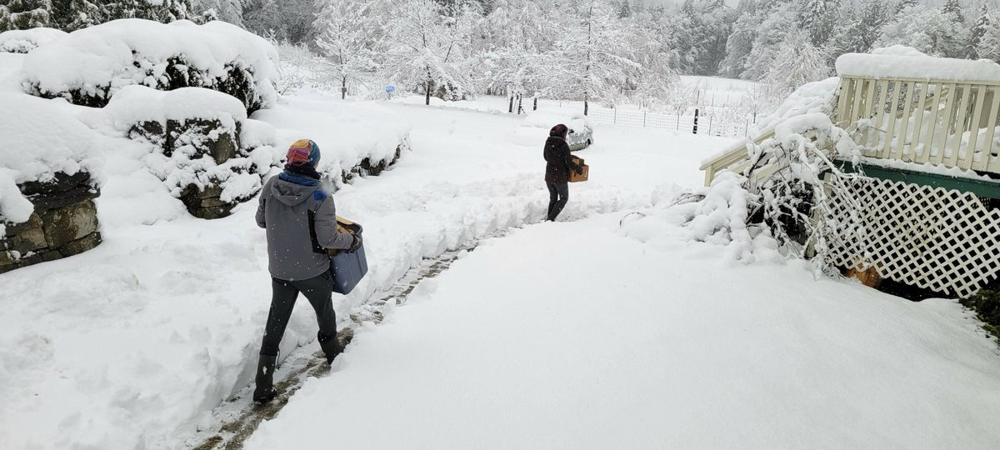 Delivering firewood[/caption]
[caption id="attachment\_30312" align="alignnone" width="980"]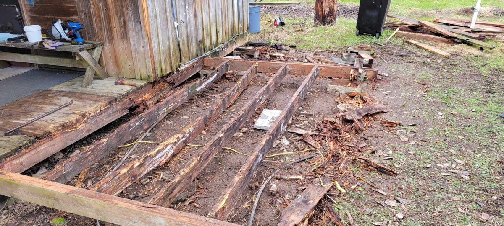 The sauna deck waiting on repairs[/caption]

### Sri Ram Ashram

A few members of the Satsang community have left the snowy BC weather behind for the warmth and beauty of India! [Sri Ram Ashram](https://sriramashram.org/), Babaji’s home for abandoned children, continues to be such a bright light of love and belonging!!
[caption id="attachment\_30318" align="aligncenter" width="639"]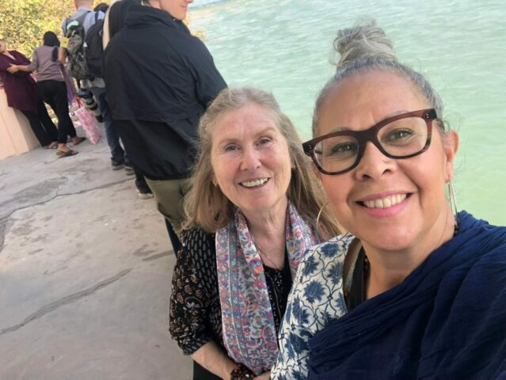 Anuradha and Chetna in India[/caption]
Chetna and I (Anuradha) arrived a couple days before Babita’s wedding. It was so great to see all the older kids who were able to come home from jobs, college studies, and some arriving with their children for the wedding!! And all the younger kids and toddlers who have grown so much since the last visit. And the precious new babies!! And of course, all the dedicated staff family who take care of the kids and everything else!! Such a great reunion and celebration as we all came together, including the grade 12 class and teachers from Mount Madonna School!! Best wishes to Babita and her husband and continued best wishes to the Sri Ram Ashram Family!!
  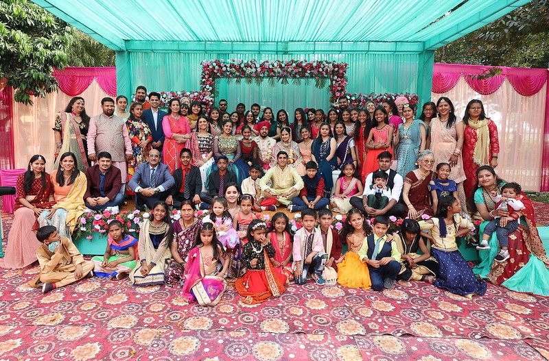

*Babita's wedding photos*

The schedule remains the same as Babaji put in place decades ago.
At 6 am the first bell rings. The kids get up and come out to the courtyard for morning prayers by 6:30. Then 10 mins. of exercise, followed by morning Sadhana prayers, pranayama, and meditation. When finished, they are off to get ready for school and breakfast. We eat together sitting on the floor mats in the kitchen. The cooks start very early every day. After breakfast the kids get their school bags and line up to be checked off the list as they leave for school. The mummies and babies/toddlers get ready for their day, which includes a lot of laundry. Kids come home for lunch and when school finishes, change into play clothes for teatime and play time, followed by daily study hall. The little ones have swing time, playground play and walking up and down the driveway which is lined with marigolds and dahlias. It’s a slow walk, stopping to smell the flowers along the way ;-) Arati is before dinner with Kirtan and lots of drumming, very loud and enthusiastic!! Dinner and short play time before everyone heads inside, older kids to study and little ones for bed.
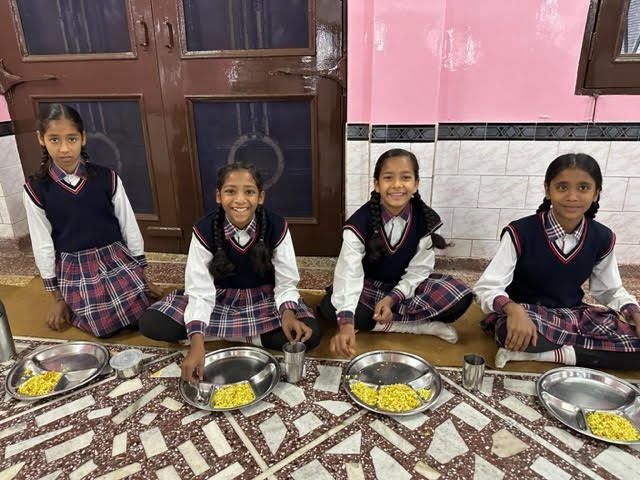  
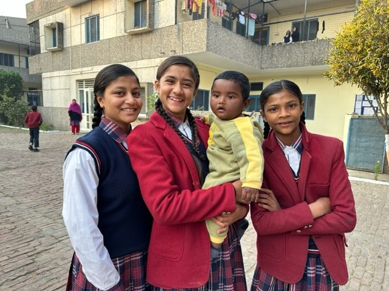 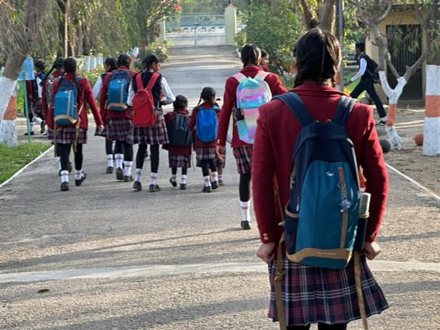

*Sri Ram Ashram kids*

Babaji’s Presence and Grace continues to be so strongly felt!! It has always felt like the Ashram is such a special light and love portal!! If you ever have the chance to come and visit, do and be prepared, they will steal your hearts!!
[caption id="attachment\_30305" align="aligncenter" width="480"]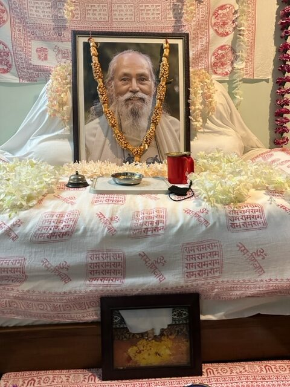 Babaji's room at the Ashram[/caption]
Chetna is posting great photos and stories on [Facebook](https://www.facebook.com/tracy.c.boyd.1) of the India trip.
We have arrived in Rishikesh now and are meeting with Vishvaji and friends at Anand Prakash Ashram. Jyoti will be joining us here as we leave for the Kumaon pilgrimage, many sacred places, and areas Babaji wrote about where he visited saints and lived for some time. Kenchi Ashram is where Ram Dass met and was taught by Babaji. From that, a group of students came to India to study with Babaji. One of these was Anand Dass, who became our first teacher and introduction to Babaji and his teachings!! Jai Babaji!! Jai AD!! Jai Satsang Family and Friends all over the world!!
