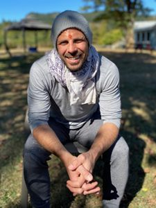

Here are the prompts people were given to stimulate some reflections about their lives at the Centre. You may want to consider these questions yourself (perhaps with a little revision to fit your life).

- *What have been the highlights of your time at the Centre so far?*
- *What have you learned – about yourself, yoga practice, living in community?*
- *What teachings and practices have inspired you?*

Two of our current karma yogis have shared some of their reflections about how their experiences of living and working at the Salt Spring Centre of Yoga have contributed to their lives and their outlook on life - Anastasia Shyla and Joe Muller.

---

## Anastasia Shyla

The croaking of frogs, the hooting of owls; these are the sounds I would hear as I drifted off to sleep in my tent, when I first arrived at the center in August.
I was in awe of the deep stillness and peace of this land.
I came here after a six year long spiritual quest - chasing god and living in many different spiritual communities across Canada and the States.
The impetus for the quest came when I encountered a level of suffering in my life that could not be overcome by any regular, everyday means.
I needed a safe container, in order to begin looking within.
The Salt Spring Centre of Yoga offered me this opportunity in many ways.
There were yoga theory classes where we plunged into the deep question of "who am I, beyond the body and mind?"
There was also writer's group where we explored our innate creativity.
Another favourite of mine was the tipi circle, where we got together in community to share openly what was on our hearts.
Finally, the yoga asana classes helped me connect to my body, and to bridge it with both mind and spirit.
All of these activities were interspersed with the thread of self-less service. The kitchen was the perfect place to practice karma yoga, with its spirit of giving, of offering.
And after the busy, bustling summer and fall, came the stilling, the hushing of winter. There were only six of us on the land! I fell deeply in love with my solitude.
I stopped my running around, and with the help of the teachings of Baba Hari Das, surrendered to the fact that what I was searching for was within me all along.
I am so grateful to the centre and all the wonderful people I am surrounded by to this day. What gift, what blessing.

---

## Joe Muller

The opportunity to live a life in spiritual community has been deeply meaningful. It has been an honour to be a part of a residential group that works so well together. The warmth and loving support from the extended satsang has also been incredible. I love the fact that you never know who you is going to show up at the centre with a big smile and willing hands.
This land holds a powerful energy, infused with love for the past 4 decades that you can feel. Sleeping in the forest has been a catalyst for healing. The owls, the stars, the loud silence. I have been finding beauty in all the little things like cold plunging in the creek, greeting frogs in the outdoor shower, and taking time to pray with forest hanuman. Some of the other highlights of my time here include morning arati, learning kirtans from so many willing teachers, learning how to use a chainsaw, growing my culinary skills, and spending time with Sharada.
I continue to embrace the practice of selfless service with patience and the aim of humility. It truly helps to have inspiring examples all around. I have been observing silence on Tuesdays, and continue to find my way in this discipline. I am fascinated by the study, self inquiry, and practice of ishvara pranidhana (devotional surrender), and formally learning sadhana and pranayama has been profound.
I am so grateful for the love and support of this community, and to be walking the path with you all.
Jai Canada! Jai Satsang! Jai Gurudev!

---

*To learn more about volunteering or working at the Salt Spring Centre of Yoga, visit our [Get Involved](https://saltspringcentre.com/get-involved/) page.*
