### 2009 - A Big Change in my Life

There’s something about stepping out of life’s routines that really stirs things up. It was at my first stint as a Karma Yogi at a retreat centre on Cortez Island when I realized that I did not want to marry the person I was engaged to. At the end of my month there, I called the wedding off, just 1 month before the big date, which turned my world upside down. Thankfully, I found the Salt Spring Centre, and they provided a safe space for me to land and gather myself.

---

### Arriving at the Salt Spring Centre of Yoga

Looking back through my photos of that period, what stands out to me is the beauty and the love. The photos bring back memories of the flowers (arranged on top of food!), forests, fields, lake swimming, the land and the people! Community check-ins, listening to MC Yogi while cooking for retreat guests or just the community, holding hands around the dinner spread, Om-ing together, singing kirtan, dancing, hugging!
It’s interesting that “doing yoga” didn’t show up in that list. Certainly we did practice yoga, but I have come to realize that life at the yoga centre is so much more. I was introduced to the different aspects of yoga; including Bhakti yoga (singing and lots of weeping during kirtan) and Karma yoga, meaning selfless service. Giving to others as a spiritual practice. So we worked our jobs, mostly cooking and office work for me, and of course dishes. And working on ourselves, either consciously and publicly (getting out of bed in time for the morning meditation) or unconsciously and privately, which is what I did a lot of.

---

[caption id="attachment\_30816" align="alignleft" width="500"]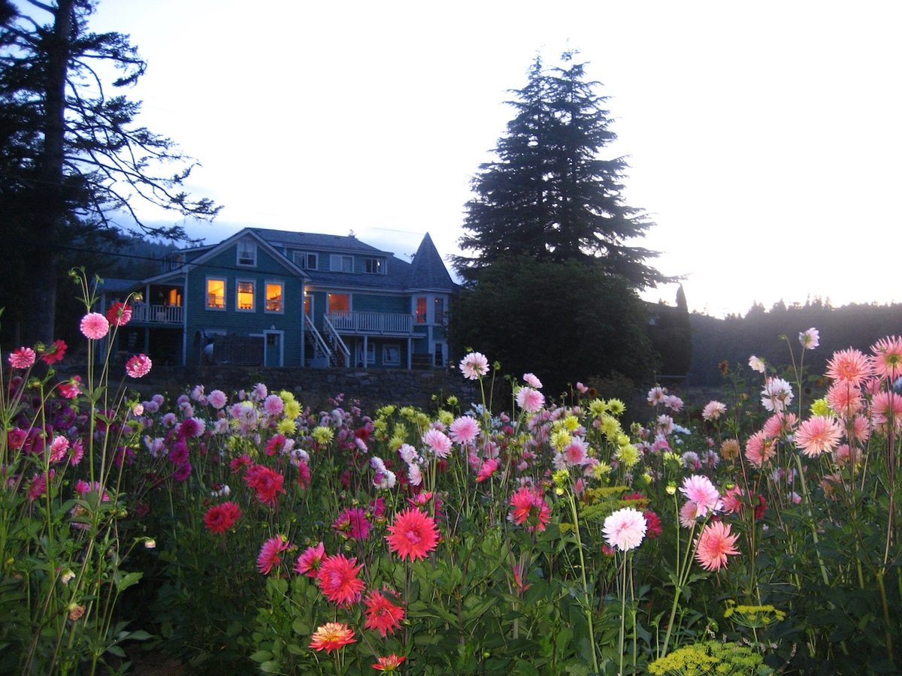 The dahlias that year![/caption]
[caption id="attachment\_30813" align="alignleft" width="225"]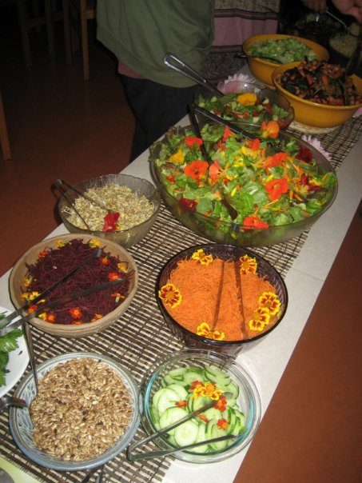 Beautiful food with flowers on top![/caption]
 
 
[caption id="attachment\_30815" align="alignleft" width="504"]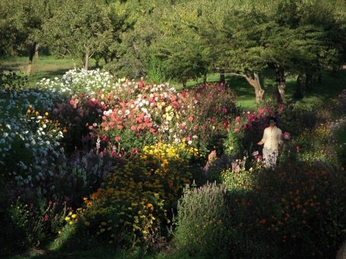 Picking flowers for making flower arrangements[/caption]
[caption id="attachment\_30821" align="alignleft" width="263"]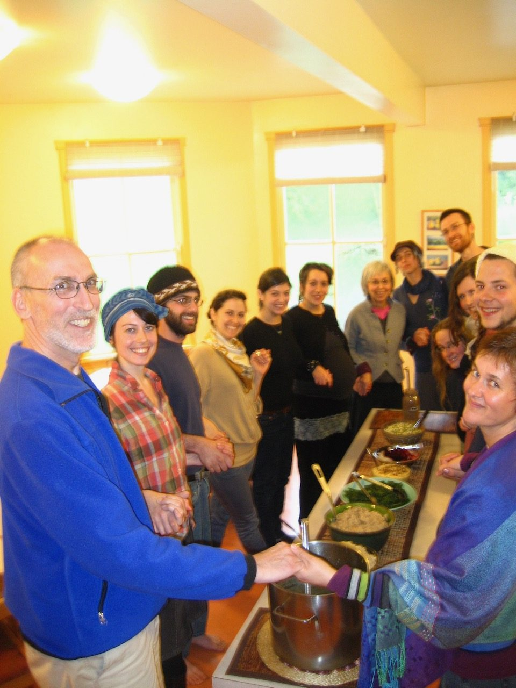 Pausing to feel gratitude and pour collective love into the meal before digging in. Om![/caption]
 
 
 
 
 
[caption id="attachment\_30820" align="alignleft" width="400"]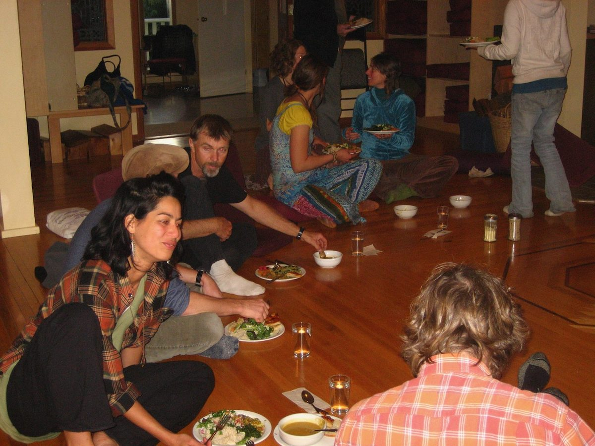 Dinner in the Satsang room[/caption]
[caption id="attachment\_30817" align="alignleft" width="400"]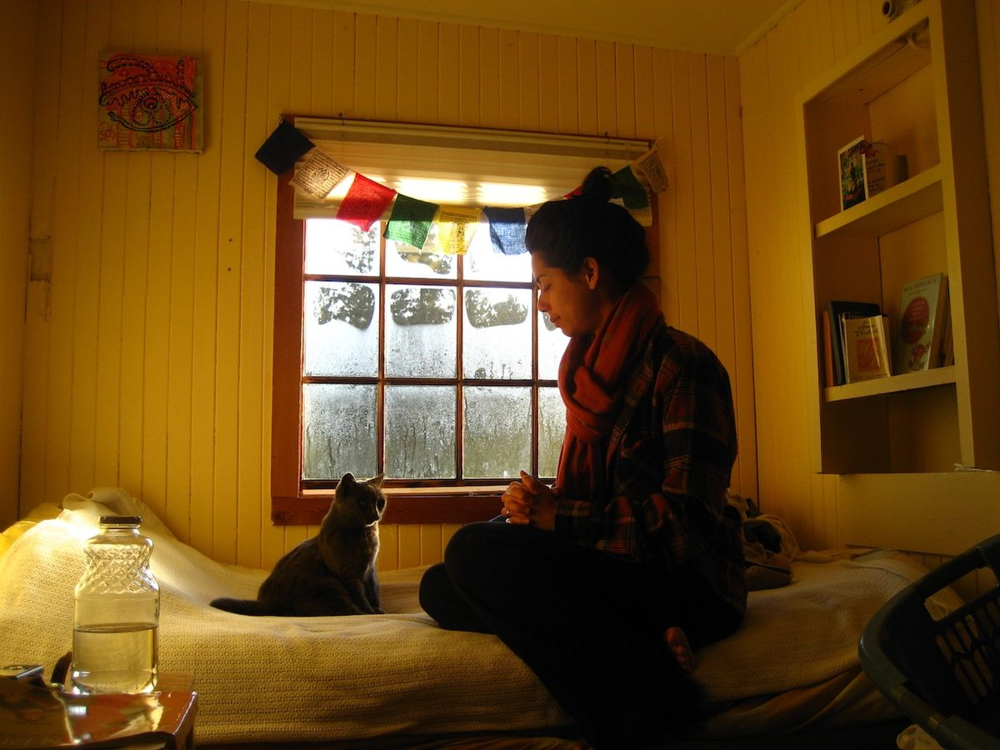 A visit from Smokey the resident cat[/caption]
[caption id="attachment\_30814" align="alignleft" width="400"]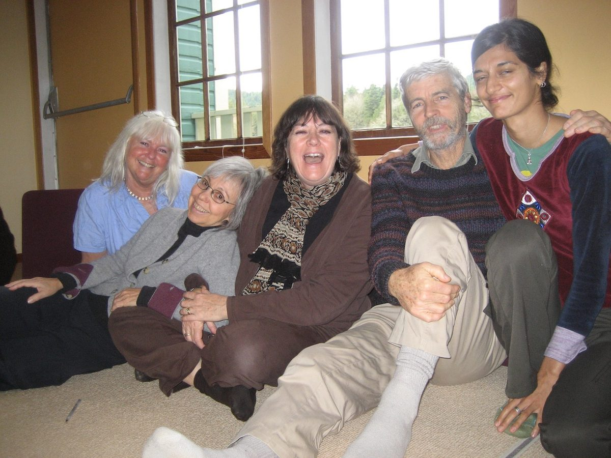 Elders and friends - Kalyani, Sharada, Lakshmi, Shankar and Indica[/caption]
[caption id="attachment\_30818" align="alignleft" width="400"]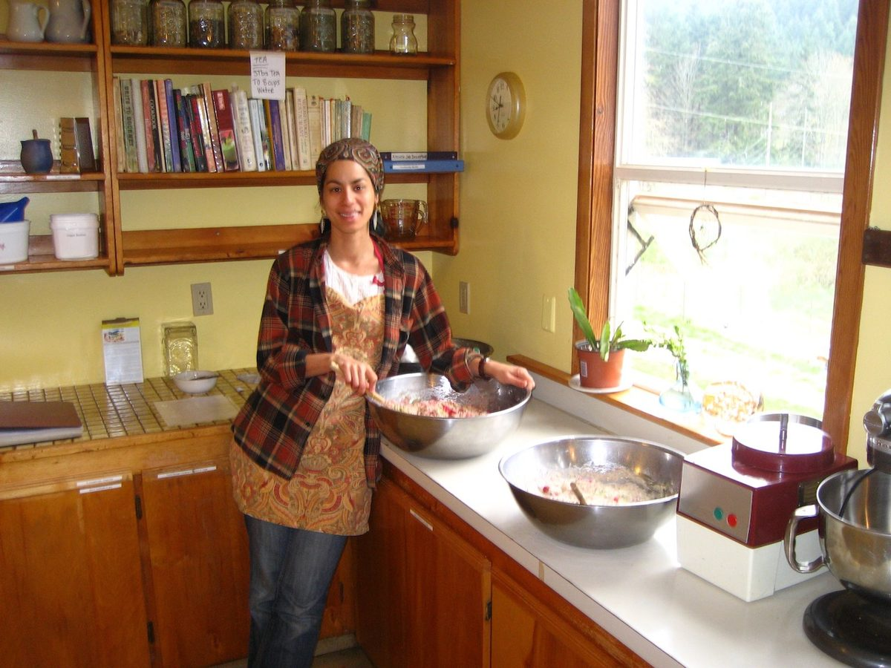 Mixing up large batches of muffins for guests[/caption]

---

### Internal Experience

What my photo collection doesn’t show is the internal turmoil I experienced. In spite of all the smiles, and hugs and the genuine loving connections I had with dozens of people (which I see clearly looking back), what I was actually experiencing was a deep sense of being alone and separate. My “stuff” was coming up. Each day in community brought these feelings up in one way or another, and presented a chance to notice it and work to heal it. But it’s only time and distance that have allowed me to see what was happening and notice the opportunity that was there. In the moment, I just accepted that pain as normal and continued on.

---

### Finding My place

My month-long engagement at the Centre became 8 months, as I became one of the over-winter yogis, staying cozy in the Sage house with sweet KY roomies, Vidya and Jonah.
The length of my stay meant there was time to work on a more in depth project that put my skills in marketing and graphic design to good use in a wonderfully fulfilling way, thoroughly auditing the Centre’s existing visual presence on the property, in the community and online. From there I refined their existing brand and expanded it to be warm, inviting and – most satisfyingly – cohesive. I then designed a full collection of posters, signs, guest binders, brochures, booklets, email newsletter and more, which were all rolled out to my great satisfaction and pride.
In 2009 I was still a fairly new graphic designer, so looking back I’m amazed at the confidence the Centre leaders and management placed in me to guide their visual presence to the extent that I did. I am so thankful to Shankar, Indica, Danie and Margaret, my office family.
[caption id="attachment\_30811" align="alignnone" width="499"]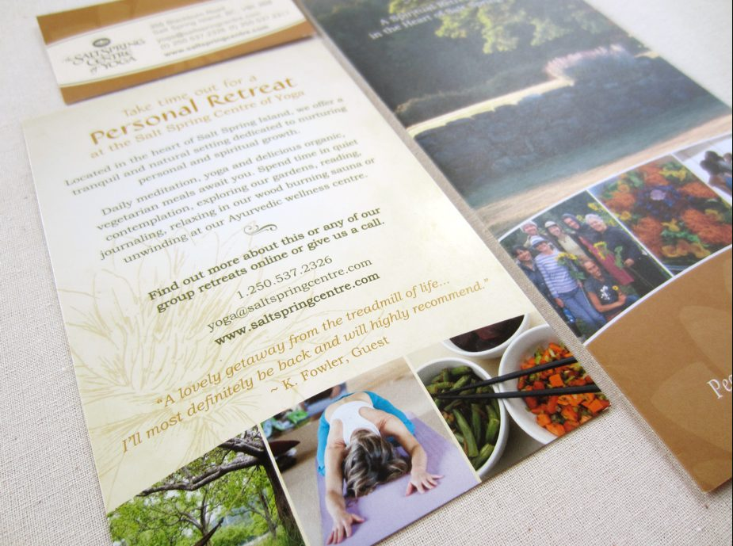 Some of the promotional material I designed for the Centre (2009)[/caption]

---

### Food Security for the Community

Another beautiful aspect of the Centre that I only really appreciated in hindsight, was Babaji’s vision for food security for the community; so much of the food we enjoyed was grown right there on the land. At the time, I had no interest in farming, but today I grow my own huge food and flower garden (shared through my [Instagram account](https://www.instagram.com/keiko.creative/)), one of the main sources of sustenance (for body and spirit) in my life.
I also now live in [community](https://livinghere.ca/growing-together-on-bedford-road/) with my husband’s family on 1.5 acres, and my own family (dad, sister and nephew), live across the road. Of course, this living arrangement means my “stuff” still comes up all the time! But my experience at the Centre and since, means that now I see it for what it is and am actively working on changing beliefs and patterns, and healing old wounds. It’s a process, isn’t it?
I am also a mother (the best practice of “selfless service” out there) to a boy who is already in the double digits.
Now in my 40’s, I have been channeling energy into my own personal passions – my drawing practice, my daily yoga practice, as a community leader, and as a dancer. All of this has begun to cultivate the genuine sense of belonging and connection that I was missing.

---

[caption id="attachment\_30819" align="alignleft" width="980"]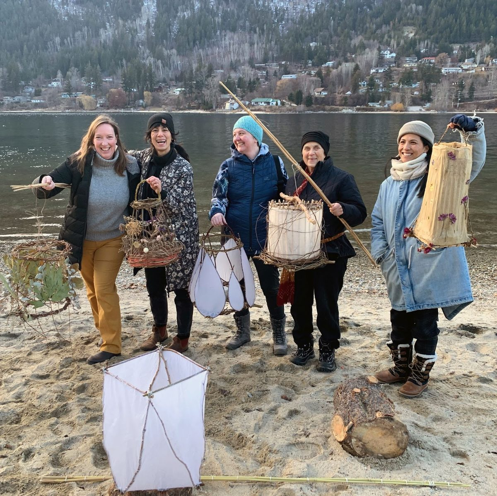 Displaying the lanterns we made for the local lantern festival, an initiative I led through Earth and Gleaners Society’s Nelson chapter (2023) ​​[/caption]

---

And I’m still a graphic designer, running an independent design studio, Keiko Creative! The work I did for the Centre exemplifies the type of projects that I love working on today - partnering with organizations who are working to make the world a better place, addressing their communication challenges holistically, to produce results with clarity, simplicity and beauty.

---

[caption id="attachment\_30826" align="alignleft" width="400"]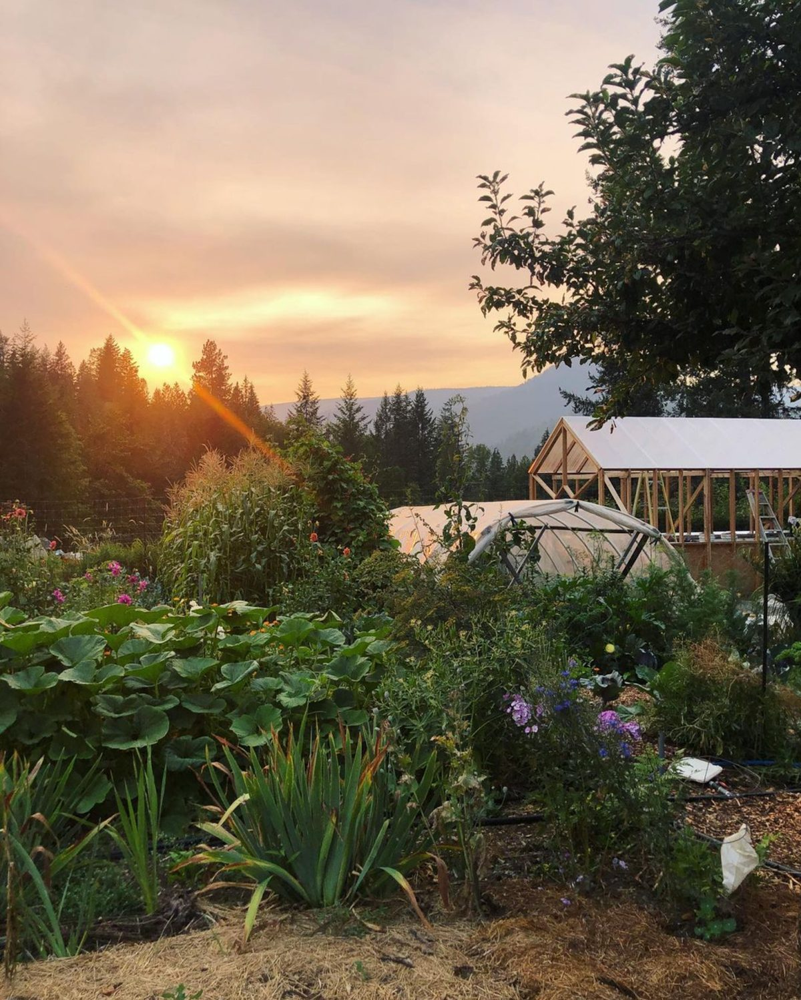 Our late summer garden in her glory (2022)[/caption]
[caption id="attachment\_30825" align="alignleft" width="401"]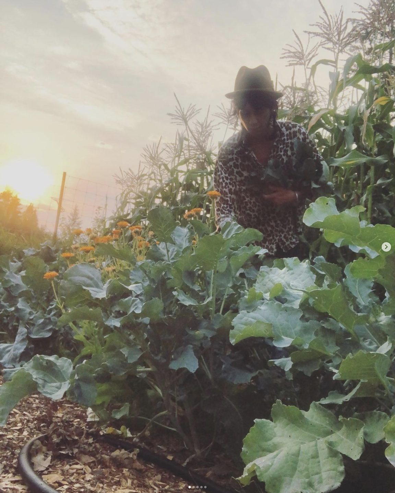 Harvesting some broccoli for dinner (2022)[/caption]
[caption id="attachment\_30824" align="alignleft" width="500"]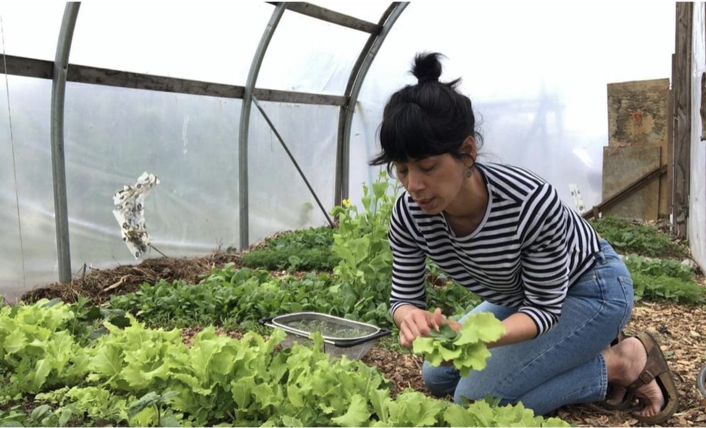 Video still from a [cooking video](https://www.youtube.com/playlist?list=PLh6oOIQgnwnuYuiLoLEUj9u0tewL8Uiwe) I created for our local food bank’s food skills program (2022)[/caption]
[caption id="attachment\_30822" align="alignleft" width="240"]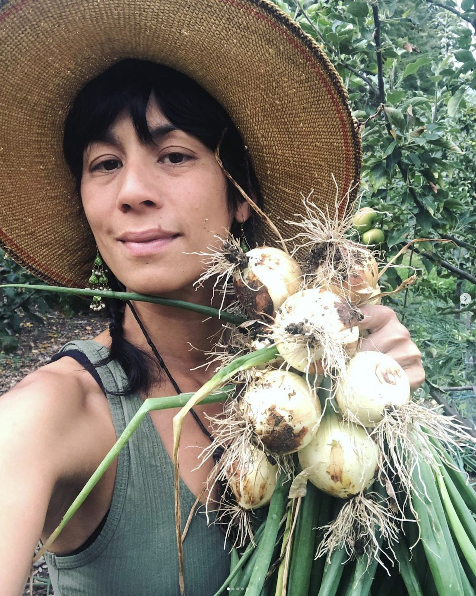 Harvesting onions with pride, a kitchen staple (2022)[/caption]

---

### The Newsletter and Ongoing Connection

After leaving the Centre, I continued to produce their monthly e-newsletter for over ten years! This meant that each and every month my dear friend and Centre elder, Sharada, would send me news, photos, stories and inspiration from the Centre which I formatted into the newsletter to send to their many contacts. In this way, the energy and teachings of the Centre was a constant in my life, and still is today, even though I am no longer creating their newsletters.
The Centre will always hold a special place in my heart, as it truly played a central role in the unfolding of my life. Things were dug up, new seeds were planted, and today, I am enjoying many sweet blossoms and fruit of my life.
Love,
Keiko
(*interview by Sharada*)
