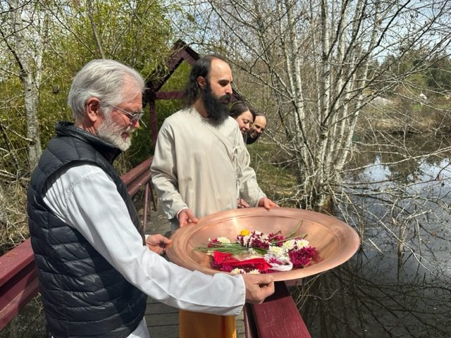
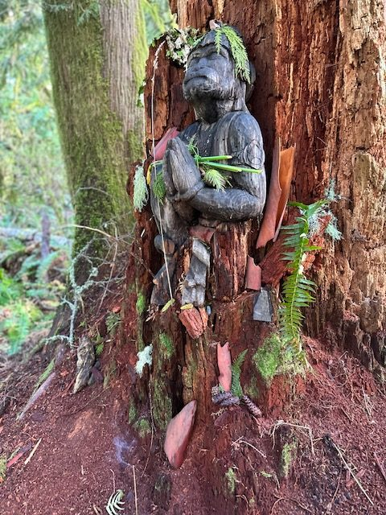
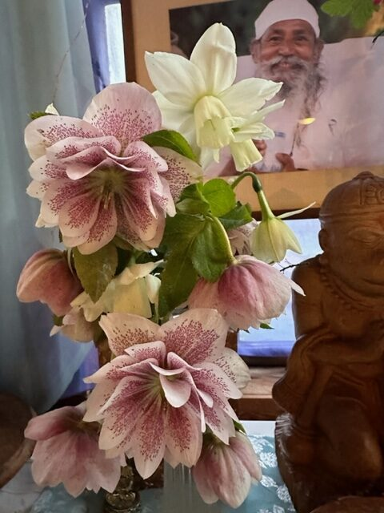
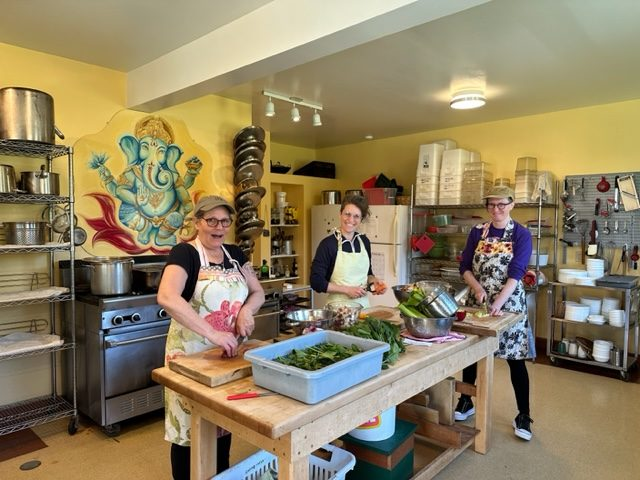
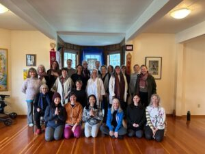
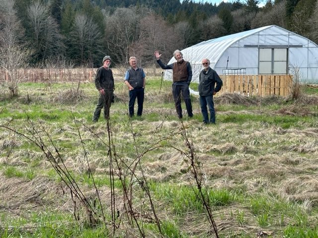
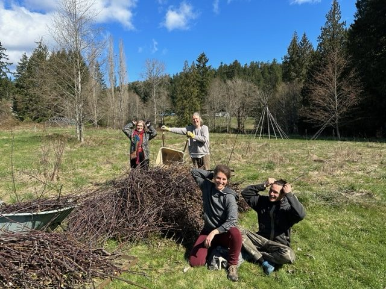
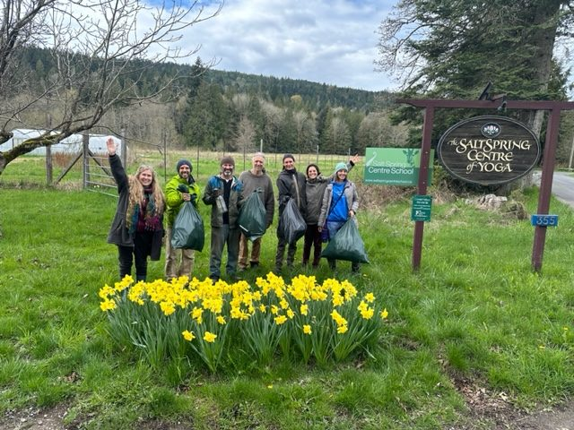
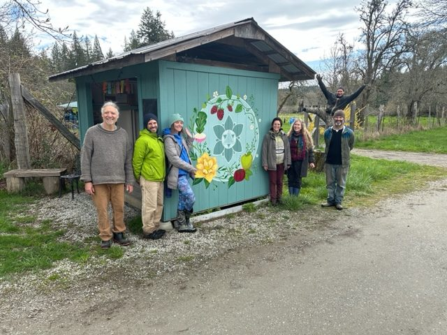
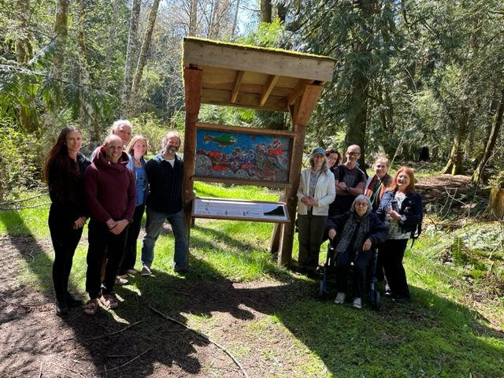

April started with the celebration and ritual of Hanuman Jayanti (Hanuman's birthday). Babaji taught us this ritual by first sharing it with us at Mount Madonna on his 80th birthday. (Babaji’s birthday is near the same time and so many were coming to MMC to celebrate his 80th and the Hanuman Temple.) Yogeshwar and Mahavir officiated, Jagannath and a few others from off Island joined. It was a lovely celebration and we carried Hanuman around the Land to see all that he takes care of, including through the forest to stop at Forest Hanuman. Islanders like to walk the forest trail and many leave offerings of flowers, leaves, and moss for Forest Hanuman.
 
Satsang has grown to about 30 people each Sunday, in person and on Zoom - always a highlight of the week. After the Yoga Wellness Retreat weekend, some stayed on to join us.

The Retreat weekend was a great success for all of us - the community, as well as the guests, really enjoyed the first program of the season. Thank you so much to everyone; the office team, the hosts, the teachers, cooks, cleaners, and all areas that were supported to make it such a great weekend!! Special thank you to Mayana and Sharada for the preplanning and all that look after the food they love so much. Off Island guest teachers were Rajani (from Seattle) and Courteney. On-island teachers were Kishori, Anuradha, and Michael.

Airbnb bookings are beginning to increase now that the weather is warming up and the sun is shining.
SN, OmPk, and Jagannath talking with Michael about farming and the Land. Feels like Spring is finally here!!

Some of the KY work parties:
Gathering all the pruning that was done in the orchard so the next phase of grass cutting can begin! Lots is beginning to happen in the garden now, thanks to Vikash and Mahavir heading up various areas, and all joining the work parties for garden and grounds. And as always,  ongoing maintenance, with Suneel and Michael, and Pipo.

An April "Pick up Garbage" Program happens on the Island. We joined with the Centre School. They did a section earlier along the trail, and we finished up gathering the garbage on Blackburn Road. Thanks for notifying us about it, Janell.
 
The new painting on the Farm Stand, by Elise, is a beautiful beginning to the opening of the garden season. She is standing to the right of the painting and is helping us upgrade our signs as well.

The School invited us to the Opening ceremony of the Forest Trail. The signs made decades ago were falling apart. They got a grant from the SS Foundation to redo them and collaborated with indigenous writer Jared Qwestenuxun Williams to write the text and share the names in his language. It was a beautiful and meaningful ceremony.

Wishing you all a wonderful Spring and sunshine on your face, peace of mind and love in your heart!! Thank you to Babaji for all we have, for continued Grace and our Satsang family that is ever growing!!
Please support the Centre in whatever way you are able; with your donations, your time, your prayers, and as ambassadors to share the beauty and wonder of the Land and Centre.
