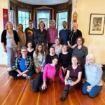

Natasha (Jyoti) Samson recently travelled to India where she spent time Sri Ram Ashram, visited sites where Babaji lived and practiced, and took part in an intensive 21-day panchakarma detox at [Vaidyagrama Ayurveda](https://www.vaidyagrama.com/).
She sat down with us to talk about her trip and the wisdom she will be sharing at her upcoming [Ayurveda and Yoga Retreat](https://saltspringcentre.com/programs-retreats/ayurveda-and-yoga-retreats/).
[embed]https://www.youtube.com/watch?v=J6Jp9rpUYbw[/embed]

---

### Upcoming Retreat:

**June 23 - 25, 2023**
[Ayurveda & Yoga "I Want More from Life" Retreat](https://saltspringcentre.com/programs-retreats/ayurveda-and-yoga-retreats/)
at the Salt Spring Centre of Yoga

---

### More about Jyoti:

[Bio](https://saltspringcentre.com/sscy_team/natasha-jyoti-samson-ayurveda-and-yoga/)
[Website](https://nourishyoufirst.ca/)
[Facebook](https://www.facebook.com/natashasamsonyoga)
[Instagram](https://www.instagram.com/natashasyoga/)
