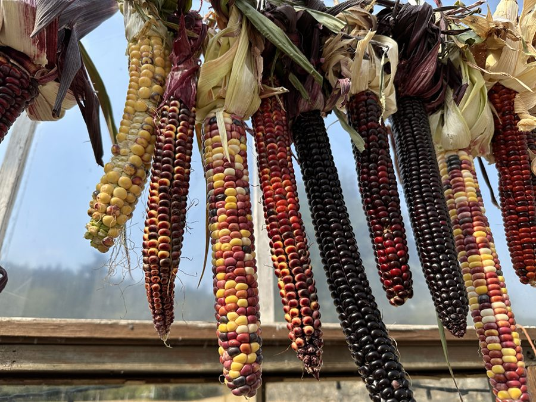
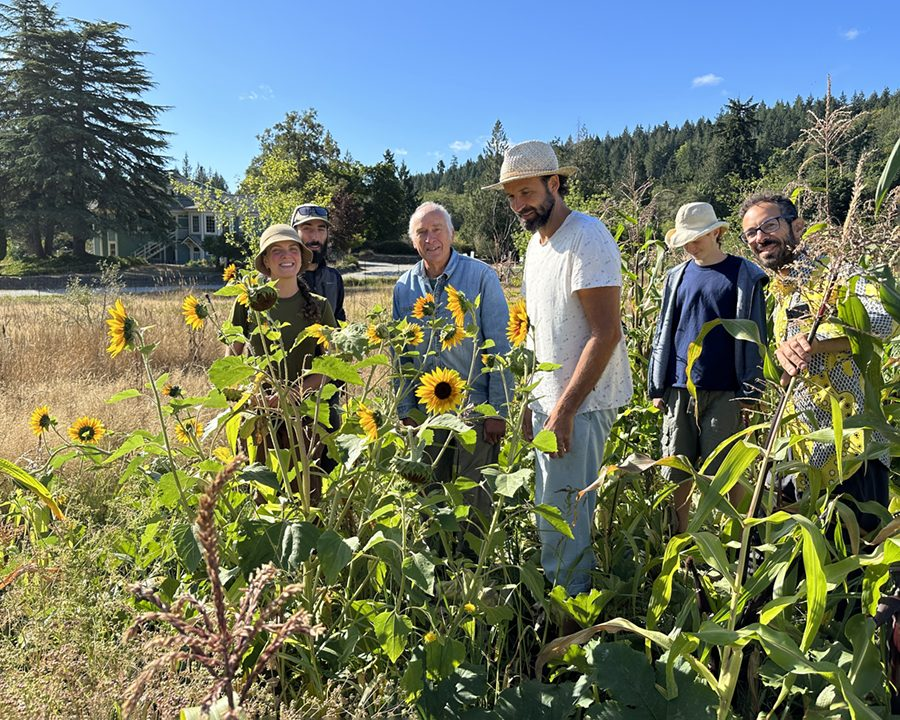
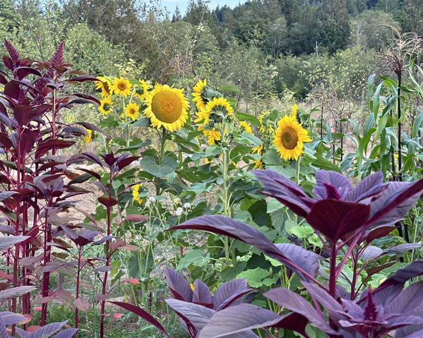
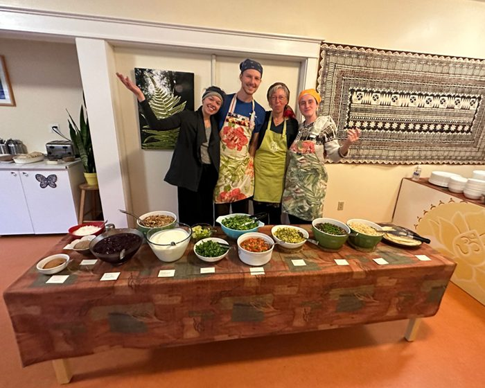
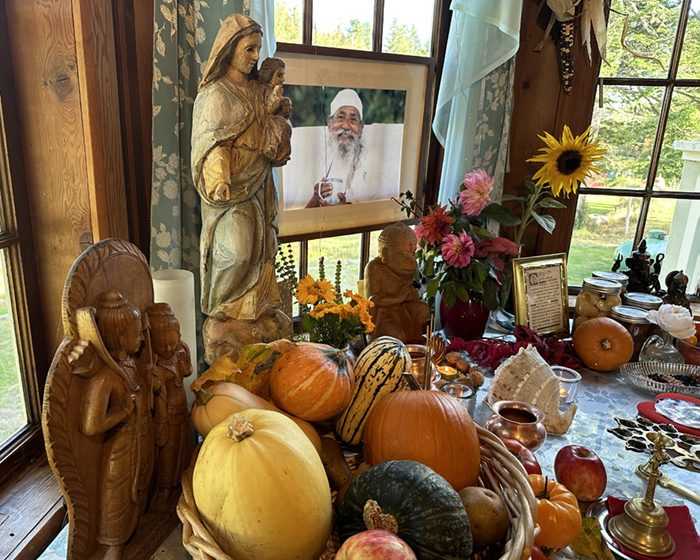
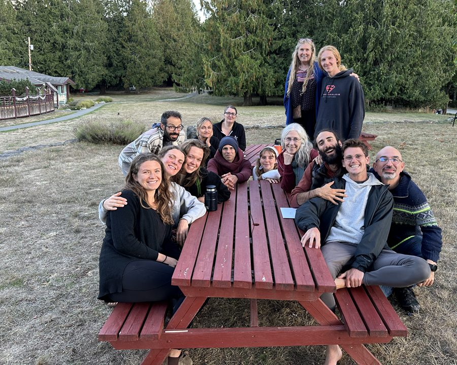
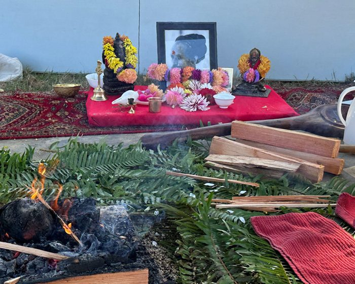
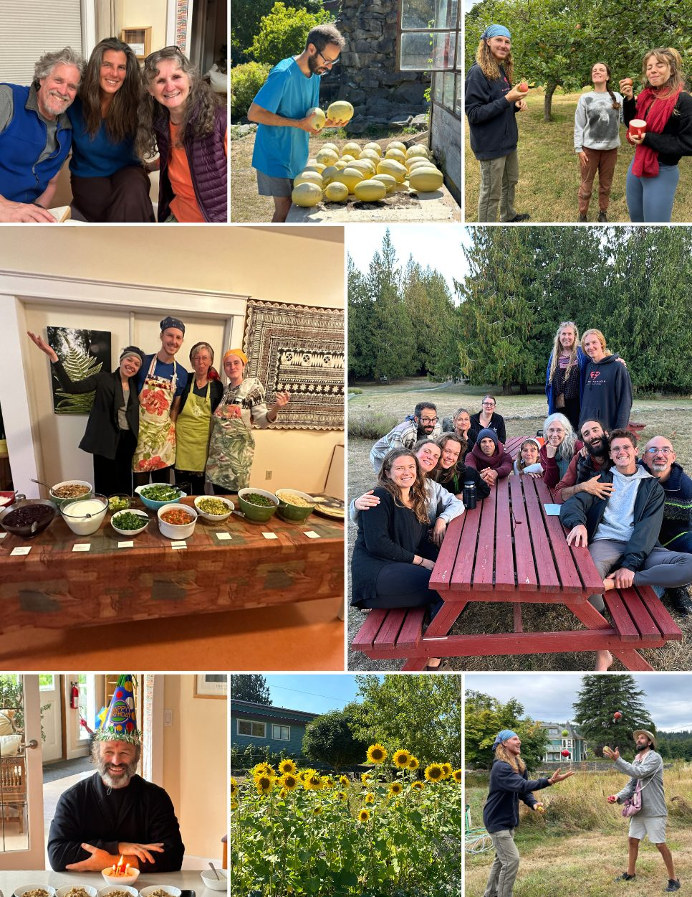
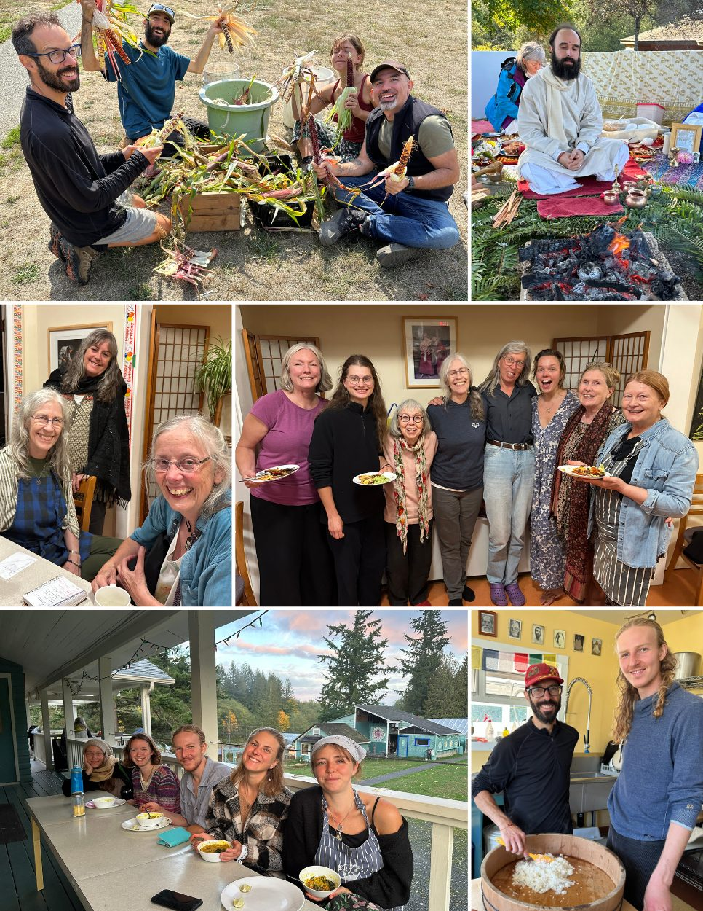

The miracles of Mother Nature are such a gift - the changing of the seasons, the harvest from the garden, the orchard, the walnut trees down the driveway!! The orchard trees were bright with apples and pears, a bumper walnut and bumper pear crop. Plus, all the seeds in the garden that were planted, some transplanted, all tended by the farm team and other karma yogis have manifested into abundant harvests.

So many types of squash: delicatta, butternut, buttercup, hokkaido, spaghetti, and pumpkins - and beans: green beans, dry beans; kidney, white Ruckle, speckled, and little reds, orcas. Also carrots, potatoes, beets, zucchini, cucumbers, and kale, chard, peas, raspberries, blueberries, blackberries! Big thanks to the planters, the pruners, the weeders, the harvesters, the cooks – so much appreciation to all the wonderful people who helped make this happen. We are excited to tally the figures for the recorded produce brought into the kitchen and see what it has saved us in food purchases this year.

Also, Ana's garden/field is such a sweet creation in memory of Ana, grown from her treasured corn cob from last year’s harvest of painted corn. It is now a field full of corn plants taller than me, surrounded by sunflowers and edged with amaranth, spreading out into more beets, carrots, peas, and kale. Bright and beautiful, a tribute to Ana’s bright and beautiful being, now in spirit!!

The monthly Yoga and Wellness Retreats are very well attended and a joy for us to offer and serve. Thank you very much to all who help during the program and the teachers who volunteer to come and present the classes. People leave so relaxed and recharged.
Another program highlight this time of year is the 6-day silent retreat for doctors to de-stress and learn self-care practices, mindfulness, meditation, and each evening ends with a dharma talk. Participants are so grateful for being on the receiving side of so much loving care – and fabulous food!
We are looking forward to welcoming guests to our final few programs of the 2023 season, including our November Yoga & Wellness Retreats, the [Going Deeper Silent Retreat](https://saltspringcentre.com/programs-retreats/going-deeper-silent-retreat/), and various rental programs, before winding down for a quieter winter period.
We've also recently opened registration for our [2024 Yoga & Wellness Retreats](https://saltspringcentre.com/programs-retreats/yoga-and-wellness-weekend-retreats/) if you're looking to visit the Centre next year!

The bookings for [AirBnB rooms](https://www.airbnb.ca/users/show/465565369) during non-program times has been slow this year. The whole island has felt a drop in bookings; people are travelling elsewhere now that they can. Yet, some are coming in and long weekends have been better.
The office team provides the hub and support for all needs and activities. They take care of the administration and logistics for the resident programs, public programs, guest services, meet and greet enquiries, plus outreach through our social media shares, and replies to and updates on our [fundraising campaign](https://saltspringcentre.com/together-we-can-sustain-the-centre/).
Thanks to all who have donated!! We really need to reach our financial goal by the end of the year - paying off the government loan to receive the $20k gift for paying on time (December)!!

Like the seasons, the ebb and flow, the comings and goings of Centre life continues. Several people have headed off in the last month, moving on to their next adventures. We wish you all the very best and thank you so very much for everything!!
We give a big welcome to our new karma yogis joining the Centre community during the fall season through to November 30 as we serve more programs, begin winterizing projects, and finish the last of the garden harvesting.

Monday, Thursday, and Friday yoga classes continue with Centre teachers. Please check the [website](https://saltspringcentre.com/programs-retreats/yoga-classes/) for classes and times, online and in person. Arati, Tuesday, Wednesday and Thursday, (6:30 am) has moved inside to the Satsang room for the season. Bhagavad Gita and Yoga Sutra classes continue each week. Check our [website](https://saltspringcentre.com/programs-retreats/events-calendar/) for all our offerings, including Sunday satsang, and please join us if you can.
Recently we held an outdoor fire yajna for Babaji’s Aradhana. So much gratitude to Babaji for his teachings, his example, and loving care for all. His Grace continues.

Prayers and mantras of Universal Peace from our hearts for love and peace to prevail for the suffering and injustice in the world. Prayers have no boundaries, we are beings of energy and light.
Those of us here at the Centre are so grateful to the whole Satsang family and friends near and far. Thank you for our connections and your support. Together we can make a difference!!
> “Peace in the mind,
>
> Love and compassion in the heart,
>
> Bring the scattered world into one reality.”
>
> - Baba Hari Dass

