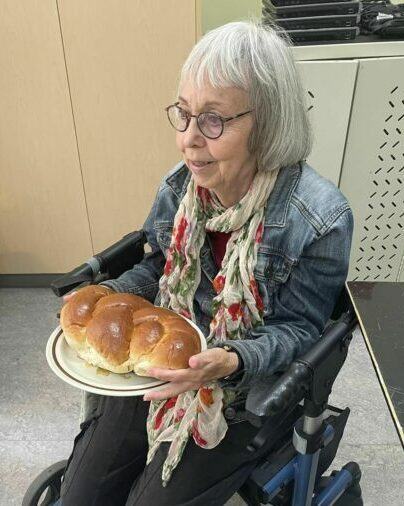
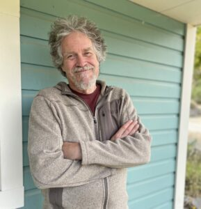

### September 2023 update

On this 40th anniversary of the Salt Spring Centre School, we’re happy to report that the school is open! There were some unsettling days before the first day of school, but everything has come together.
Dharma Sara Board appointed Sharada, Kalpana and OmPk (Mark Classen) to the School Board to work with the existing Board.
We’re very grateful to Ompk for having stepped into the role of interim principal. Usha is once again ‘hands on’ with the school, and comes to teach/play with all the kids on Tuesdays. Sharada shares and teaches about the holidays and festivals from many cultures. School enrollment is small, but the energy in the school is peaceful and happy, and we anticipate a successful school year!
**Sharing Holiday Traditions**
In the school’s tradition of celebrating all cultures, Sharada had the pleasure of leading the students in a Rosh Hashanah (Jewish New Year) celebration. The focus was on appreciation for the goodness in our lives.

---

#### Letter to the SSCS Community

*September 2023*
*Dear SSCS Community,*
*My name is Mark Classen, and I would like to introduce myself to the Salt Spring Centre School community. I have been asked to serve as the Interim Principal at the school due to a critical family emergency which has caused the current school Principal to temporarily withdraw from the role.*
*For those of you who appreciate “credentials”: I am a recently retired school Principal with sixteen years’ experience in public and independent schools. My last assignment was an 11-year posting in a small arts-oriented school. I started my career teaching intermediate students at the Salt Spring Centre School in the 1990’s working closely with the founder, Usha, who was my mentor. I hold a BC Professional Teaching Certificate and a master’s degree in Curriculum & Instruction.*
*More importantly I am deeply dedicated to the ideals that inspired us when the Centre School was started. As an active member of the Centre community since the land was purchased in 1981, I carry in my heart the ethical and spiritual ideals which inspire both organizations. I will always stand for integrity, inspiration, inclusiveness, and dedication to our common vision.*
*What does that look like? We will renew our school as a true learning community: academic excellence, compassionate relationships, genuine collaboration with families and the flexibility that only a small school can have to face the challenges of today’s world. We especially wish to truly inhabit and learn from the beautiful 70-acre property which is our precious gift— the wild land and the farm.*
***I hope this vision inspires you and that we can work together to learn and create something magical! If you wish to meet with me about any concerns, please make an appointment through Shauna, the school administrator, or chat with me on the playground. Thank you for trusting your children to our care.*
*Mark*
*Salt Spring Centre School acknowledges that we live and learn on the shared, traditional, unceded territories of the Coast Salish Peoples, specifically the Hul'qumi'num and SENĆOŦEN speaking peoples.*

---

### October 2023 update

We're happy to report that life at the Salt Spring Centre School is going very well. Although enrollment is lower than past years, the students are loving school and the families are happy. Meg, our new primary class teacher has now moved to Salt Spring, making her life easier. For the past few weeks she was commuting from Victoria and during the days she couldn't be here, Helena, a Centre School alumna, now a teacher and counsellor, filled in. The primary class kids have been well served by their teachers, along with extra support from Usha. Daniel, our creative and fun intermediate class teacher, teaches the older kids.
All the ongoing school traditions continue. The Halloween pumpkin walk was fun for everyone, and as always the jack-o-lanterns were spectacular. Usha has been teaching all the children the songs we sing every year at our annual Celebration of Light which is scheduled on November 28. If you're on Salt Spring that day, please join us for a delightful evening of light and song as we remember the light that continues to shine inside us as we move into the darkest time of the year.
Be a living light!
