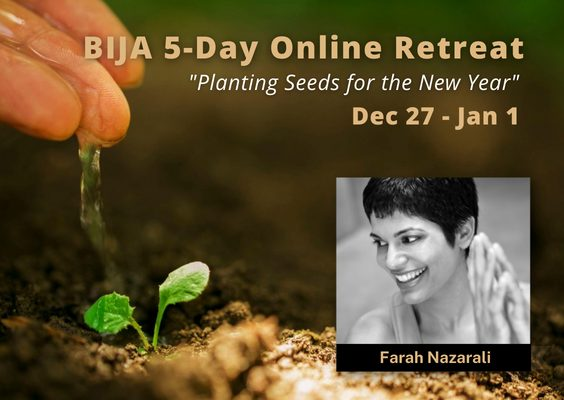

(*originally posted December 5, 2022*)

Do you find yourself losing touch with your yoga or meditation practice over the busy holiday season? Do you start the new year feeling off-kilter, drained, or needing another break? 

The frenzy of the winter holiday season can leave us feeling ungrounded and off-kilter, but reconnecting with your yoga practice can help you reset for the year ahead.

Farah Nazarali will once again be offering her [BIJA: Planting Seeds for the New Year Online Retreat](https://saltspringcentre.com/events/bija-online-retreat-farah-nazarali/) from **December 27 - January 1**, for those looking to start off their new year with a strong yoga practice. 

*A portion of the proceeds will be donated to the Salt Spring Centre of Yoga.*

We spoke with Farah about her plans for this year's [BIJA retreat](https://farahnazarali.com/bija-online-yoga-retreat/).

---

#### [vcex\_spacing size="20px"]

### Q&A with Farah Nazarali

#### ***What was the motivation for offering BIJA?***

The holiday season can be a difficult time of year. If you are estranged from your family or if there are toxic and dysfunctional dynamics among family members, the holiday season can be emotionally stressful and draining. In addition, December tends to be a time of year of over-indulgence, excessive sugar and alcohol consumption, over-eating, late nights, and the amplified hustle and bustle of consumerism that reaches its peak during Christmas. 

What I have noticed in myself and in many students is a hangover from the crazy excess of the holiday season and a lack of motivation to start with new habits until after New Year Eve when there is a repetition of excess and indulgence. I decided to offer [**Bija: Planting Seeds for the New Year On-Line Retreat**](https://farahnazarali.com/bija-online-yoga-retreat/) to help people face the holiday season with a different approach - moderation, simplicity, and yogic practices that keep us grounded and balanced.

What is unique about this [**Retreat**](https://farahnazarali.com/bija-online-yoga-retreat/), is that it offers a combination of live and pre-recorded components so students can participate in family and social gatherings and fit classes and workshops into their day.

A typical day looks like this: a morning yoga video, in the afternoon, an optional podcast, journalling, or a workshop, and ending the day with either a Yoga for Sleep class, Yoga Nidra, or a Yin Yoga class 

[vcex\_spacing size="30px"]

#### ***How does an online retreat work?***

People often assume that online means glued to the computer; but it doesn’t. This retreat includes journalling, listening to a podcast, and best of all - cooking!

Since I am no stranger to "Zoom fatigue", I created an on-line retreat that requires minimum online engagement. In fact, I encourage students to take time away from digital devices for the duration of the retreat. 

The retreat also includes a golden mylk mix as well as delicious daily recipes? Food is such an integral part of the retreat experience and with a meal kit, students have the opportunity to cook a delicious, nourishing meal for themselves.

[vcex\_spacing size="30px"]

#### ***You mention that everything we do and say impacts our subconscious. How can yoga help with negative patterns we wish to change?***

There is a famous saying, “Watch your thoughts, they become your words. Watch your words, they become your deeds. Watch your deeds, they become your habits. Watch your habits, they determine your character.”  By immersing in yogic practices and yogic wisdom, we become more aware and conscious of our actions, our words, and our thoughts. Through this consciousness, we can change our habits. All of this happens through practice. 

As Baba Hari Dass, says, “If you work on your yoga, your yoga will work on you.”

Yoga is more than physical postures, it is a holistic system of awakening consciousness. When consciousness awakens, we can shift our perception, change long-standing behaviours that don’t serve us and most importantly, we awaken to love and Divine Grace. Our lives become more purposeful and oriented towards serving others and in being in “right relationship” with Mother Nature.

[vcex\_spacing size="30px"]

#### ***You are very generously donating the proceeds of this retreat to the Salt Spring Centre of Yoga. Can you tell us about what prompted this beautiful gift***

I am honoured to raise funds for the Salt Spring Centre of Yoga and to share part of the proceeds of this [**Retreat**](https://farahnazarali.com/bija-online-yoga-retreat/) to the Centre.

All wisdom traditions know that the secret to living abundantly is sharing and generosity. Giving is one of the Six Perfections in the book the Guide to the Bodhisattva Way of Life written by Master Shantidev, and when I studied this book, I became inspired to test for myself whether generosity works in creating abundance.

My karmic experiments over the years have proven over and over again that sharing and generosity are the best ways to ensure prosperity for all. Clinging and grasping to our money and possessions is rooted in scarcity. One of the Gurus from my Lineage says, “the goddess Lakshmi doesn’t like to be captured”. The true purpose of prosperity is sharing and the dharma of wealth is to provide for others.

[vcex\_spacing size="30px"]

#### ***What are some things that retreat participants can expect to take away from this experience?***

My hope in offering this **[Retreat](https://farahnazarali.com/bija-online-yoga-retreat/)** is to inspire people to commit to practicing yoga and testing for themselves the ethical guidelines of yoga – the yamas and niyamas.

In yoga, ethical living is not an ideology or dogma, it is offered as a science for happiness. When we integrate ethics into our daily life and into our relationships, we develop confidence, esteem and integrity. These foundational qualities help us develop trust and faith in life regardless of our life circumstances. Even amidst hardship and challenge, we can lean on ethics to provide us with a guide and road map that will lead us towards harmony and integrity.

[br]

[vcex\_divider\_dots color="#64979c" margin\_top="10" margin\_bottom="10"]

[br]

[br]

**Bija: Planting Seeds for the New Year** is a 5-day Online Yoga Retreat that takes place from December 27 - January 1. Each day includes 2 yoga classes (live on Zoom and/or a yoga video) and optional afternoon activities. All participants will receive a meal kit from **[Karuna Vihara Gourmet](https://www.karunaviharagourmet.com/)** and will receive additional recipes to try.

To register, visit [**https://farahnazarali.com/bija-online-yoga-retreat/**](https://farahnazarali.com/bija-online-yoga-retreat/).

[br]

[vcex\_divider\_dots color="#64979c" margin\_top="10" margin\_bottom="10"]

[vcex\_spacing size="30px"]

### About Your Host

Farah is an inspirational yoga teacher, podcast host, and advocate of yogic practices that support health, happiness and harmony.  She is founder of Drishti Point yoga Podcasts and has hosted podcasts for Hollyhock, Banyen Books, and Vancouver Co-op Radio. Farah specializes in facilitating transformational experiences in Retreat settings in BC and internationally. She teaches locally at Xenia Centre, Salt Spring Centre of Yoga, Hollyhock Leadership Centre, and leads international Yoga Retreats with True Nature Travels. She has a deep love for all things yoga and is profoundly inspired by the sacred texts of yoga, the teachings of Buddhism, and wisdom traditions that lead us to love, truth, and being of service.

Learn more about Farah at: [**www.farahnazarali.com**](http://www.farahnazarali.com/)

[embed]https://www.youtube.com/watch?v=Bx0IBCbqdQc[/embed]
