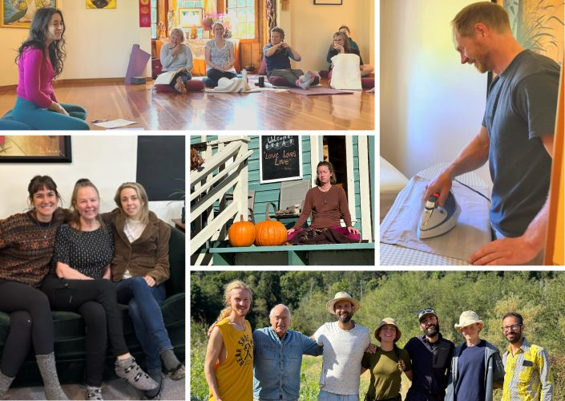
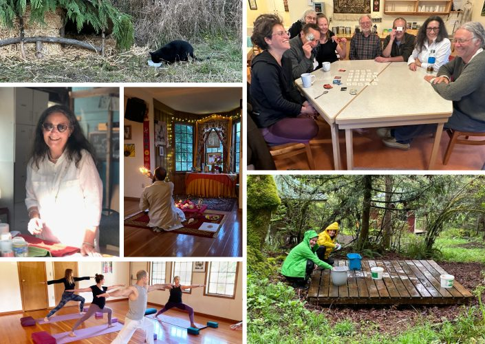
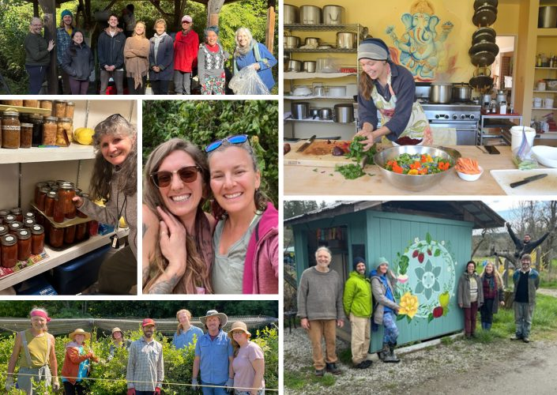
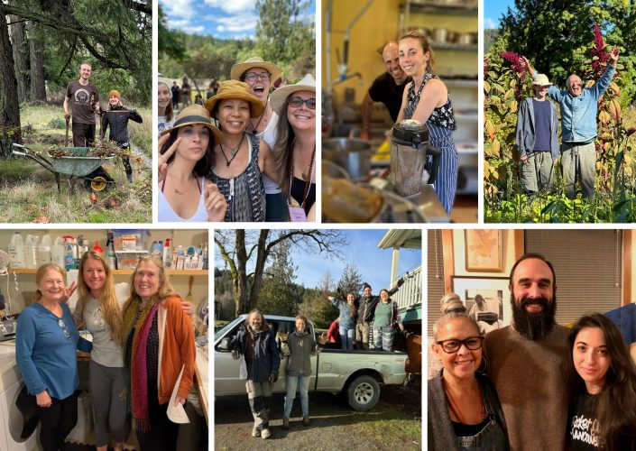
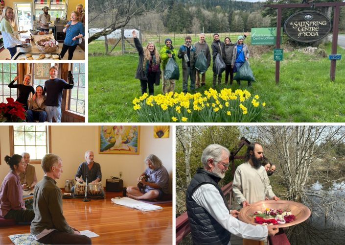
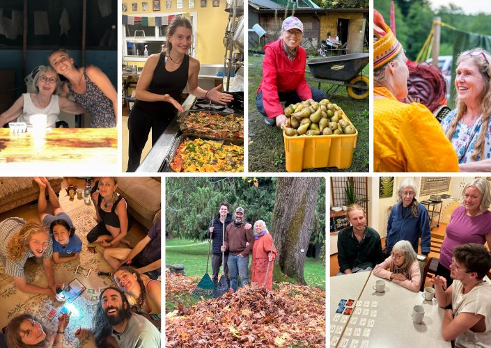

### Year End Review and Thank You!!

Thanks to all, we have had a successful 2023 year on many levels!!
**Thank you** for the donations this year to help pay down our debt and support growth. They help financially, of course, but also energetically. We feel the support of those near and far, and that energy keeps the Centre functioning with a positive vibration that attracts others to be involved.
**Thank you** to those at the Centre; the staff, community, and volunteers – involved daily.
**Thank you** to those on the Island, and the greater Satsang family and friends who have been able to come to the Centre. You have come to help in the garden, including harvest and processing; to teach classes; and help in programs/rentals and project areas, along with maintenance and odd jobs.
**Thank you** to those who attend Sunday Satsang – in person and online – and Wednesday night Kirtan.
**Thank you** to everyone who is an ambassador of the Centre – sharing the amazing offerings and opportunities, inviting friends and family, and attending programs as volunteers or participants.
**Thank you** to everyone who loves the Centre, who continue to wish the Centre the very best.
**Thank you** for all your prayers. And always we are grateful for Babaji’s Grace!!

### Season Highlights

The Centre office and administration team have done a great job creating, supporting, and delivering the pieces to keep within this year’s tight budget and support our fundraising efforts.
This year the Centre joined an online site that connected certified yoga teachers, who wanted to volunteer and teach, with retreat centres. Many of our wonderful volunteers this year came from this posting. It was truly a win/win, great people joining and building community, some offering weekly classes, and some taught in the Yoga and Wellness Retreats.

Our volunteers served in so many areas – the kitchen, in housekeeping, in the garden and farm, in the classes and programs, in the projects, maintenance, the art project of the farm stand and Latte Da paintings, the Centre signs cleaned up and painted, as well as the garden sales, harvest, and processing. This also included Island Satsang family and friends who were able to come and help throughout the seasons.

We had a very special garden planted in the summer, the memorial field and garden for Anastasia – Ana’s Field. It was a beautiful offering of sunflowers, painted corn, and the veggies she would use to make her borsht. For this next year, 80% of it is planted in our cash crop of garlic and in the Spring, we will again plant a simple and beautiful garden for Ana. A place of peace, love, and light!!

The attendance for Sunday Satsang and Wednesday night Kirtan has increased, as well as for the monthly Yajnas. We have all come together, either in time, with donations, and/or prayers and networking for the Centre’s success.

The Program Season finished the end of November. We followed up with many work parties and odd jobs. Deep cleaning of the kitchen, downstairs storage and laundry room happened, and we were able to clear many unused items to the thrift stores. Also, the exodus began of the community members who had signed up until end of programs. We now have a small winter community of the regular residents.

Wishing you all a wonderful season of Light and Love!!
Happy Hanukkah, Merry Christmas, Happy New Year and all the best for every day, moment to moment choices for peace and well-being from all of us at the Centre.
As Babaji would write:
> “Wish you happy and healthy”
> ~ Babaji
