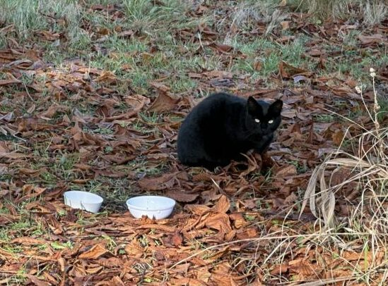
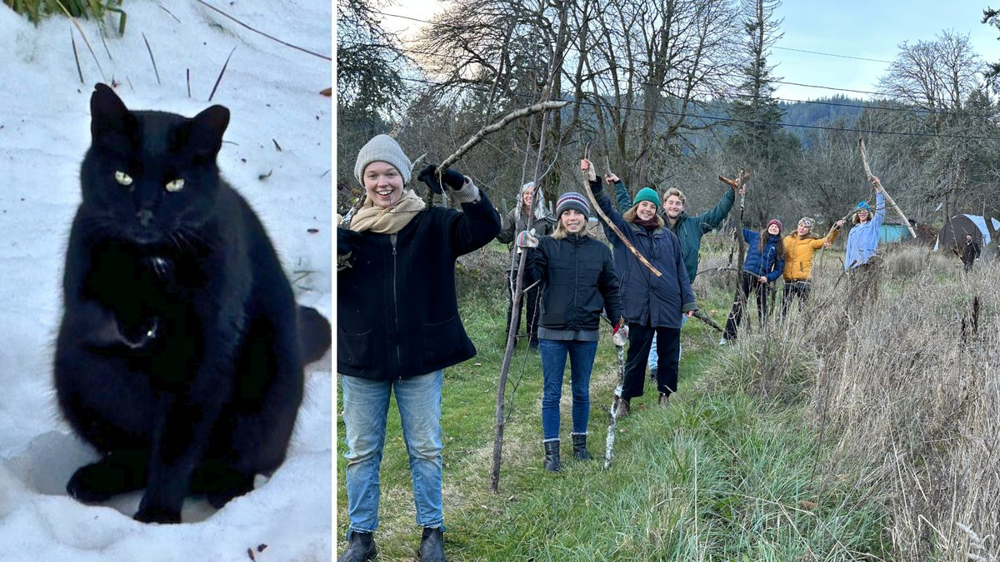
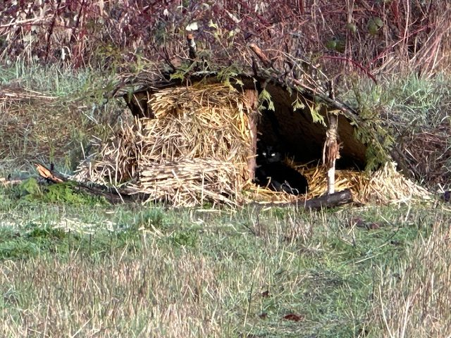

Once upon a time, in 2019, to be exact, a small cat was seen around the blackberry bushes and the orchard. She was a wild cat, and not long after its first appearance, we saw two little black kittens with her.
Lucky Lauren was with us at the Centre then and had experience in cat rescues. So, when the time was right, they were caught and went to the vet to be checked and neutered and then returned to the Garden. Lauren was finishing her Centre time and visiting friends who said they would take the two kittens. Once again, the kittens were caught. Garden Dan brought the carry case to the car. But it broke before he got there, and one kitten escaped and ran back to the Garden and the blackberry patch.
May I introduce to you *Prince of the Garden*.

He stayed out of sight, seen here and there on the property for the next couple of years. Mama Cat lives somewhere in the valley and appears every 4 or 5 months for a day to visit Prince.
Whenever Cathy came to volunteer, she would feed Mama and Prince. Lahiri also looked after them. We saw less of Mama. In the summer of '22, Lahiri was cutting blackberries off the fence. When he got across from Prince's bushes, Prince would come out and sit in the sun not far from where he was working. Seemed like Prince appreciated the company. We were feeding him under the horse chestnut tree by then if he showed himself in the Garden, still very wild.
Anastasia also got involved in feeding Prince, and that winter, the snow was so deep she dug a path for him from the bushes to the tree where he ate and beyond where she saw his footprints go. One day in the Spring, Ana told me that Prince was talking to her. She'd say, "Are you hungry?" *Meow*🐾 "Ready for breakfast?" *Meow*🐾 "Are you a beautiful boy?" *Meow🐾*. So we started to think maybe this wild cat would like to have some kind of relationship with us.
When the weather turned cold this winter, the community decided to build him a warm house by the blackberries. Branches and materials were collected. Andy and Sol headed up the project. We used straw, not hay, as it dries out better. Prince tried it out a few times. It's a beautiful house, with the sun shining on it during the day. But he ended up moving under the sauna for winter.

Prince was fed in the morning during the warm months and twice daily in colder weather. Because Ana told me Prince talked to her, I also started talking to him when I fed him. "What a beautiful boy, what a good boy."
In the Fall, he started rolling on the path before me and almost winding around my legs. Leah said he wants you to pet him. He started coming right to his bowl and not waiting for me to leave. One day, I leaned over and petted him. He ran back and looked at me. I told him, it's okay, and it's your call, all in your own time, Prince.

Fast forward, Prince is now happy to have me pet him. He comes out when I call, we play, and I can pick him up. Prince starts purring and will put his head on my shoulder. He meets me when I bring his food, purrs loudly when he eats, and I pet him.
After breakfast, we go to the temples and shrines in the Garden, then race back to the sauna to play hide and seek, and his latest is chasing the string. I'm hopeful that he will begin to trust others here, also. It is sweet to get to know Prince of the Garden. Lovee and Magic both passed away in the last two years. I miss them very much!! There is something special about having a cat for a friend. It's purrrrfect!!
Anuradha
