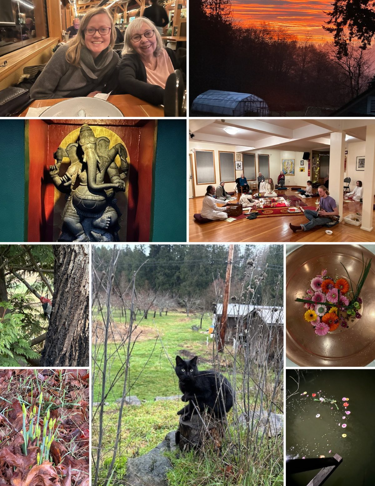
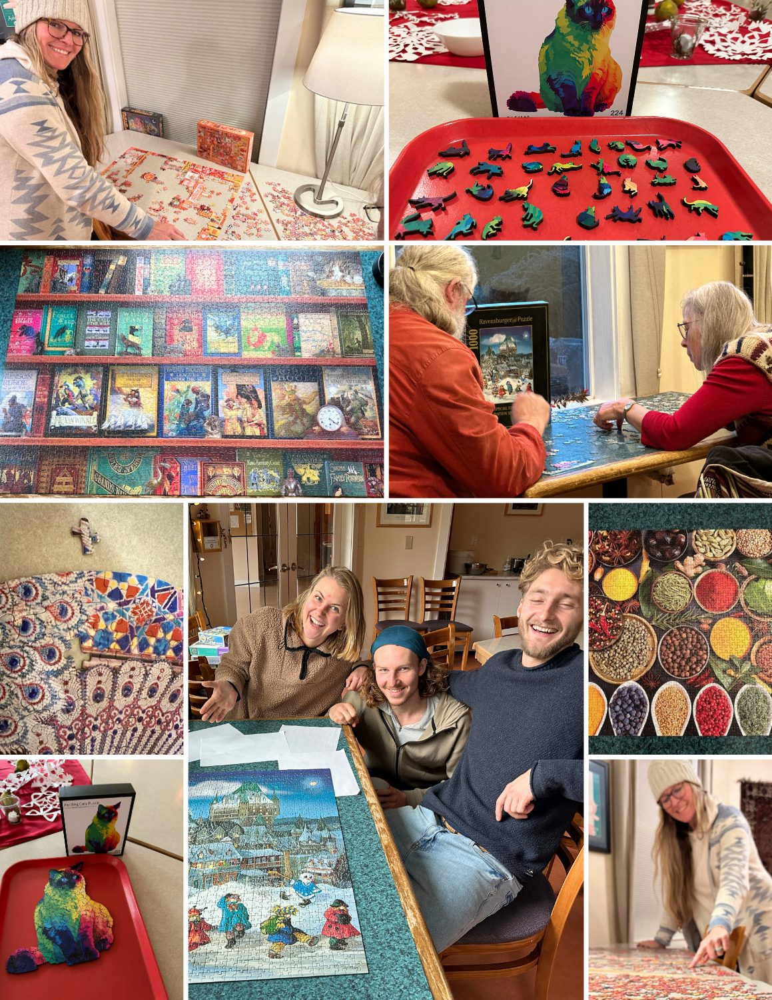

### A snapshot of life at the Centre in January and February 2024!

At the end of the program season, the tradition of Puzzle Season takes place.

Suneel is the puzzle master, but others also enjoy puzzling. As a part of the tradition, the last piece of the puzzle is always left out for a non-puzzler to complete. Interestingly, this piece happens to be Anuradha's favourite 😊.
The Cat puzzle comprises of 48 pieces, while The Peacock puzzle is half a century old!
