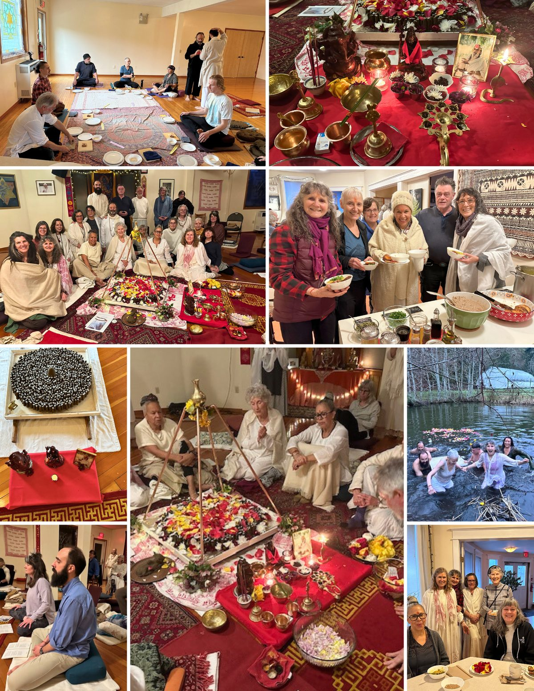
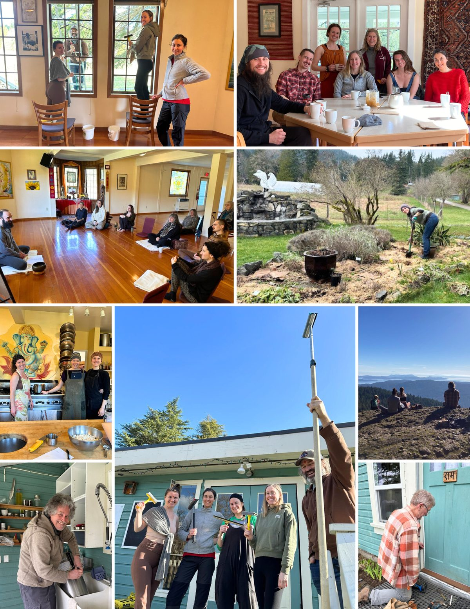
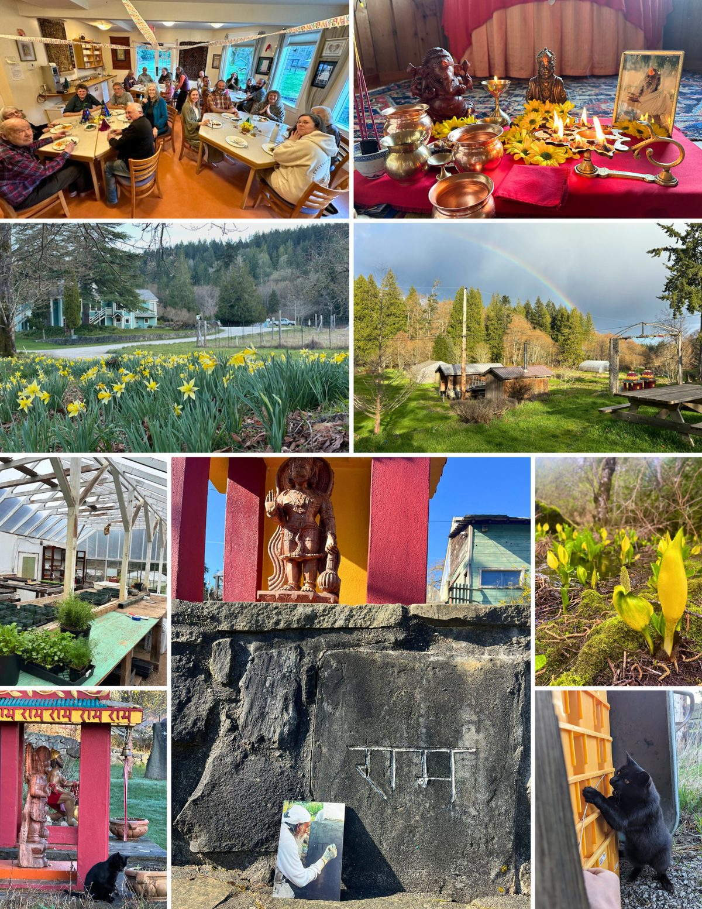

### A snapshot of life at the Centre in February and March 2024!

#### February ended with the celebration of Maha Shivaratri. It is an auspicious time to deepen our practice and affirm our devotion and discipline supporting that.

Starting early in the morning, 11 people gathered to make 1008 lingams while silently repeating the mantra given by Babaji throughout. The clay we used was dug from the Land and prepared for the lingams; it was very special to have that. The lingams represent the auspicious energy of Shiva, the destroyer of illusion and giver of peace, the protector and the Lord of Yoga, some of his qualities.
Fifty-plus people attended kirtan up until midnight; about 20 continued through holding vigil, with kirtan, pujas, asanas and prayers, until the morning. Then, there was the early morning puja, followed by a procession that took the lingams and offerings to the pond. Some folks also joined the offerings by going into the pond. Hara Hara Mahadev!!
 

#### 

#### We’re very happy to welcome new Karma Yogis: [Amy, Celine, Emitt, Julia, Paz and Aurelia](https://saltspringcentre.com/about-us/staff-volunteers/)

We had a wonderful weekend on their arrival with a mini Retreat. It was a great way to get to know each other and also to practice and play together.
Work parties were focused on getting ready for the first program of 2024. They included window and house washing, full clear and clean of the walk-in cooler, and repairs. We also have Tea Time on Tuesday and Thursday at 3pm. Like Babaji did!!

#### 

#### Spring has sprung, daffodils and skunk cabbage in full bloom!

Lots of farm, garden clean up and organization happening with greens coming on strong and other early plants in the glass greenhouse. A celebration dinner, with Arati before, for 90th and 80th community members' birthdays. A reminder of the importance of coming together and celebrating each other and Babaji’s Grace!!
 

#### The Yoga and Wellness Retreat, March 22-24, was the start of our 2024 program season.

Thanks to the teachers, the office, the kitchen, the housekeeping, the grounds and all the areas that were supporting to make it such a great success for all. We feel the effects of the collective energy when so many gather together in the spirit of Yoga. Jai Babaji!! Jai Satsang/Centre Family and Friends!!
Wishing all a wonderful start to April, and looking forward to seeing you online and at the Centre!!
