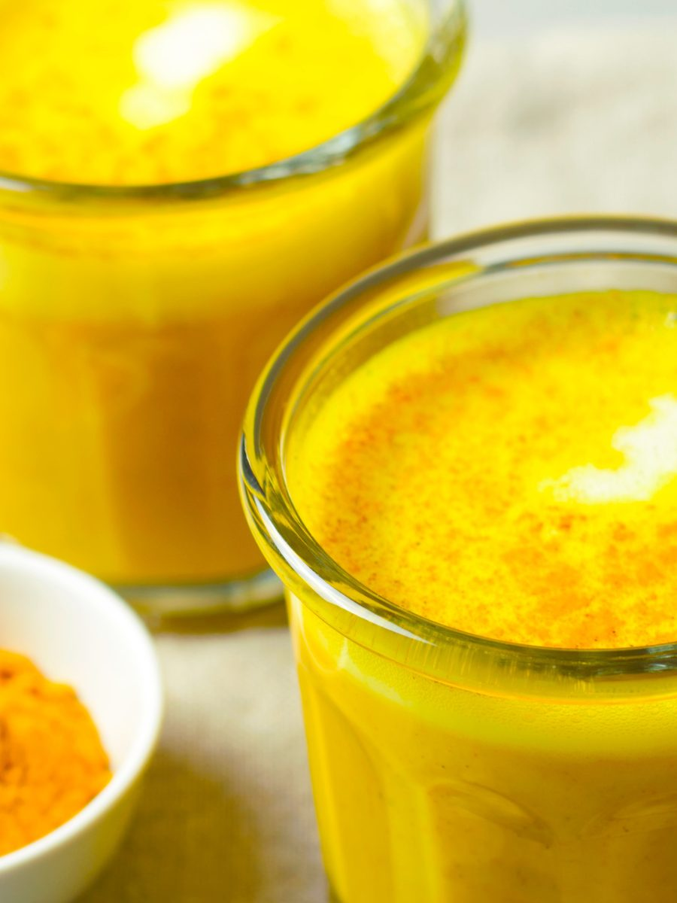

#### by Natasha (Jyoti) Samson

It’s true. You are what you eat, digest, assimilate & absorb. This is a saying in Ayurveda and also teaches us that our food profoundly affects our emotional health. 

If you are noticing you are stuck in a funk of: 

- Sadness, lethargy, hopelessness,
- Anxiousness, indecision, restlessness (especially at night),
- Frustration, jealousy, overwhelm, burnout,
- Rigidity (trying to control everything so you don’t go off the rails),

...you may be trying to keep yourself busy with work, exercise, and your endless to-do list, or even seeking help from counseling, but you still cannot shake off the recurring mood. This suggests that you may need to pay closer attention to your diet and how it impacts your emotional health. 

### The food we are eating has a profound impact on our emotional health

### depleted

Something you may not have known is that the food you are eating has a physiological ***and*** psychological effect on you.

Here is a simple layout that you may find fascinating - Ayurveda teaches us that there are six (6) tastes, each with a distinct effect on our mind. When taken in excess, they can make you feel the same way as the name given to that taste.  
  
Let's take the ***Sweet taste,*** for example: With a healthy balance of the sweet taste, your emotional state will be, well, sweet: experiencing compassion & bliss. With the sweet taste in excess (especially with harmful sweet foods), feelings of attachment & heaviness will pop up. Here, you have a choice point: start shifting the imbalance or fall deeper. When you fall deeper, you start to feel addictions, lethargy & depression.

What has a sweet taste? Some healthy options are dates, sweet potato, almonds, coconut, and salmon.

Unfortunately, though, when we try to self-medicate our emotions, we turn to sugar and sugary snacks, such as non-sour-dough flour bread (including gluten-free), pastries, cake, cookies, ice cream, pizza, pasta, and more. These choices can exacerbate our emotional state, leading to a vicious circle.

You know when you are in a lazy mood and just want to hit the couch and Netflix? Well, what are you usually in the mood to eat? Pizza, cookies or ice cream? Ayurveda tells us that *like increases like,* and the more of the “bad” sweet taste you consume, the more you will feel unmotivated, heavy and depressed. It’s just science!

### Shift Your Sweet Taste Cravings with Ayurveda

So, how do you get out of this cycle? Try this [Elevated Golden Milk Drink](https://nourishyoufirst.ca/recipes/golden-milk-drink-elevated/) recipe, licorice tea, or some homemade sweet treat from dates, cocoa, almonds and coconut. These delicious options will ease you into shifting your mindset without going cold turkey on the sweet taste.

We should also mention that adding sweet foods to your meals will help with the cravings, so say hello to purple yams, carrots, & mung beans more often. 

Of course if you want to make a major shift on your emotional health, you would pick a taste with opposite qualities than sweet - like green juicing kale, celery, parsley, apple and chlorella, which have predominate astringent and bitter tastes, and hit the dry sauna while you are at it. Babaji (Baba Hari Dass) did say “depression sweats out”. But more on how movement can affect emotions in the next article.

Fascinating stuff, right? If you are wondering about the other five (5) tastes, what they are, and how they affect your mind and your emotional health, you are going to love all things mindset shifting that will be covered in the upcoming transformational and experiential 5-Day Retreat: [“I Want More From Life”](https://saltspringcentre.com/programs-retreats/ayurveda-and-yoga-retreats/) Ayurveda & Yoga Retreat this Fall! [Check out the details here](https://saltspringcentre.com/programs-retreats/ayurveda-and-yoga-retreats/).

Wishing you the sweetest day.  
Natasha (Jyoti)

[vcex\_divider color="#dddddd" width="100%" height="1px" margin\_top="20" margin\_bottom="20"]

#### **Natasha Jyoti SamsonNatasha (Jyoti) Samson,  CYA-RYT 200, AHC, P.Eng.Ayurveda & Yoga Educator**

Intuitive healer with an engineer’s mind, Natasha has been studying, teaching and counseling for more than 15 years. Her love and passion are palpable to everyone who works with her or attends one of her events. She offers her gifts and skills with a servant’s heart and is a medium for divinely inspired healing.

Natasha is dedicated to sharing her deep understanding of healing the mind, the root cause of suffering, through engineering, ancient science, and intuitive knowledge. She draws from both the physical and philosophical wisdom of Ayurveda and Yoga and her own intuitive knowledge to connect with the root cause. As someone who is solution-oriented, she uses her natural problem-solving skills to find patterns in all aspects of your life and offers accessible tools, specific to you, to unblock your path.

“I Want More from Life!” Is the theme of her offerings, incorporating physical practices to shift the energy of the mind, food choices that will enhance your well-being, daily rhythms to help the body run efficiently, psychology to overcome limiting beliefs and internal blocks, as well as yoga, strategic movement, breathing and meditation. She integrates these applied sciences to engineer the human psyche towards greater happiness and contentment, all with the spiritual undertone of Mind, Body & Soul healing.

Natasha hosts retreats, offers courses, workshops, and keynote speaking engagements.  
Learn more at: [www.nourishyoufirst.ca](https://nourishyoufirst.ca/)  
Follow her on [Instagram](https://www.instagram.com/natashasyoga), [Facebook](https://www.facebook.com/natashasamsonyoga), [YouTube](https://www.youtube.com/@natashasamson-nourishayurv6185/videos), or [LinkedIn](https://www.linkedin.com/in/natashasamson/).
