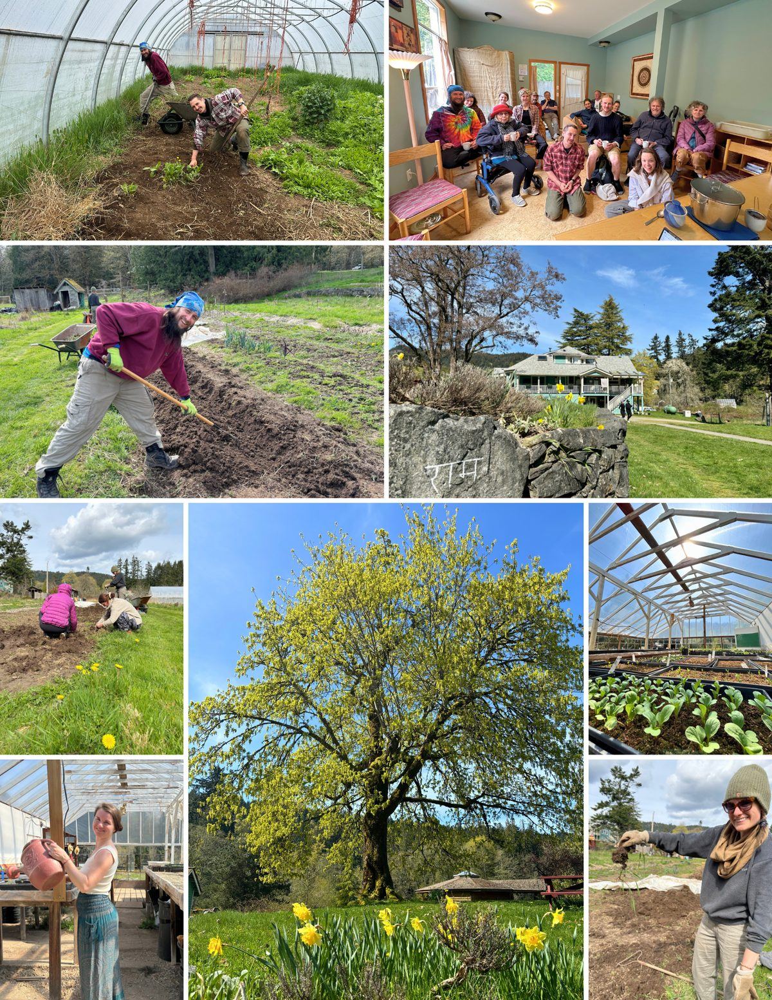
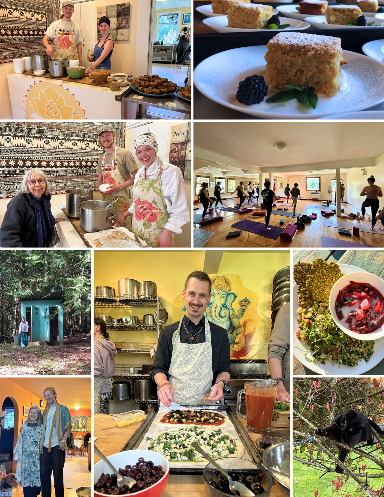
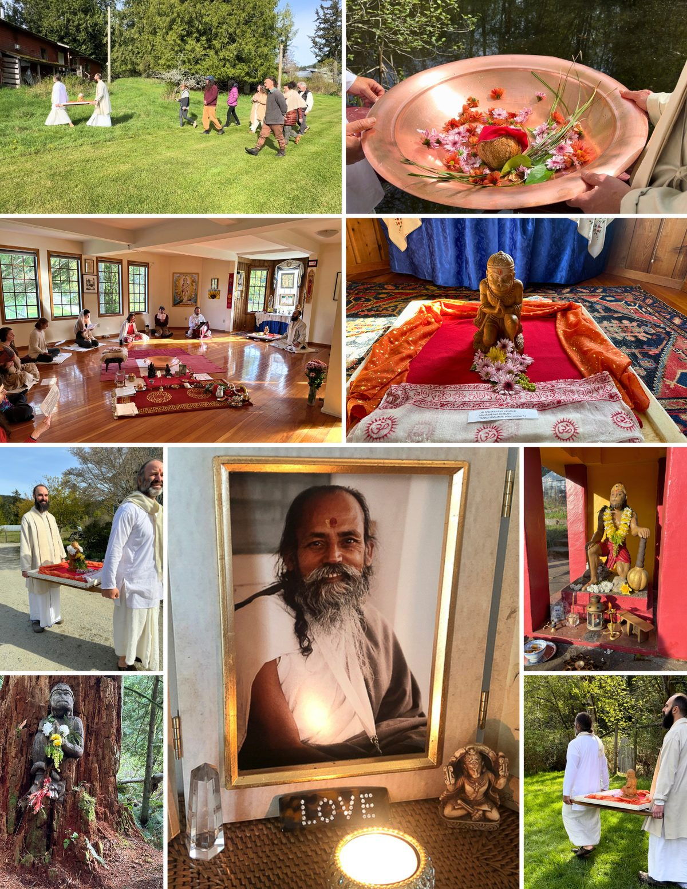

### A snapshot of life at the Centre in April 2024!

#### April brought the right mix of rain and sunshine for the beautiful transformation into Spring.

The farm team is preparing the outside beds as the glass greenhouse is abundant with plants started earlier. The mowing has begun, and the grounds look beautiful. The flower beds were also trimmed and cleaned up, on land and off land yogis. Karma Yoga is alive and well!! Babaji's maple tree on the mound is magnificent, along with the shades of green everywhere. 

Programs, our Yoga and Wellness Retreat, and rentals kept the Kitchen and Housekeeping teams busy. Also, Personal Retreats and some BnB bookings all available with meals now. It is always a gift to have the participants and guests discover the joy, peace and Grace!!

We celebrated Babaji's birthday, and Hanuman's too, with Hanuman Jayanti Ceremonies, Yajna and Land procession. And a pizza party dinner for a Centre b'day celebration!!

Registration has opened for the [50th Annual Community Yoga Retreat](https://saltspringcentre.com/programs-retreats/annual-community-yoga-retreat/)!! It will be Epic!!
The Centre wishes to acknowledge the passing of Satsang member Dinesh Wayne George Pallant in October 2023, in advance of his Celebration of Life on May 26, 2024. See the [In Memoriam page](https://saltspringcentre.com/about-us/in-memoriam/) for more information.
Jai Babaji!! Jai Satsang!!
With love and gratitude!!
Anuradha and the Centre Community
