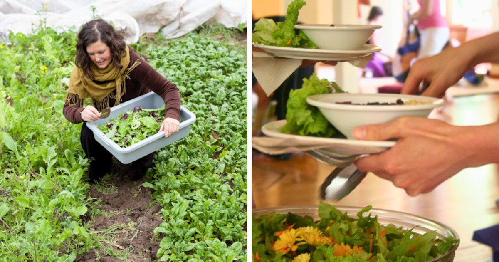

At the Salt Spring Centre of Yoga, we dedicate ourselves to offering pure, delicious, and nutritious meals that support the practice of yoga. We root our food philosophy in the principles of a sattvic diet and lifestyle, aiming to harmonize both our internal and external ecosystems.

### **The Essen****ce of a Sattvic Diet**

Sattvic foods bring one closer to peace, balance, and harmony, both with-in and with-out. Such foods are considered to have the highest amount of prana, or ‘life force’. They provide optimal nourishment and a calming effect on the body, mind, and spirit. Loosely speaking, sattvic foods include most fruits and vegetables, most whole grains, legumes, and nuts that are fresh, non-GMO, and free from chemicals. They are prepared with mindfulness and gratitude.

In keeping these principles, The Salt Spring Centre of Yoga embrace a simple and whole-food Lacto-vegetarian diet to support meditation by minimizing mental and emotional disturbances. Our meals feature dairy products in moderation while excluding eggs, fish, and meat. We also avoid onions and garlic to prevent overstimulation of the mind. We provide non-dairy and gluten-free alternatives for those with dietary restrictions at every meal.

### **Mindful and Loving Preparation of Sattvic Meals**

Our meals are fresh, tasty, and satisfying without being heavy. They are prepared with mindfulness and love, embodying the spirit of selfless service. We use organically grown produce from our own farm and supplement with high-quality organic produce as needed. Guided by our Kitchen Manager, our kitchen team crafts a variety of unique lacto-vegetarian dishes. These dishes blend time-tested Centre recipes with fresh, creative infusions that reflect the seasons and the spirit of those serving at the Centre.

### **A Legacy of Culinary Excellence in Sattvic Cuisine**

The Salt Spring Centre of Yoga has built a strong reputation for excellence in vegetarian cuisine. In 1993, we published our first cookbook, “Salt Spring Island Cooking, Vegetarian Recipes from the Salt Spring Centre",” which sold an impressive 52,000 copies. Finding a copy today often requires a lucky search on eBay or a used bookstore. However, during your stay, you’ll have ample opportunities to sample staple recipes from this renowned cookbook.
In 2001, we released a second cookbook, “The Salt Spring Experience: Recipes for Body, Mind, and Spirit.” This book combines yoga philosophy, practice, asanas, and Ayurveda with a variety of delightful recipes. It provides a comprehensive guide to living a yogic lifestyle. 

### **Adapting to Dietary Preferences, Seasonality and Locality within the Sattvic Diet Framework**

Each program and menu uniquely blends classics and modern infusions, tailored to the season, weather, produce, and guests' needs. We strive to accommodate a variety of dietary restrictions and preferences within the framework of sattvic cuisine, finding creative ways to make food a nourishing celebration for all. For comments, questions, recipes, or learning about sattvic principles, contact us! We love hearing from you. Reach our Kitchen Manager at [kitchen@saltspringcentre.com](mailto:kitchen@saltspringcentre.com).
For a more hands on opportunity in our kitchen, consider joining us for a [Karma Yogi experience](https://saltspringcentre.com/about-us/volunteer-opportunities/) or a [program or retreat](https://saltspringcentre.com/programs-retreats/). What better way to learn than to live the experience!
