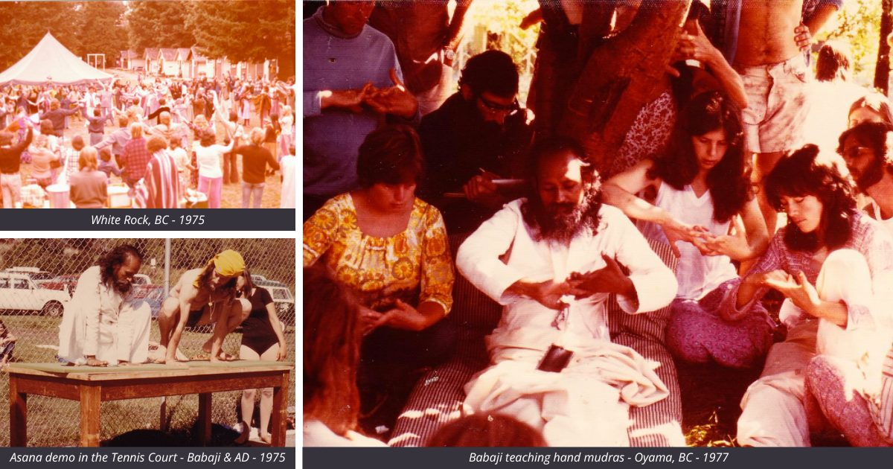
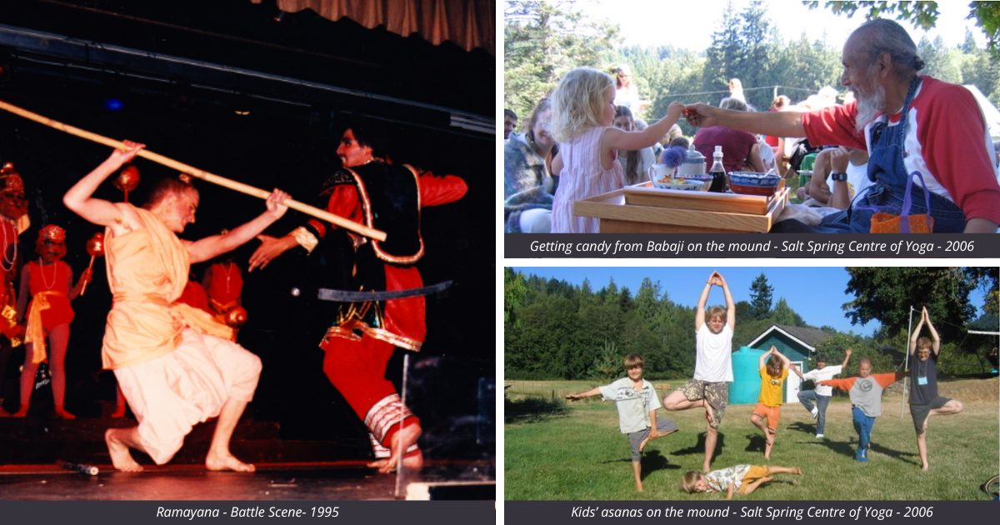
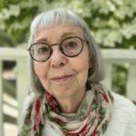

### The Birth of the Annual Community Yoga Retreat

Our [**Annual Community Yoga Retreat (ACYR)**](https://saltspringcentre.com/programs-retreats/annual-community-yoga-retreat/) is the highlight of our year, as it has been since the first one in 1975. When **Baba Hari Dass (Babaji)** visited Vancouver in 1974, a group gathered around him – the beginning of **Dharma Sara Satsang Society**. Babaji told us at that time that if we held a yoga retreat the next year, he’d come. That prompted us, inexperienced as we were, to begin to plan our first public yoga retreat in White Rock, BC. We had a lot to learn, but we were young and enthusiastic.

### The First Retreat: White Rock, BC

We put up some posters, and hundreds of people showed up. I recall that it rained for 9 of the 10 days of the retreat, but that didn’t dampen our spirits. The kirtan was awesome, the yoga classes were excellent, and the food was delicious. During that retreat, there was a wedding and a performance of the Ramayana brought to us by our California sister Satsang. ([Mount Madonna Center](https://www.mountmadonna.org/) and [Salt Spring Center of Yoga](https://saltspringcentre.com/) were in the process of developing.)

### Moving to Oyama, BC

For the next few summers, we relocated to a camp in Oyama, BC, where it was dry and hot, ensuring no summer rain. Nestled by Lake Kalamalka, the camp offered a main building, small cabins, a tennis court, and even canoes. We brought a large tent for asana classes, creating a vibrant retreat atmosphere.

#### Pre-digital Days and Registration

This was long before the time of computers or the idea of pre-registration. We’d gather for a few days with Babaji, during which we’d pack up everything we needed in U-Haul trucks to transport to the camp. I remember arriving around 1 pm and opening registration at the gates, locked until 4:00 pm. Around 400 people came, having found out about the retreat from posters in health food stores and ads in Common Ground magazine.

People didn’t arrive with yoga mats; there was no such thing at the time. What drew them was the presence of Master Yogi Baba Hari Dass, whose photo they had seen in Ram Dass’ book, Be Here Now.

#### Activities and Community Bonding

There were asana classes in various locations, the tent and the tennis court; yoga theory classes in the main hall, and lots of kirtan, games and even canoe races, as well as childcare for the many families who came with their kids – lots of kids! At dinner time, the meal circle was so large, it took a long time for everyone to get food, so we sang kirtan as the meal circle snaked around the room. Meanwhile the kids sat at a table with Babaji who played with them while they waited. It was the best place to be!

### Establishing the Salt Spring Centre of Yoga

During a meeting with Babaji during one of those years, he suggested we look for land to start our own yoga centre, a place where people could come to learn yoga and find peace. He was a silent monk; he wrote on his chalkboard, “Buy land.” Thus began the search for land which lasted a few years.

In 1981 we purchased the land that came to be called [the Salt Spring Centre of Yoga](https://saltspringcentre.com/). We held our first summer yoga retreat on the land in 1982. That was the summer we ran out of water. It was also the year we did our first production of the Ramayana in the barn.

### Growing Together as a Community

Every year after that Babaji came and we held our summer retreat, which over time came to be known as [ACYR (Annual Community Yoga Retreat)](https://saltspringcentre.com/programs-retreats/annual-community-yoga-retreat/), and our community continued to grow. Even when Babaji was no longer able to be with us, we kept going, even during the two years of Covid when we held our retreats online.

### Join Us for the Next Annual Community Yoga Retreat

We hope you’ll join us for the next Annual Community Yoga Retreat. We’re looking forward to celebrating this joyous time with you 👉 [Click here to know more.](https://saltspringcentre.com/programs-retreats/annual-community-yoga-retreat/)

Love,

Sharada

---

Sharada Filkow, a student of classical ashtanga yoga since the early 70s, is one of the founding members of the Salt Spring Centre of Yoga, where she has lived for many years, serving as a karma yogi, teacher and mentor.
