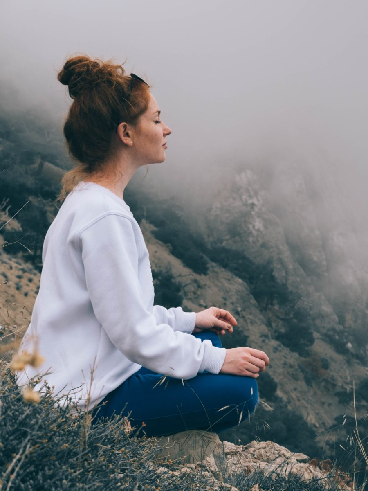

You are not alone.
This is a place I have visited, and had taken up residence a time or two.

## What is This “Dark Cave of Negative Emotions”?

It's a feeling of being sucked into darkness. You feel alone, disconnected, heavy, and lose sight of anything outside of it. 
It's not that you intentionally push people away, but you seclude yourself maybe to not burden anyone else, maybe because you don’t want anyone to witness you like this, maybe you need the noise, stimulation and triggers to stop.

## My Journey With Negative Emotions

My first time in this place lasted over a year, the immersion into the cave happened slowly over time. I was in a relationship that made me feel stuck, disrespected, and unloved. Though I had a good job, it was unfulfilling and far from what I desired to do with my life—all the while being fully attached to a parent suffering from a mental illness that I could not understand and wanted to save. I became a shell of myself, ghost-like. I felt like I had no control over my life and was too scared to change it because these events had weakened me.
The second time I went in there, I slowly emerged after 11 months. This one hit me even harder than the last, but my tools had improved and took less time to come out. 
Now, I still enter this cave from time to time, however, my stay there is only a week or two for the intense events and only a few days when I reach overwhelm or despair.
This timeline transition took a lot of work on myself, many tools, outside resources, and moving through several growth periods we have termed “mini-graduations”.

## Stages of Awareness of Negative Emotions

As our spiritual path unfolds and our sadhana accumulates, our levels of awareness shift.

### No Awareness:

We cannot see anything outside of what is happening to us. The ego’s desire to keep us safe clouds all other thoughts. We may think that God or the divine has abandoned us and we are truly alone. This stage is the most painful, we feel it, and you can be sure that our loved ones are equally affected. But we do not see that and often can really hurt the people around us.

### Glimpse of Awareness:

 You start asking yourself, “why am I feeling so angry and short-tempered” or “Why is this making me so depressed?”  “How do I get out of this feeling?”. At this point, you may break down and cry for help. Literally, I have cried to God to help me out of this feeling because I could not do it myself. I did not have the strength.

### Self-Recognition:

 You see yourself. This is my trigger of not feeling loved, valued or good enough. You stop blaming what is outside of you. You are shown there is still work to do on yourself. In this stage, we turn to books, podcasts, counsellors, and mediums to inspire further growth and self-awareness. This stage takes time and strategic tools to get out of. You start to understand that your life and where you are, what is happening externally, what you have and do not, is not the real issue; these merely bring to light that there is deeper soul work to be done and that your relationship with your mind, with yourself, is the thing that needs to shift.

### Higher Awareness:

 You understand the trigger, the big picture, have compassion for all involved and neutralize the emotions. You still fall and have a moment of despair, but your consciousness knows what it feels like on the other side, you will get through because you are not that same person who fell before, you are stronger and more aware and have gained the tools to pull you out.

## How to Emerge From the Cave of Negative Emotions

I want to share with you how I managed to get out and how I have helped other clients and friends emerge from this case as well. I hope to convey the tools and bring to light what you can implement right away.

### **Understanding negative emotions:**

Know that this cave is addictive. We continue our actions even though we know it is hurting us. This is a type of “safety” our ego is offering us because what is outside of the familiar is scary and beyond the ego’s “control”. 
There is a vicious circle that happens here. An action creates an impression, the impression then creates a desire, and that desire then leads to an action. We repeat our core wounds until we rise out of them. Think about a spiral upward that elevates by 2% with every spin. A new impression will create a new desire and a new action. 
The tools take so much effort. It is easier to sink down than to stand and fight. Master Yogi Baba Hari Dass (Babaji) has told us to “face, fight, finish.”  You need to know you are worth it. You are worth the fight. Your number one priority when you are in this place is you. You can not make an impact when you are in there, and you cannot help anyone else until you help yourself out first.

### **Acceptance of Your Situation:**

In the cave, you feel separate. I have this trauma, this is happening to me, and I am alone. You want the feelings and emotions to just go away, and you want to be yourself again. The attachment to these thoughts will keep you stuck. Remember, Babaji first said to “face” first. Accepting where you are is the first key to getting out. Instead of being angry, confused or depressed that you are here, which will keep you spiraling downward, take on radical self-acceptance and compassion and admit you are in this dark place and you don’t know for how long.

### **Taking Action to Heal:**

The tools offered by Ayurveda and Yoga span across the body, mind and energetic subtle body, and are individual to your specific emotional cave. There is more than what is outlined here (for this, you will need to read my upcoming book or [attend the Retreat this fall](https://saltspringcentre.com/programs-retreats/ayurveda-and-yoga-retreats/) to dive deeper into the actions you can take). 

## Healing Through the Body

### Recognizing Physical Sensations

**Ask yourself:**

- Where do I feel this pain?
- What is the temperature, shape, density, texture, color?
- What is it that I need to do to move this or release this?

Take a movement to visualize this. Do not merely put this aside, continue on, and hold it in. 
You may feel like you need a walk, a time out, a cry, a scream, a type of somatic movement or visualization to disperse this energy. You also need to not be afraid or feel guilty to take time for what you need at that moment.
Now if communication with your body is foreign to you, not to worry, it was to me at first, too. Here is some guidance to help you understand.

### Ayurveda is to Heal the Mind Which is Trapped in the Body

In Ayurveda, emotional states are often correlated with elemental qualities and doshas:

- **Heavy, dense, thick, and stuck:** Related to the earth element and Kapha Dosha. Often associated with depression, hopelessness, despair, lack, feeling alone and unloved, and no motivation or energy to go on.
- **Hot, sharp, and constricting:**  Related to the fire element and Pitta Dosha. Often associated with frustration, anger, overwhelm, resentment, jealousy and feeling like you are not enough or not valued.
- **Confused, unsure, ungrounded:** Related to the air element and Vata Dosha. Thinking about every scenario where things will go wrong and are in the pain of not being able to make a decision or bubbles of air stuck in the body. Often associated with anxiety, worry, paranoia, and feeling like your thoughts, feelings, and opinions are not heard or respected.

In each scenario, there is potential for transformation. Understanding your boundaries—both with others and yourself—is crucial. External triggers often mirror internal conflicts. For instance, if someone disregards your time, examine if you prioritize it for yourself in terms of goals and self-care. Similarly, if someone doesn’t make room for you, reflect on whether you allow enough space for yourself. Evaluating your self-worth in relation to others’ perceptions is vital for personal growth.
In Ayurveda, we say, “like increases like and opposites pacify” this is to say, if you continue to maintain habits, movement practices or food choices that have the same qualities as your emotion then you will increase that emotion. The opposite will help pull you out. Now you can also try to “self-medicate” with the wrong choice, so it is helpful to [understand the fundamentals](http://NEW BLOG POST). 

## Healing The Mind

Healing through the body will get you part of the way there. But there is more work to do still. Changing our thought patterns can also be achieved through more psychological tools. As mentioned previously, there are many external resources out there to offer assistance, like working with a counselor, reading self-study and growth books and listening to these types of podcasts.

### The Power of Journaling

A free and a powerful tool for getting past the ego and tapping into the root cause or the core wounds that have triggered this immersion into the cave. 
If journaling is something you have not tried before. A great way to start is to ask yourself a question at the top of the page and then start to write out the answer. Know that the first few answers are only from the ego, superficial, talking about fears, dislikes and external issues. You continue to dig deep, pulling away the layers and asking yourself “why” over and over, you will eventually get on the other side of the ego’s blockade and start to unveil the real truth.

### Breathwork and Meditation

These practices directly affect the mind and can be used strategically for your specific cave as well. A meditation can turn into a mantra or affirmation and perhaps allow you to feel the energy moving. Try a [breath practice](https://nourishyoufirst.ca/learn/breathing-practices/) or a [meditation practice](https://nourishyoufirst.ca/learn/manifestation-practices/). Feelings are stored not only in the body but in our subtle body as well, with each energy center (Chakra) being affected by our stuck emotions or energy. Releasing this may or may not lead to a physical release like tears, sweat, chills or a feeling of unrestricted flow. All are good and not to be feared if they happen to you. If you feel nothing that is also absolutely perfect as well.

## Healing the Subtle Energy Body

You can now see how the practices are leading towards another realm of release through the more subtle channels in the body. These tools are often less understood or even thought of to explore. What I love about energy work is that a person with a curious and problem solving mind can take a back seat as this work needs no mental exploration or understanding at all. 

### Clearing Energy Blocks

Clearing energy blocks can be done through breathwork practices and also through Reiki and other types of energy work, but it can also be intentionally done by you in your own home. The energy work I teach and [offer](https://nourishyoufirst.ca/consultations/energy-healing/) is specifically targeted to release stuck beliefs or energy from the chakras and subtle.
You will know if this step is for you if you have put in your years of self-study and work on yourself, but still, some version or fingerprint of your trauma or trigger rears its head. This is perhaps a sign that your chakras have some stuck energy to clear out.

## The Wrap Up

You may think:

- This was an overload of information and needed steps that are custom to you.
- You want additional support on this journey
- This information is fascinating to you, and want to learn more.
- I know someone that needs to read this.

If any of these thoughts have arrived, we would love to hear from you!
**Join us for the fall "I want more from life, Ayurveda & Yoga Retreat" 👉 [Click here](https://saltspringcentre.com/programs-retreats/ayurveda-and-yoga-retreats/)****Book a free chat with Natasha (Jyoti) 👉 [Click here](https://calendly.com/nourishwithnatasha/chat-with-natasha)****Share with a friend and [connect with us](https://saltspringcentre.com/connect/contact-us/) ❤️**
And I will leave you with these thoughts:
You need to do the work.
You are worth it.
I love you and support you.
Many blessings on your journey. 
Natasha (Jyoti)

#### **Natasha Jyoti SamsonNatasha (Jyoti) Samson,  CYA-RYT 200, AHC, P.Eng.Ayurveda & Yoga Educator**

Intuitive healer with an engineer’s mind, Natasha has been studying, teaching and counseling for more than 15 years. Her love and passion are palpable to everyone who works with her or attends one of her events. She offers her gifts and skills with a servant’s heart and is a medium for divinely inspired healing.
Natasha is dedicated to sharing her deep understanding of healing the mind, the root cause of suffering, through engineering, ancient science, and intuitive knowledge. She draws from both the physical and philosophical wisdom of Ayurveda and Yoga and her own intuitive knowledge to connect with the root cause. As someone who is solution-oriented, she uses her natural problem-solving skills to find patterns in all aspects of your life and offers accessible tools, specific to you, to unblock your path.
“I Want More from Life!” Is the theme of her offerings, incorporating physical practices to shift the energy of the mind, food choices that will enhance your well-being, daily rhythms to help the body run efficiently, psychology to overcome limiting beliefs and internal blocks, as well as yoga, strategic movement, breathing and meditation. She integrates these applied sciences to engineer the human psyche towards greater happiness and contentment, all with the spiritual undertone of Mind, Body & Soul healing.
Natasha hosts retreats, offers courses, workshops, and keynote speaking engagements.
Learn more at: [www.nourishyoufirst.ca](https://nourishyoufirst.ca/)
Follow her on [Instagram](https://www.instagram.com/natashasyoga), [Facebook](https://www.facebook.com/natashasamsonyoga), [YouTube](https://www.youtube.com/@natashasamson-nourishayurv6185/videos), or [LinkedIn](https://www.linkedin.com/in/natashasamson/).
