### Highlights From our 50th Annual Community Yoga Retreat: A Journey of Connection, Play, and Babaji’s Timeless Teachings

August 2024 was a milestone for the Salt Spring Centre of Yoga as we celebrated the 50th Annual Community Yoga Retreat. Over 300 participants joined, making the retreat more than just a gathering. It was a heartfelt reunion, bringing together generations united by their love of yoga, Babaji’s teachings, and the joy of community.
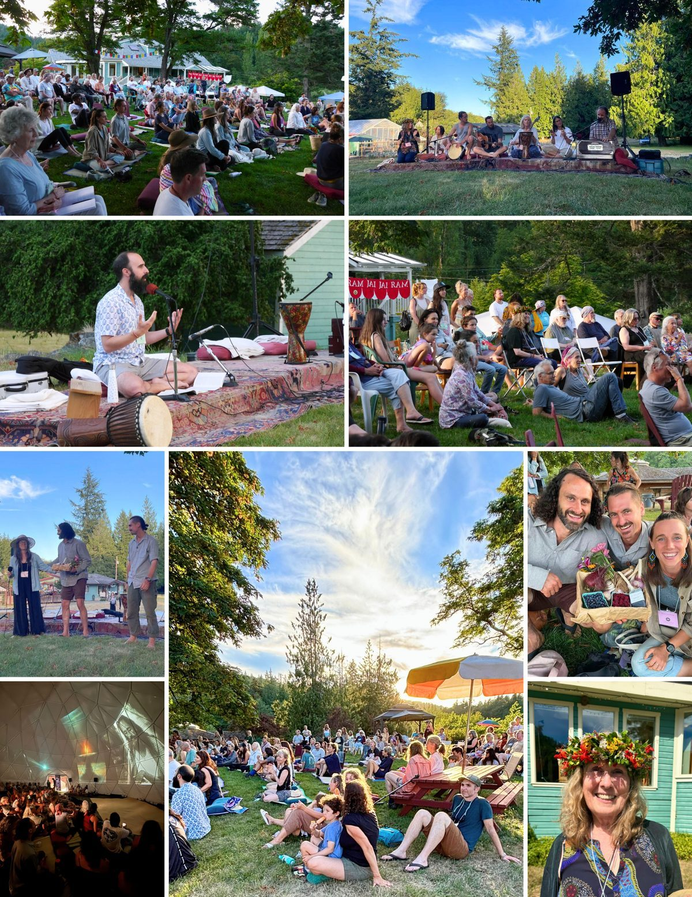

### A Reunion of Hearts and Souls

The retreat united old and new friends, many of whom have been part of this journey for years. The warmth of the welcome was felt by all.*“So wonderful to be back at the Centre.”* This sentiment echoed throughout the week as people reconnected with familiar faces and revisited cherished practices like early morning pad kirtan and satsang. Seeing old friends and spending time in a peaceful, beautiful place was a highlight for many. This underscored the deep bonds that have formed over the decades.

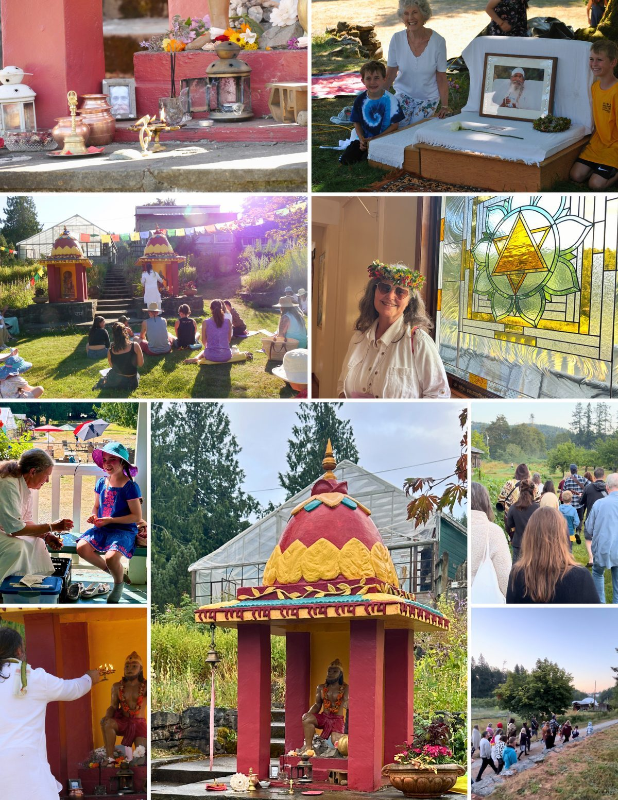

### The Presence of Babaji: A Guiding Light

Throughout the retreat, Babaji’s teachings were deeply felt. Participants shared how Babaji’s energy was *“so very palpable, shining and permeating”* every aspect of the retreat. Whether in quiet reflection or during vibrant satsang, Babaji’s presence was a guiding light, bringing peace and purpose to all.
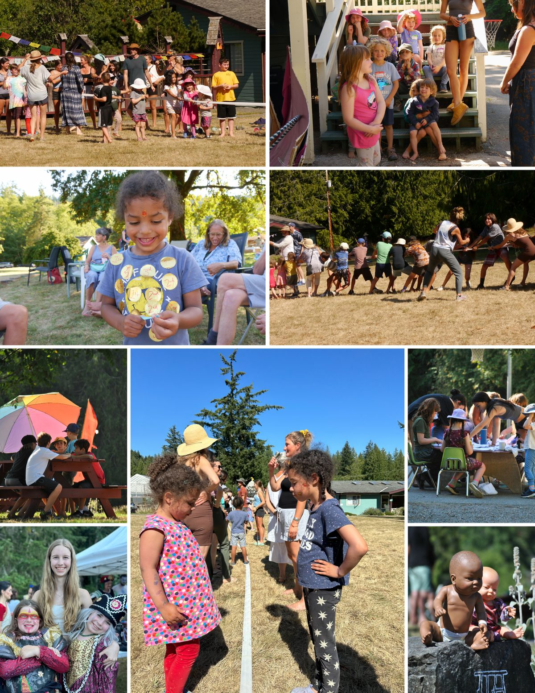

### A Celebration of Playfulness and Connection

The retreat is also a celebration of playfulness and connection. This year, the multigenerational aspect was especially meaningful, with activities for all ages. *“We all came home to the Salt Spring Centre.”* The kids’ program provided space for the younger generation to explore, learn, and have fun. Meanwhile, parents and grandparents engaged in classes and workshops. The Hanuman Olympics, always a highlight, captured the spirit of play and togetherness that defines our community.
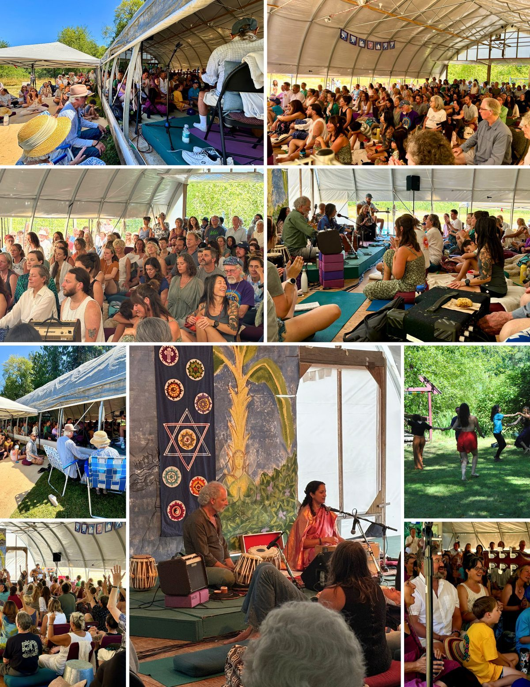

### Nourishing Body and Soul

No retreat at the Centre is complete without delicious, thoughtfully prepared meals. This year, the food was a particular standout. *“It was truly amazing to produce such wonderful vegetarian meals for all tastes.”* Shared meals became moments of connection. Stories were exchanged, and laughter filled the air, nourishing both body and soul.
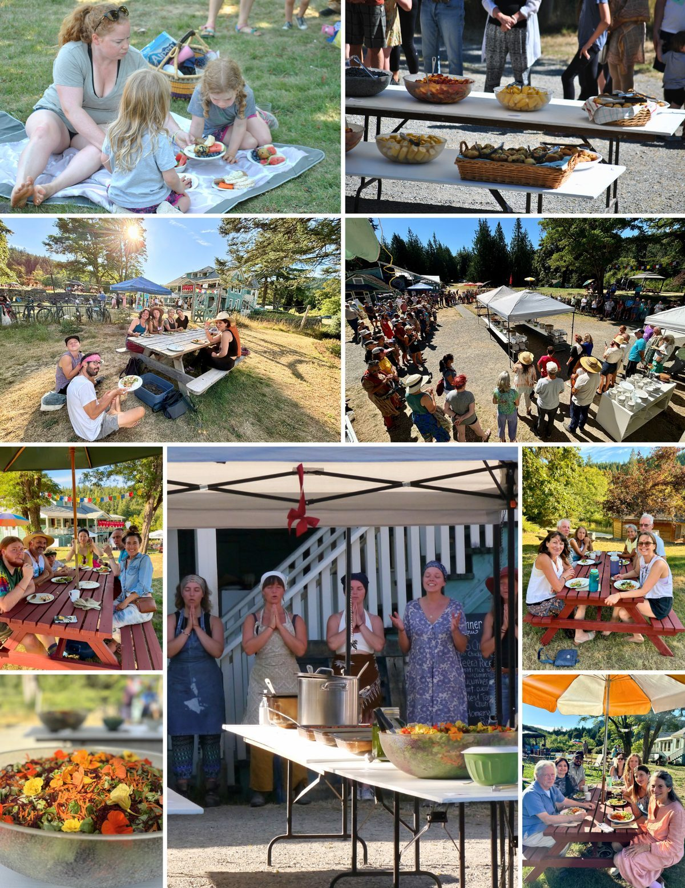

### Deepening Practice: Pranayama, Meditation, Asana and Philosophy

The retreat offered a variety of yoga classes for both beginners and experienced practitioners. Each morning began with calming pranayama and meditation, setting a reflective tone for the day. The diverse asana classes allowed everyone to deepen their practice under skilled teachers throughout the day.
Beyond physical practice, the retreat emphasized yogic philosophy. Discussions on the Bhagavad Gita and the Yoga Sutras provided profound insights, connecting participants with the spiritual essence of yoga and Babaji’s wisdom. *“It is not often that we get to sit with so many who have studied these texts for so long. It was rich, inspiring, encouraging, and uplifting.”*
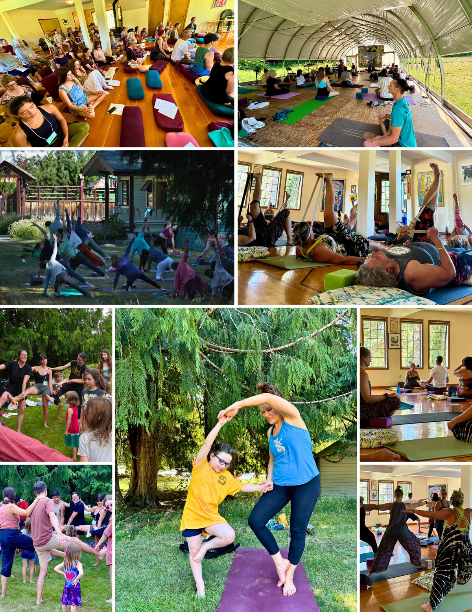

### A Community Effort: The Heart of Karma Yoga

Karma Yoga infused every part of the event. Whether volunteering in the kitchen, helping with setup, or assisting in the kids’s program or different activities, every participant contributed.*“There was a wonderful feeling of inclusiveness in being a part of putting on the retreat.”* This collective effort blurred the lines between spectator and participant, creating a sense of belonging and unity.
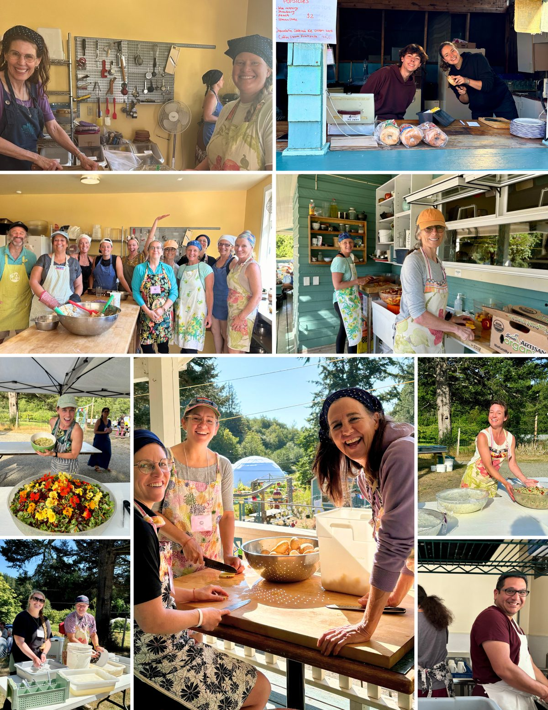

### Unforgettable Moments: Ramayana, Talent Show, and Sacred Gatherings

The retreat was filled with unforgettable moments. The Ramayana play, a beloved tradition, brought joy and laughter to all who attended. The Latte Da Talent Show showcased the diverse talents within our community, ending the retreat on a high note of creativity and fun.
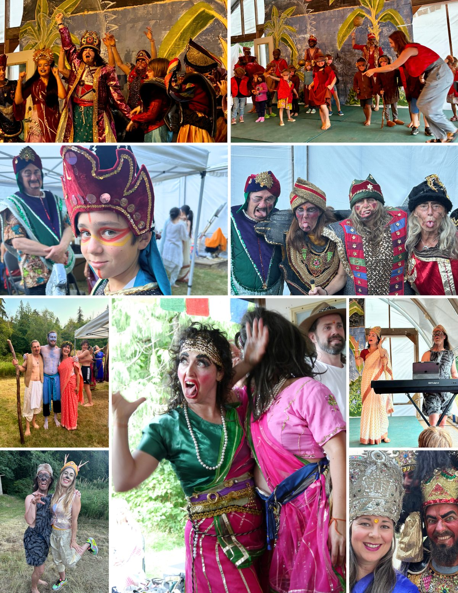
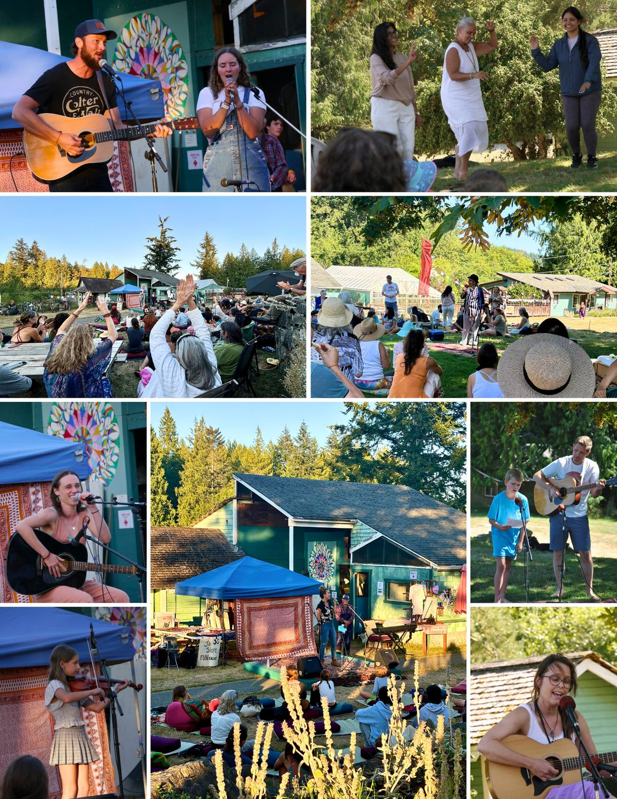

### Gratitude and Looking Ahead

As we look back on this incredible 50th anniversary, our hearts are full of gratitude for everyone who made it possible. The retreat was a testament to Babaji’s teachings, the strength of our community, and the practices of yoga that continue to unite us.
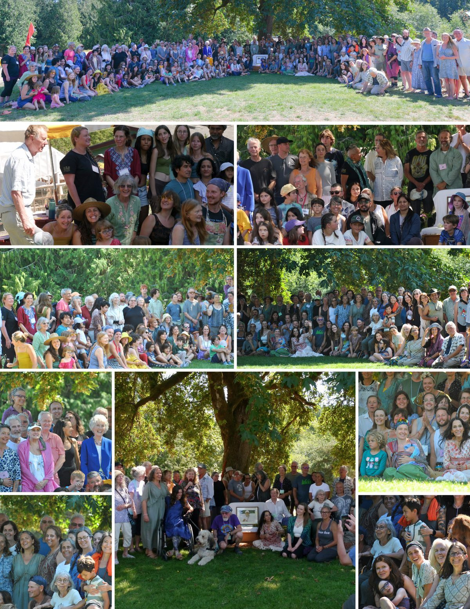
For those who couldn’t attend, know you were in our hearts. We missed you and hope to see you at future gatherings. If you haven’t experienced the Annual Community Yoga Retreat yet, [we look forward to welcoming you next year](https://saltspringcentre.com/programs-retreats/annual-community-yoga-retreat/)!

Jai Babaji! Jai Satsang! 💖 🙏

*Italicized phrases are feedback from participants, reflecting their experiences during the retreat.*

**"I love you whether you know it or not. You asked about our relationship. It's a relationship of guru and disciple in which all relationships merge. You will know me through sadhana. You can't understand me by seeing my physical body. How the body acts, plays, shows pleasure and pain, it's an illusion. If I have to know you, then I have to see inside you and not your physical body. My only aim is to bring people in sadhana. For me sadhana is not only asana, pranayama, and meditation. Sadhana includes developing positive qualities, building right conduct, closeness with parents, friends, and society, right livelihood, ect."**
**- Baba Hari Dass**

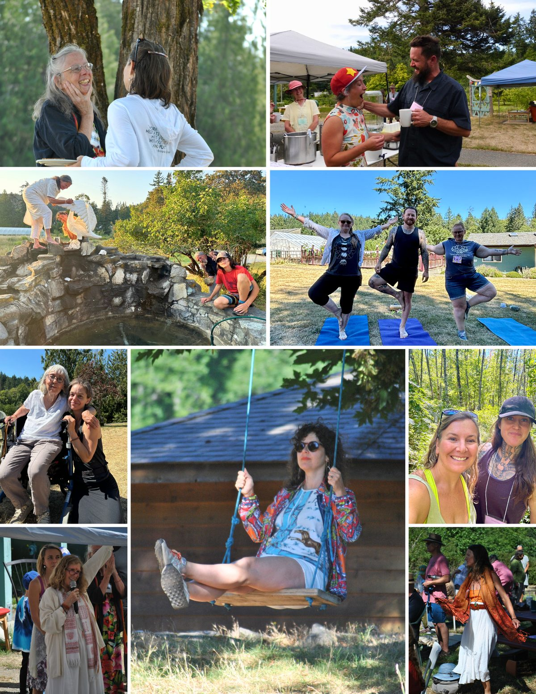 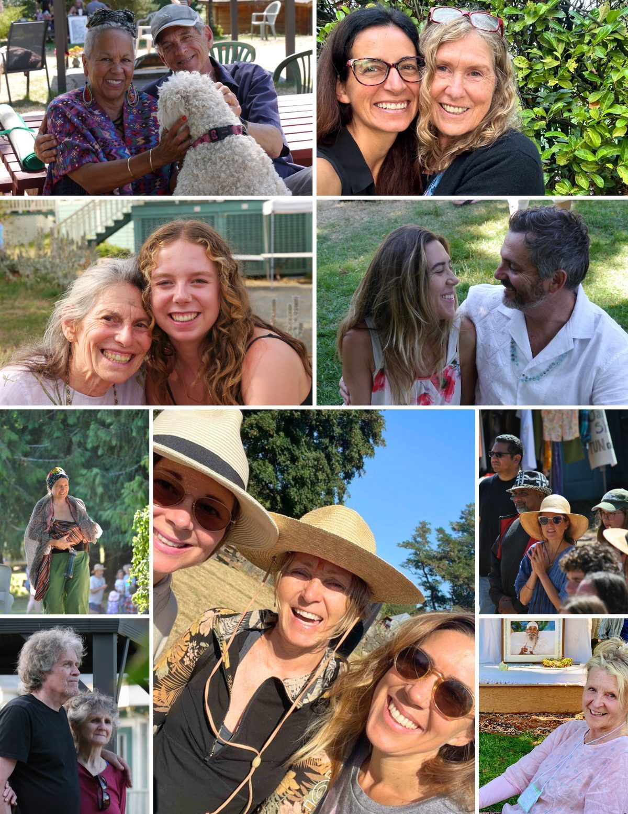
