### A snapshot of life at the Centre in September 2024!

Retreat sorting, packing, and program & rental preparations happened simultaneously with the school cleaning and major grounds cleanup. It is great to hear the kids playing; they seem to love it. The ebb and flow of community also happens at this time of year. People are finishing summer shifts, and others are joining for the fall and /or winter. There is much to do with the farm harvest. Garlic has been the big one the last couple of weeks. We harvested the last grapes of the season, started harvesting some apples and are waiting for them to be ready. As we head into fall weather, some areas are dug for planting crop covers. 
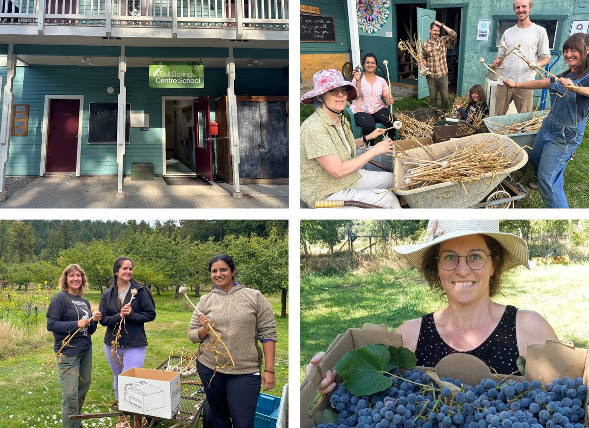
Ganesh Chaturthi, Ganesh's birthday, was celebrated in beautiful warm weather this year. We started with a lovely arati, then chanted and walked with the small clay Ganesh in a procession around the land to show him all that he takes care of, along with Hanumanji. This was followed by the Ganesh puja back at the temple and a delicious lunch. Jai Ganesh, illuminator and remover of obstacles!
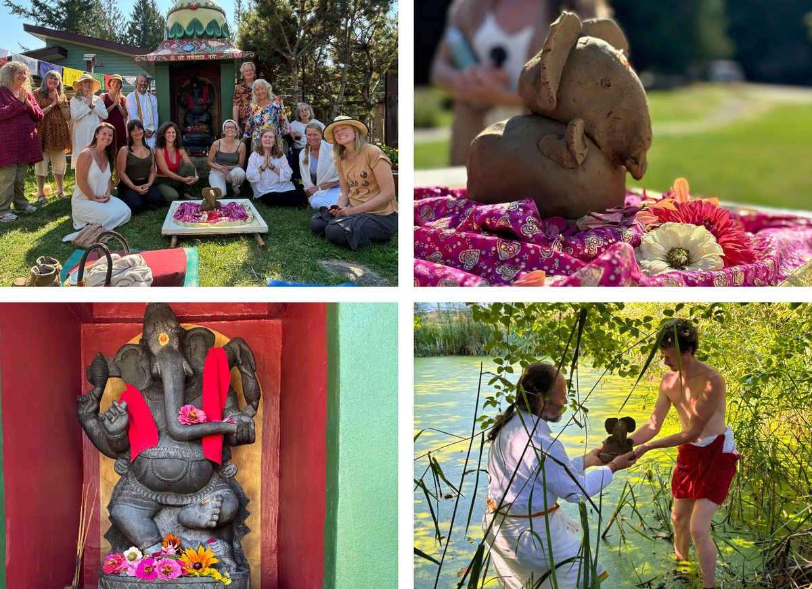
We did fit in time for the Centre artists to work on a scarecrow for the Fall Fair. It was 6 feet tall and in tree pose, dressed from Ramayana and free box, paper Mache head and hands, straw arms and legs, beet leaf hair and the ‘heart beet of Salt Spring’. We won a Trophy and first prize. We also had a booth to share info about the Centre with the local folks and to get our name out in the public scene. 
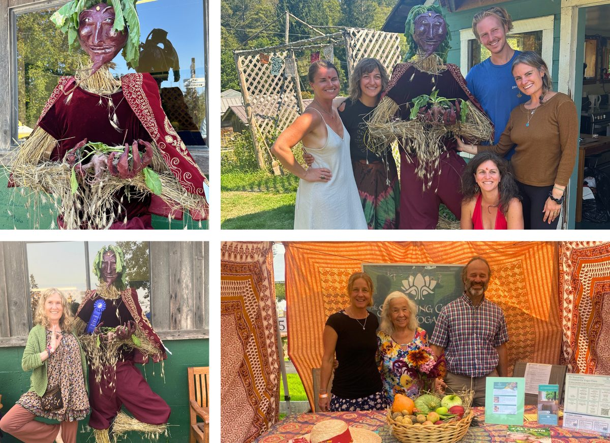

Work parties have been focused on autumn activities: cleaning decks and windows, farm harvests, final lawn mowing for the season, weeding fountain grounds, and clearing general areas of the grounds. The Centre is looking great and well cared for.
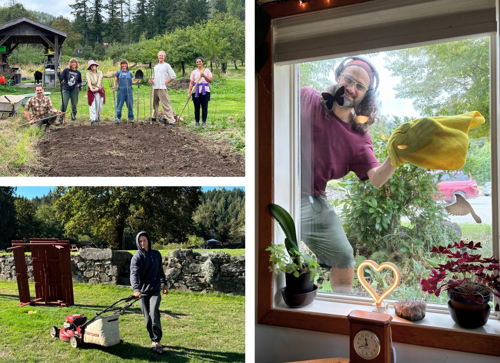
We have many classes offered by community, plus Dorothy and John continue weekly classes. Cara and Sam finished their summer fundraiser classes at the Pond Dome as the weather becomes colder. We received the visit of Swami Sadyojathah, a revered senior teacher of the Art of Living Foundation, for a powerful 90-minute session of Sanskrit chanting, meditation, and wisdom on how to cultivate inner peace amidst life’s chaos.
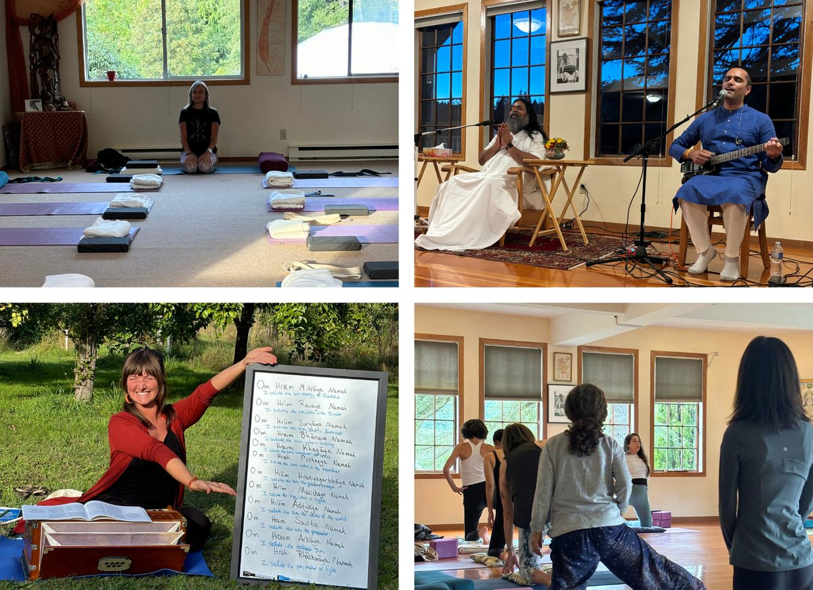
This month, we also honoured Babaji and the anniversary of his passing with the yearly  Aradhana ceremony. Yog and Mahavir have been incredible in carrying out all the  responsibilities of pujari duties for our weekly arati’s, monthly pujas, yajnas and special  events. We started the Hanuman puja that day at 5am to be able to chant the 11 rounds of the Chalisa and finish the puja in time for the Tarpanam. 
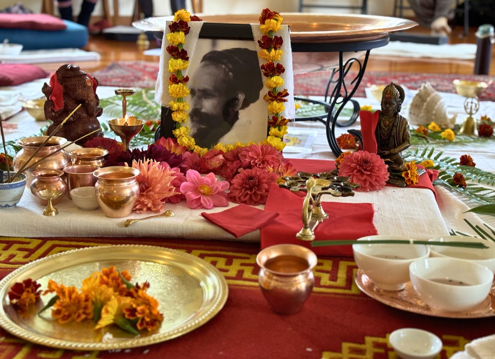
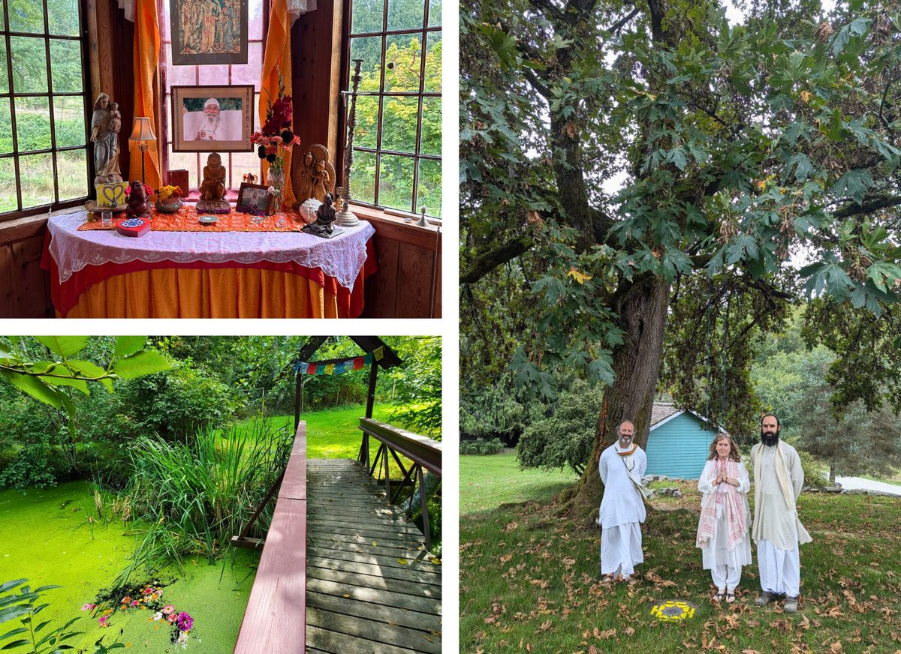
We are savouring the beautiful sunny fall days, that the fountains are still able to run before the cold weather turns off, and this most awesome gift of Stsang and community far and wide.
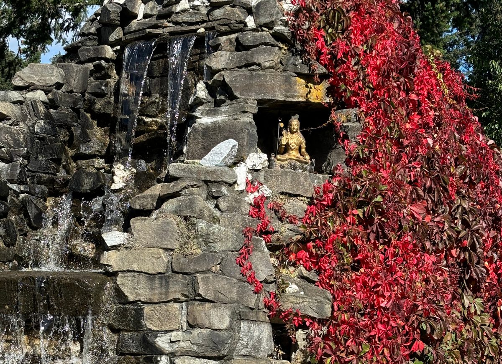
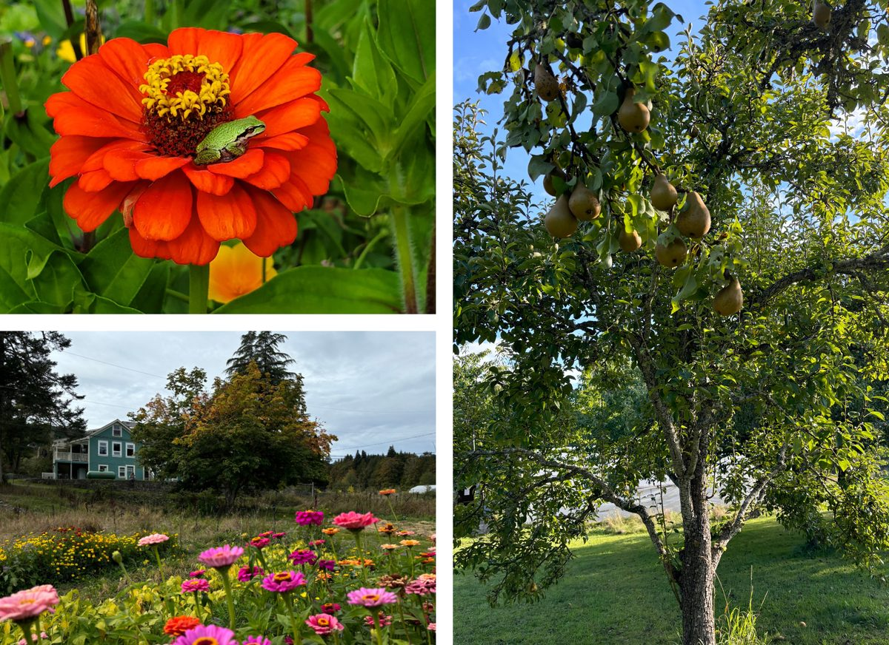
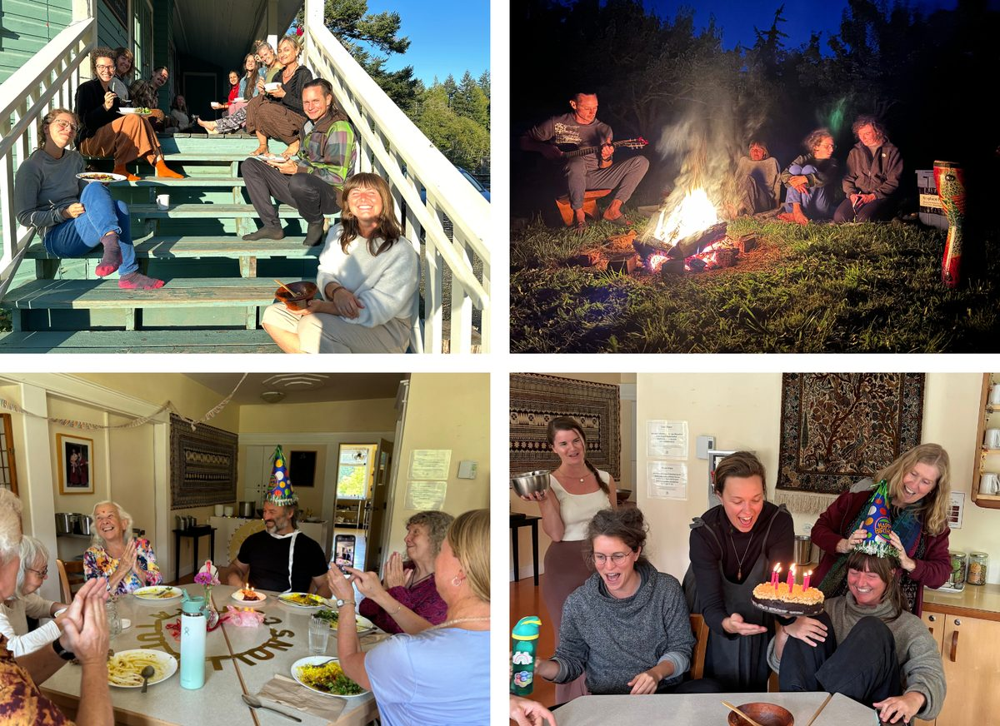
At the end of September, we hosted "I want more from life", a 4-day transformational retreat, generous offering from Jyoti. Participants could dive deeper into yoga and ayurveda wisdom to understand themselves on a deeper level.  
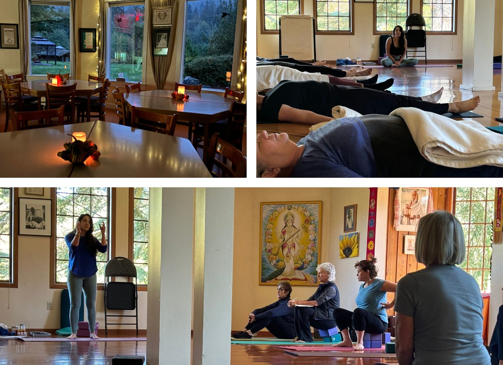
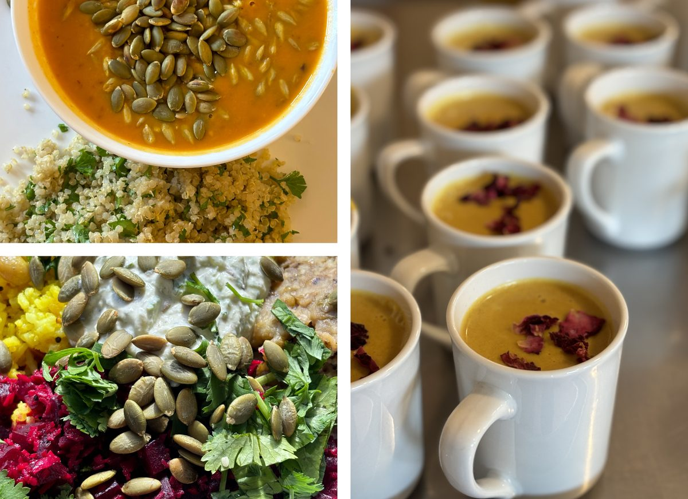

*In our hearts always ♡*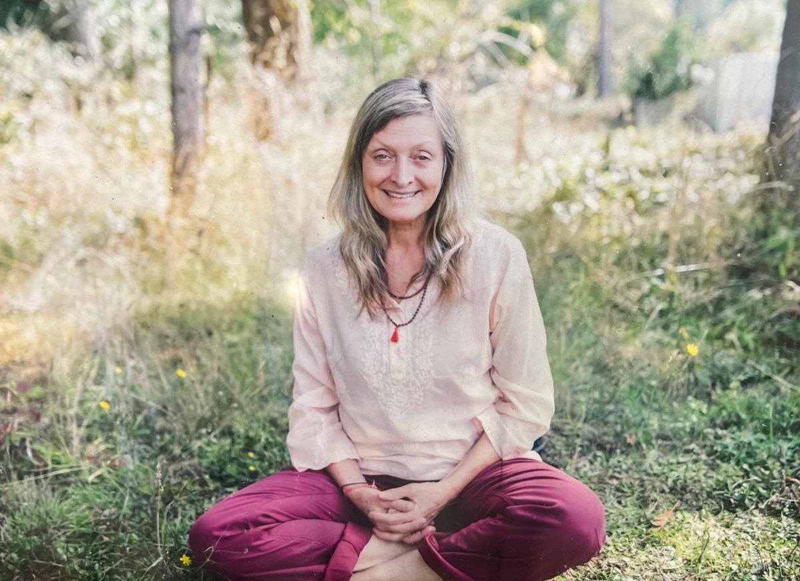

*Celeste Aradhana*

*Celeste Aradhana Mallet Jason, our long time Satsang sister, gifted teacher, and lifetime student of Babaji, passed away Sept 9th following her very courageous journey living with cancer. She was instrumental in bringing students to the Centre in earlier years and dedicated time and wisdom to presenting on the YTT (Yoga Teacher Training) faculty, both here and at Mount Madonna center, Babaji's centre in California. Aradhana is the spiritual name from Babaji for Celeste. It means to worship, to praise. She brought this sacred energy into every space she created, wherever she was and is.*
*She is so well loved, respected and admired by the local Island and Centre communities. Her love of community and her mission to share Yoga practices with everyone, every body, inspired her to create a hub for people with a town centre; the latest, being the beautiful Ganges Yoga Studio, which she ran as the founder, director, and lead teacher with her team there. We followed Babaji's ritual practice for supporting the soul's transition from being embodied to moving to the spirit realm by Tarpanam, prayers, mantras, and offerings for the first 12 days and then the Shraddha on the 13th day to truly be together and support and honour the wonderful being she is. Now transformed to spirit love and light, still working on our behalf, no doubt. She leaves such a great legacy of yoga studies and practices, inspiration, and a role model for our lives.*
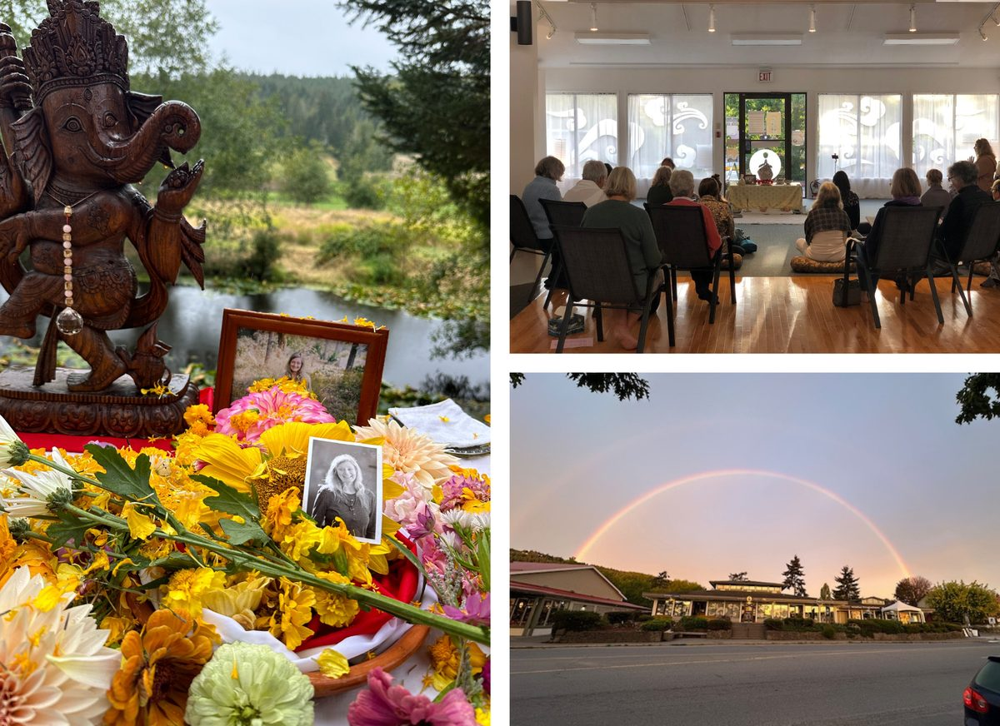

Thank you to Babaji for all the gifts he gives us as we continue to be blessed and inspired by his teachings and Grace.  
Thank you to the Board, Kristin and office team, the Operational Team, the Karma Yogis and staff and teachers, all who are working so devotedly to create support and create the best possibilities.
OMMMMMMMM Gurudev!! 
Jai Babaji!! Jai Satsang!!  
Thank you,
Anuradha
