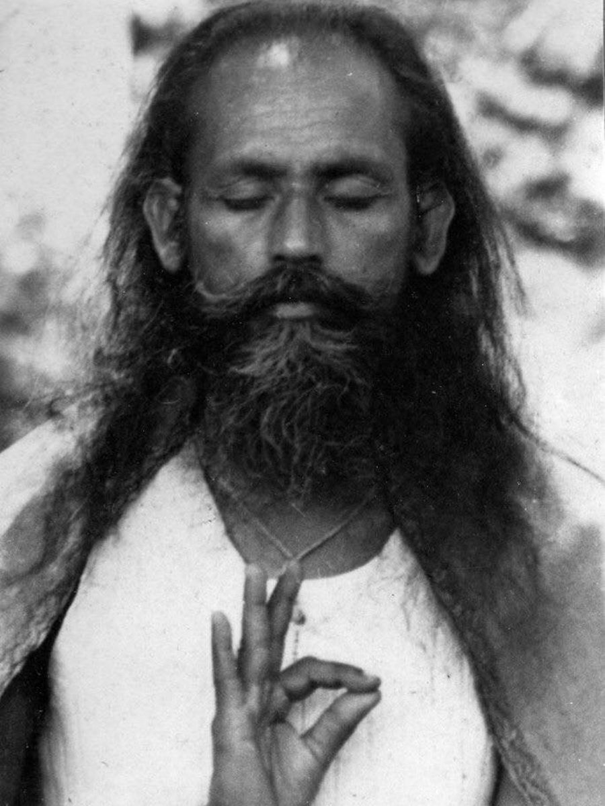

##### By Yogeshwar

## Going Deeper: A Time for Reflection and Yoga Practice

Summer is over, and even the fall equinox, that final and most generous marker of summer’s end, has passed. For most of us, there are now only a couple hours of daylight remaining when we return home from work. The days continue to grow shorter. Here on the island, the first heavy rains have arrived. The weather is growing steadily cooler. The bustle and activity of summer now seem like a dream remembered upon waking. It is still present and vivid in the mind but fading with each passing moment. 
There’s a tendency to feel a slight sense of wistfulness this time of year. As someone raised in more southern climes, I’ve come to appreciate the great excitement and intensification of life that summer inspires in Canada. It is a precious window of light and warmth. It pulls us outwards, both literally, as we go outside to camp, swim, garden, and play in the sun—and also energetically, as we follow our senses outward into the brightness around us and drink in the sound and colour of a world in bloom.

### The natural Turn Inward with the Fall Season

With the coming of fall, however, that outward extroversion of our lives and energy naturally begins to shift. The rain and cold insistently nudge us back indoors. The longer nights and dimmer days seem to mute the sensations around us somewhat. There is a feeling that life is quieting down. Birds and insects depart, leaves fall, and the sap and juice of plants steadily withdraw into their roots.
If we’re attached to the extroversion of summer, it can be a sad time. But if we’re able to accept the change of seasons and move skillfully with it, it can instead be a rich time. For practitioners of yoga, this can be an especially auspicious and potent period for practice.

### Yoga as a Practice of Quieting the Mind

Understood classically, yoga involves the quieting of the activity of the mind. Through this quieting, one’s true nature as conscious awareness can be revealed. The thinking mind tends to mistake awareness for the many thoughts that present themselves to it, for the content of awareness. 
This activity of the mind typically involves being very busy and anxious with worrying and wondering about *what* we are or may be—pretty, ugly, fat, thin, intelligent, foolish, liked, hated, happy, sad, cold, hot, successful, unsuccessful, right, wrong, and so on. 
The continuously changing content of the mind weaves a self-image or a self-concept that is perpetually in danger of falling apart. It is in continuous need of shoring up. What is never fully examined, however, is the source of this “I,” that may or may not be all of these names and qualities that are attached to it. Meditation invites us to look at this “I,” so to speak, not by thinking and reasoning further about it, but by stripping away the activity of the mind and senses until the source of that "I" is revealed. That source is awareness itself.

### The Deep Sense of Peace in Meditation

Until that realization arises from direct experience, this can seem like a somewhat odd, perhaps philosophical point to make. However, as one learns to quiet the activity of the mind and rest as awareness, a deep sense of peace and well-being can begin to emerge. One begins to recognize and trust that what one really is, is not some thing that needs to be defended and fussed over. It is an abiding presence that remains regardless of the vicissitudes of the mind’s content. This shift in identity is at the root of liberation.

### Aligning Yoga Practice with the Seasons

So what does this have to do with the change in season? Well, as practitioners of yoga, particularly the yoga of meditation, we can ride the wave of the seasons toward this stilling of the mind. As we step back from the activity of the summer and move into the quieter time of fall and winter, there is an opportunity for the senses and the mind to quiet their activity as well.
Rather than see them as a burden, the growing stillness and even darkness of this time of year can turn us inward. It can turn back to the heart of our being that rests behind the various objects and stimuli of the mind and senses.

### Going Deeper: Embrace the Stillness of the Season

In this spirit, Baba Hari Dass has given a collection of practices that embrace the energy of this time of year that we now call the Going Deeper retreat. The retreat takes place in a structured container, so to speak, that supports the quieting of the mind, much in the same way that the current change of seasons might. It invites us to set aside our usual outward focus and reflect on their source in awareness.
If you feel drawn to deepen your spiritual practice and connect more fully with your inner self, we welcome you to join us from **next November** for the **Going Deeper Silent retreat**. Through the practice of āsanas (postures), prāṇāyāma (breathwork), chanting, and meditation, you will be supported in moving away from outward distractions and reconnecting with the peace that resides within.
 It is a wonderful first silent retreat for those who have some solid experience with the practices of yoga and seated meditation and would like to explore them in a more immersive retreat environment. 
[👉 Learn more about the Going Deeper retreat.](https://saltspringcentre.com/programs-retreats/going-deeper-silent-retreat/)
[vcex\_divider color="#dddddd" width="100%" height="1px" margin\_top="20" margin\_bottom="20"]

#### Yogeshwar Will HumphreyBy Yogeshwar

Yogeshwar has been teaching yoga for a little over a decade.  He has completed his 200hr and 300hr teacher trainings at the Mount Madonna Center in California. Yogeshwar lived there for several years teaching various yoga trainings and retreats. He served as pujari at the Center’s Sankat Mochan Hanuman Temple. In addition to years of personal practice, Yogeshwar also completed an M.A. in Religious Studies at the University of Calgary in 2016. His studies included coursework on both western and eastern traditions of philosophy and religion. He studied Sanskrit for an aditional 2 years. For Yogeshwar, the theory and practice of yoga is a gateway to appreciating the profound mystery of being conscious and alive, and ultimately to abiding in the wholeness and peace that is our true nature.
