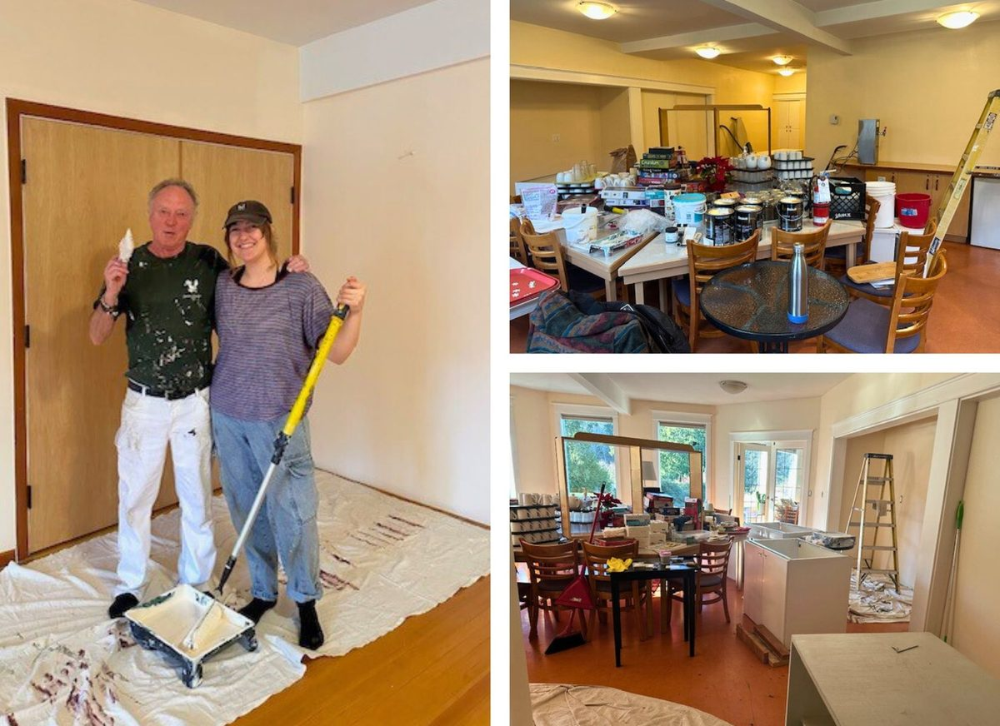
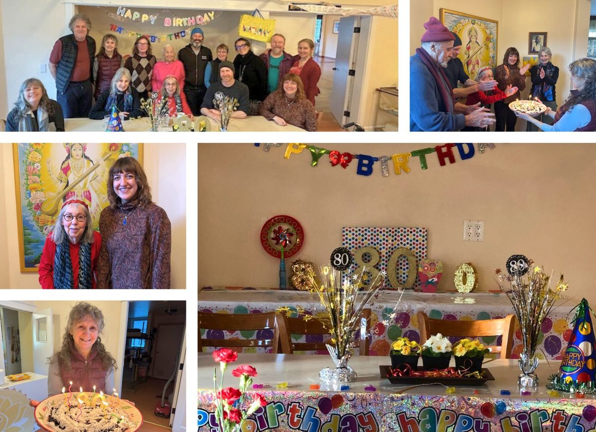
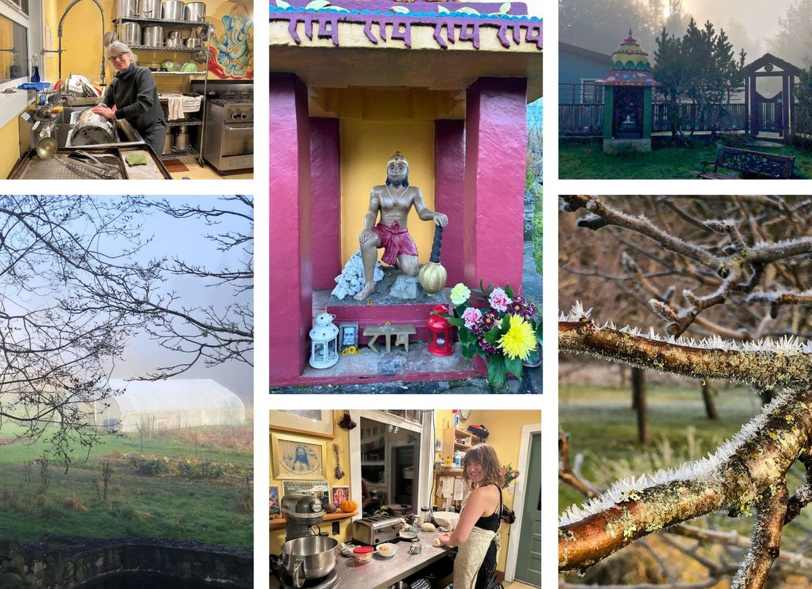
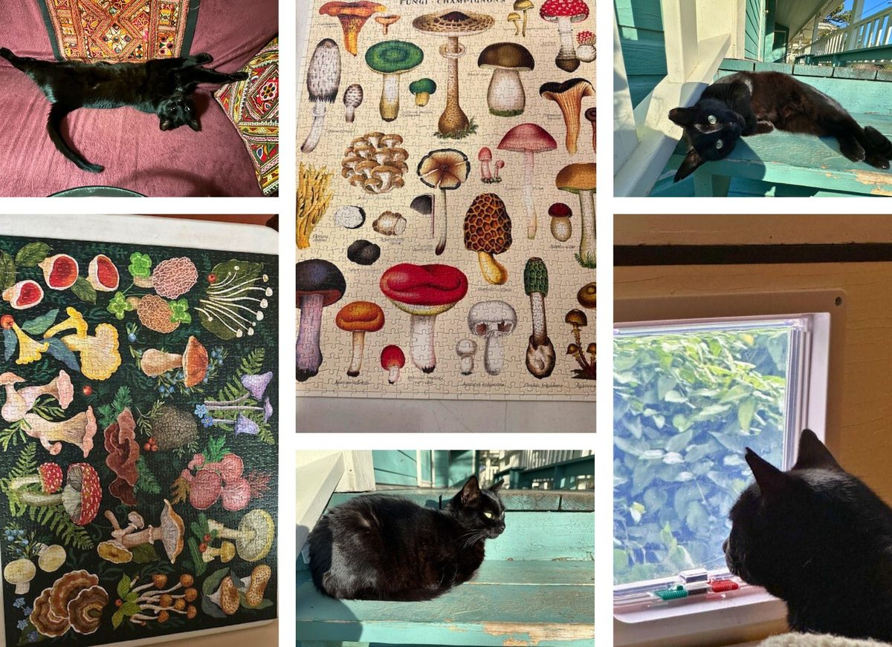
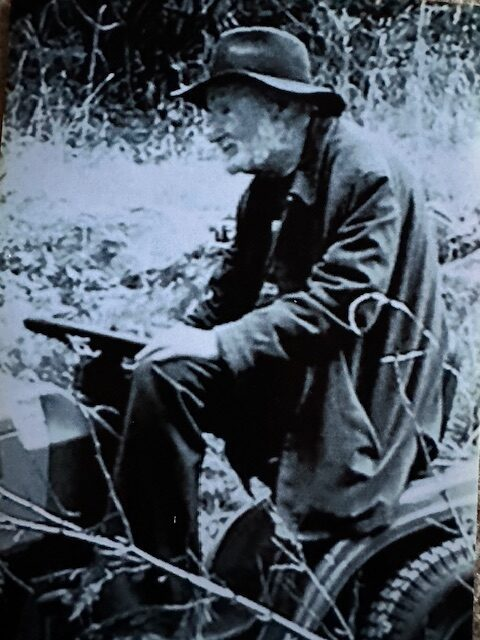
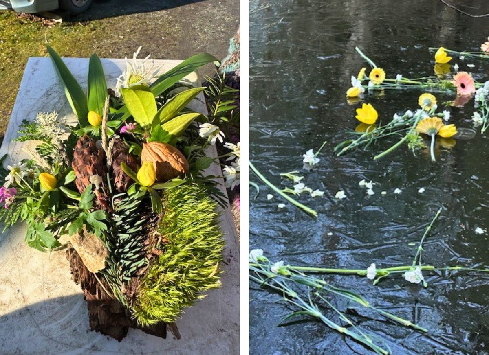

### A snapshot of life at the Centre in January 2025!

For a few of us from the Satsang, January began after the New Year’s Retreat at Mount Madonna Center. It is always a great way to start the new year.

The winter painting project for the dining room, lobby, and Satsang room is finished. It looks awesome, fresh and beautiful. Thanks to the team: Painter Bob, Suneel and Tash.

Quite a few Aquarian birthdays, Sanatan, Mayana, Dannielle, Tash, and Tom. And Sharada’s is the big one this year – 80 years amazing. She wanted a Games afternoon, so a few folks came together to play. When Ma turned 80 Babaji wrote, after 80, *"beyond all rules"*. Wishing everyone a great year ahead, health, happiness and peace.

The small winter community is catching up on various things, also having some space for personal projects, since we have a bit of a break without programs. We continue to set up and support the weekly classes, Kirtan night and Satsang. The office team continues to be busy, in person and remotely, all bringing it together for the March start up.

There is always a puzzle on the go and seems the puzzle fairies are dropping more off at the Centre regularly. Prince of the Garden has learned to use the cat door in the window for coming inside. He enjoys sunning, and is at home now more as Prince in my room :-) So grateful he is not living outside over the winter. The nights are clear and cold and mornings very frosty and beautiful.

Wishing all a happy, healthy and peaceful year ahead.
Jai Babaji!! Jai Satsang!!
Anuradha

[vcex\_divider\_dots color="#63979D" margin\_top="10" margin\_bottom="10"]

#### Mahesh ♡ In our heart always

*Roy Mahesh Naud*
*Feb 28, 1934 – Jan 6, 2025*
*Ram Nam Satya He*

Remembering and celebrating Roy Mahesh, our Satsang brother, elder and a founding member. Mahesh and his wife, Abha attended AD’s first Yoga classes in 1973 in Vancouver. AD (Anand Dass) studied in India with Babaji, shared classes in Santa Cruz when Babaji came to America, and at Babaji’s request came to Vancouver to teach and begin a Satsang. From the beginning, Abha and Mahesh were involved. They were also instrumental in the success of the Jai Stores in Vancouver. The stores and donations supported the 1981 down payment for our property to build a yoga centre. It became the Salt Spring Centre of Yoga. The stores carried the mortgage payments while we renovated the Centre and got ready for programs. Mahesh was also involved in building the Centre roads, and loved working with Babaji and the rock crews on the Centre's rock walls. Babaji gave him the nickname, "Bobcat Baba"

We followed Babaji’s guidance for the passing of the soul with Tarpanam rituals of prayers and offerings to support the soul's journey to the spirit realm for 12 days. On the 13th day there was the Shraddha service celebrating the soul’s release of its attachment to the physical earth realm. We also release our attachments to him that could hold the soul here. We want to ensure his peace and well-being in after-life.

Everything is purified with offerings, prayers and mantras; the place, the 4 directions, the earth, and the sky, and all those gathered. The soul is offered everything symbolically for its liberation, peace and soul journey until rebirth. It acts as a bridge between life and death, and the cyclical nature.

It was a beautiful day to honour, love and support Mahesh's journey to the spirit realm. It was so special to see so many at the Centre and on zoom. After the Shraddha was completed we took the plate of offerings made for him to the pond. We chanted 'Ram Nam Satya He', as Babaji had taught us for this time. We read some notes he told to Sharada when she said she wanted his story for the newsletter many years ago. But his story remained current, his love and loss of Abha, when she passed away, was his life more than anything.

From his own words:

*"Abha was always with me, and I was always with her. We did our own things, but we were devoted to each other – a relationship that I wish everybody had – one of total trust. It was a wonderful trip. To have her interested in the spiritual path like I was, was absolutely beautiful. The original Dharma Sara Satsang members put in karma yoga time and money for the Salt Spring Centre. It was just like bringing up a child. To walk onto the property as an old man and see all the shining faces and bright smiles brings joy to my heart – like seeing a child who has succeeded."*

Many of us went for lunch after the ceremony for the Bhoj (traditional feast) at one of his favourite restaurants. Just as we were going in there was an eagle that kept circling above us. Very auspicious for the connection to spirit realm journey!!

It was a celebration for his ‘flight’ and stories about love for Babaji and how he helped with rock walls and other work. His crazy eccentric ways and jokes. His love of playing crib and people coming to visit as it got difficult for him to come to the Centre. Many friends joined in the farewell to Mahesh (Magoo) at the Centre and online.

Photos of the Shraddha, the 'flower offering' made from all plants on his property that he loved so much,  and the offerings at the pond.....frozen.......but the plate with his offerings broke through the ice and dissolved into the water.

“Oh, come angel band, Come and around me stand,
Bear me away on your snow-white wings to my immortal home.”
Eternal, and together now!!  

OMMMMMMMMM Shantih Shantih Shantih!!

[vcex\_divider\_dots color="#63979D" margin\_top="10" margin\_bottom="10"]
