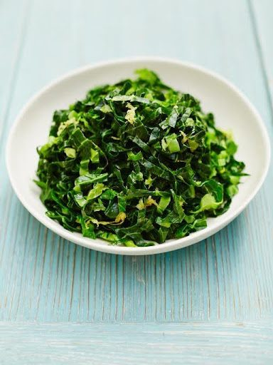
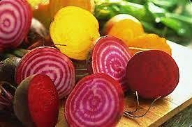

## Nourish & Detox with Seasonal Foods

### The Door to Balanced Health

March brings us closer to the cleansing time of year, as the long winter gestation begins to shed its thick coat and reveal its newness.

### The Power of Bitter Greens for Late Winter Cleansing

All spring green vegetables are high in bitters, one taste that is often left out of the Western diet and is sorely missed. Bitter greens are superfoods that:

- Stimulate digestive secretions and stomach acid.
- Aid in vitamin B12 absorption.
- Stabilize blood sugar levels.
- Promote the release of pancreatic enzymes and bile.
- Strengthen and tone digestive tract tissues.
- Heal damaged mucous membranes and soothe gastric reflux.
- Support intestinal peristalsis.
- Reduce cravings for sweets.

Spinach, chard, kale, sorrel, chickweed and especially dandelions are frequent flyers in our late winter, early spring diet. Easy to acquire and easier to prepare, they should encompass 20-30% of a healthy diet at this time of year. All greens are best consumed lightly steamed, as they can contain high amounts of oxalic acid, which can lead to gout in those with compromised digestion or stagnancy issues.
For a delicious way to enjoy seasonal greens, try our [Lemon Spring Greens Recipe](https://saltspringcentre.com/late-winter-cleanse-recipe-lemon-spring-greens/).

### Beets: A Late-Winter Superfood

If you are fortunate enough to still be eating beets from your garden they are now even more enriched with blood building minerals and lymphatic cleansing agents to boost your immunity through these last few wet months. Steamed, baked or in soups, beets can provide essential minerals to support optimal bone and brain health.

### A Simple Ayurvedic Mini Winter Cleanse for Vitality

One might consider a mini cleanse to heighten vitality and give the digestion a break from all the heavy winter storage foods. Consider these options:

- **Water Fasting:** Fast from dinner one night until dinner the next night.
- **Khichadi Cleanse:** Eat only khichadi, a traditional Ayurvedic cleansing dish made of split mung dal, basmati rice, and digestive herb masala, for a full day to cleanse the digestive channels and support proper elimination.

### Balancing Doshas with Seasonal Foods

In Ayurveda, different foods help balance the three doshas:

- **Eat Seasonal Foods:** Consume foods that are in season to naturally balance the doshas. For example, warm, moist foods in winter for Vata, cooling foods in summer for Pitta, and light, dry foods in spring for Kapha.
- **Incorporate All Six Tastes:** Ensure your meals include all six tastes (sweet, sour, salty, bitter, pungent, and astringent) to balance the doshas. Vata is balanced by sweet, sour, and salty; Pitta by sweet, bitter, and astringent; and Kapha by pungent, bitter, and astringent.
- **Use Spices Mindfully:** Use spices that balance your dosha. For example, ginger, cinnamon, and cumin for Vata; coriander, fennel, and turmeric for Pitta; and black pepper, mustard seeds, and chili for Kapha.

### Embracing Seasonal Change for Holistic Wellbeing

Spring encourages change. As such, we embrace the return of the light as natures offering of homeostasis. It reflects our innate ability to create balance within our environment.

### Take Your Spring Cleanse Deeper

If you're ready to fully embrace seasonal renewal, join us for the **Spring Cleanse Retreat** at the Salt Spring Centre of Yoga, next spring. Discover cleansing practices, nourishing Ayurvedic meals, and rejuvenating yoga to help you transition into spring with balance and vitality.
[**👉 Learn more**](https://saltspringcentre.com/programs-retreats/spring-cleanse-retreat/)

#### [Savita Leah Young - Wellness Treatments](https://saltspringcentre.com/sscy_team/savita-leah-young/2023-savita-leah-young-wellness-treatments/)[By Savita Leah Young](https://saltspringcentre.com/sscy_team/savita-leah-young/)

Certified Ayurvedic Practitioner, YTT 200
Centre Wellness Spa Director and Therapist
Amrit Dhara Ayurveda

#
