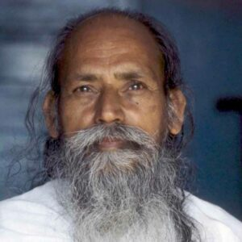
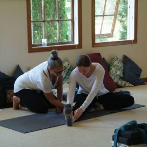

## Refining your yoga practice

Yoga is more than just a physical practice. It’s a holistic journey that integrates body, mind, and spirit. Whether you’re a seasoned practitioner or just starting out, **refining your yoga practice** is an ongoing process. The [Yoga Intensive Program](https://saltspringcentre.com/programs-retreats/yoga-intensive-program/) at [the Salt Spring Centre of Yoga](https://saltspringcentre.com/) draws deeply from classical teachings while offering practical tools for today’s world, helping yoga practitioners enrich their journey with **timeless wisdom** and practical tools.

### Rooted in the teachings of Baba Hari Dass

One of the cornerstones of the Yoga Intensive Program is the profound wisdom passed down by [Baba Hari Dass (Babaji)](https://saltspringcentre.com/about-us/our-founder-and-teacher-baba-hari-dass/), a revered teacher and scholar of classical yoga. His teachings provide deep insight into both the **spiritual and practical aspects** of yoga, offering guidance that is as relevant today as it was centuries ago.

Babaji’s approach emphasizes **discipline**, **mindfulness**, and **meditation** as central practices, encouraging us to cultivate inner peace in a chaotic world.

What makes Babaji’s teachings so powerful is their simplicity and focus on inner stillness. He taught that yoga is not just about postures. It’s about **cultivating a peaceful mind and a compassionate heart**. The [Yoga Intensive Program](https://saltspringcentre.com/programs-retreats/yoga-intensive-program/) incorporates his teachings on **silence**, **devotion**, and **steady practice**, helping you reconnect with the essence of yoga, beyond trends or superficial practices.

### The importance of purification in yoga

Refining your yoga practice can also involves **cleansing and preparing the body and mind**. In the [Yoga Intensive Program](https://saltspringcentre.com/programs-retreats/yoga-intensive-program/), you will explore **Shat Karma**, the classical purification practices designed to cleanse the body and mind to support deeper meditation and spiritual growth.

While many practitioners focus on asana (physical postures), pranayama (breathing practices), or meditation, Shat Karma plays an important role also. These traditional practices help to restore balance and vitality.

Practices like Jal Neti (nasal cleansing), Sutra Neti, and Trataka to name a few, help practitioners purify on a physical level, while others focus on mental and emotional purification. In the [Yoga Intensive Program](https://saltspringcentre.com/programs-retreats/yoga-intensive-program/), you will explore these practices with care, ensuring they are accessible and safe for you.

### Integrating yoga philosophy into daily life

Yoga is a way of life. The **philosophical teachings** of yoga found in ancient texts like the [*Yoga Sutras*](https://srirampublishing.org/) and [*Bhagavad Gita*](https://srirampublishing.org/) offer timeless guidance for how to live with more **awareness, compassion, and balance**. These teachings are designed to transform not only your practice but also your interactions with the world around you.

In the [Yoga Intensive Program](https://saltspringcentre.com/programs-retreats/yoga-intensive-program/), you will explore key yogic concepts such as the **Yamas** (ethical guidelines) and the **Niyamas** (personal observances).

You’ll learn how these teachings can be applied to everyday life, practicing non-violence in your communication, cultivating contentment in your work, or embracing patience in relationships.

### Building a sacred space for your home practice

An important part of refining your yoga practice is creating a supportive environment for it to flourish. In the [Yoga Intensive Program](https://saltspringcentre.com/programs-retreats/yoga-intensive-program/), you will be guided on how to build a **home yoga sanctuary.**

Whether you have a full room or just a small corner, you will receive tips for creating a space that supports **mental clarity and emotional release**.

### Personalized practice and supportive sequences

As part of refining your yoga practice, you’ll be supported in crafting **sequences tailored to your personal goals**, whether you're looking to deepen your asana practice, enhance flexibility, or explore meditation. In the [Yoga Intensive Program,](https://saltspringcentre.com/programs-retreats/yoga-intensive-program/) you will receive guidance on sequencing, as well as suggestions for props and tools that can help bring a sense of sacredness and ease to your home practice.

### A path of self-discovery

Yoga is a lifelong journey, and each step along the way offers new opportunities for growth and self-discovery. The teachings of Baba Hari Dass, the purifying practices of Shat Karma, the transformative philosophy, and the creation of a dedicated space for practice all come together in the [Yoga Intensive Program](https://saltspringcentre.com/programs-retreats/yoga-intensive-program/) to help you refine your practice in a meaningful and lasting way.

Whether you’re seeking physical wellbeing, mental clarity, or spiritual enhancement, the [Yoga Intensive Program](https://saltspringcentre.com/programs-retreats/yoga-intensive-program/) provides the tools and wisdom needed to **walk the path of yoga with intention and devotion**.

Let this be your invitation to refine, to return, and to reconnect.
[Click here to start your journey](https://saltspringcentre.com/programs-retreats/yoga-intensive-program/). 🌿

[vcex\_divider color="#dddddd" width="100%" height="1px" margin\_top="20" margin\_bottom="20"]

#### **[By Chetna Tracy Boyd](https://saltspringcentre.com/sscy_team/chetna-tracy-boyd/)[Tracy (Chetna) Boyd](https://saltspringcentre.com/sscy_team/chetna-tracy-boyd/)***E-RYT 500; C-IAYT, YTT 200*
