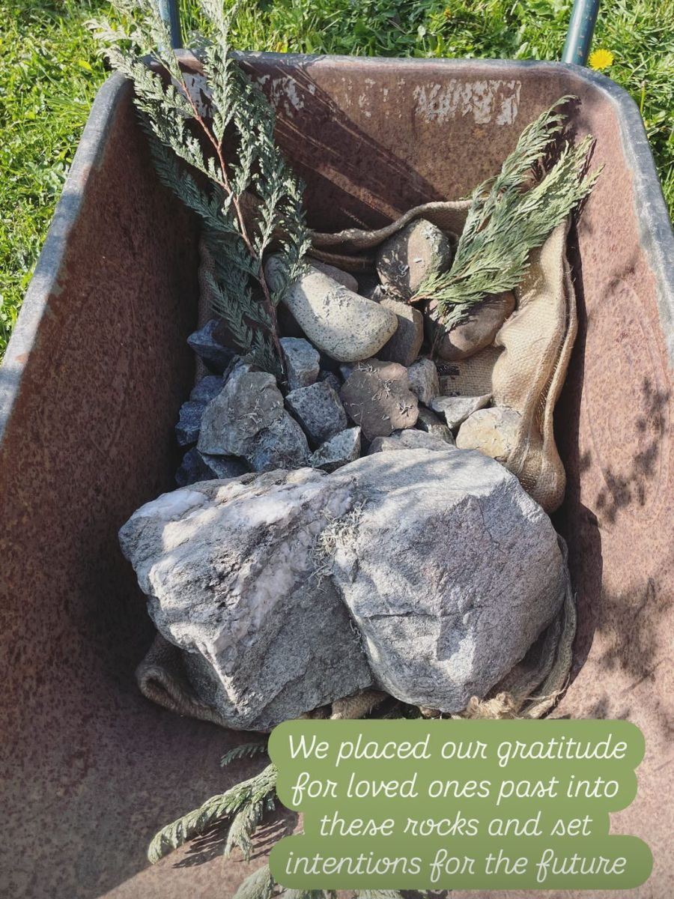
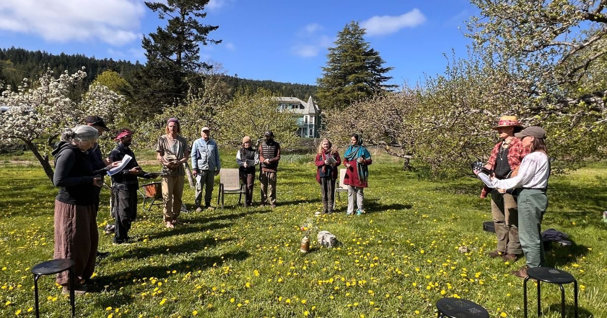
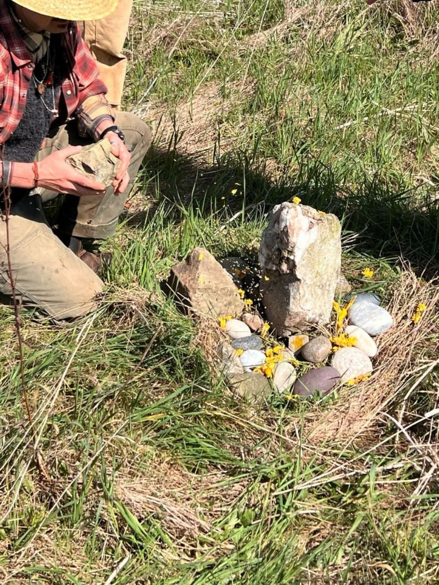
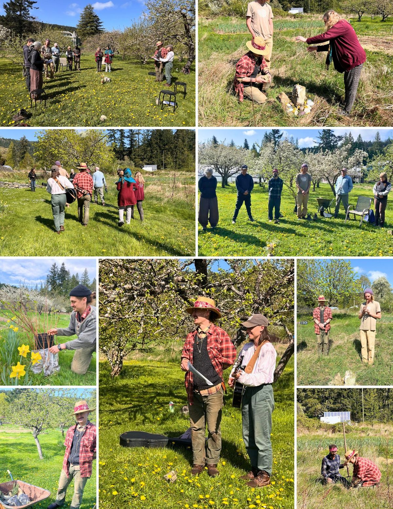
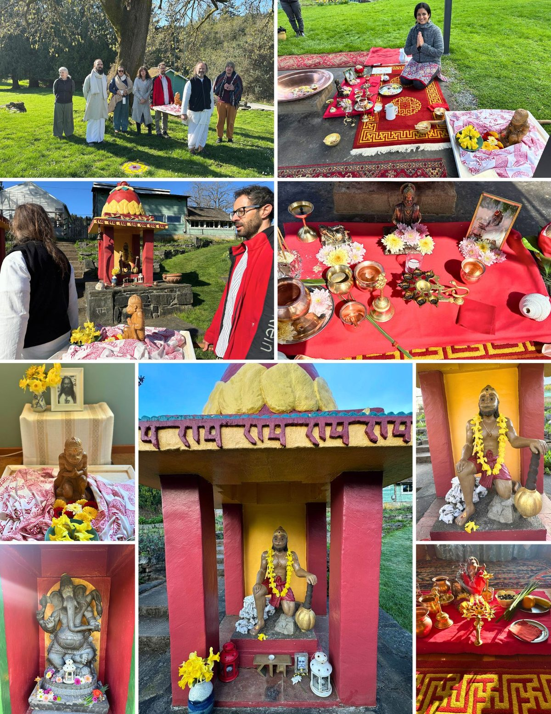
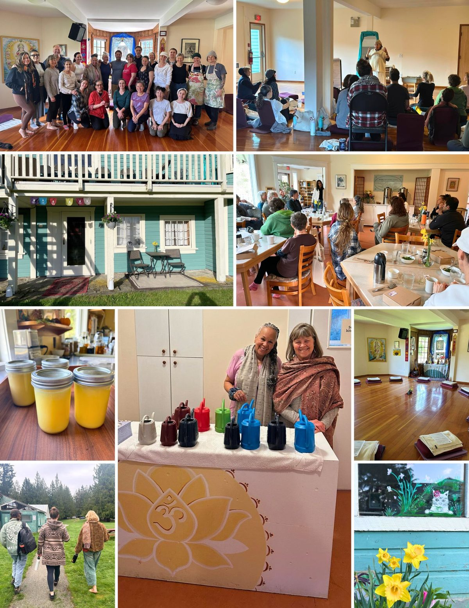
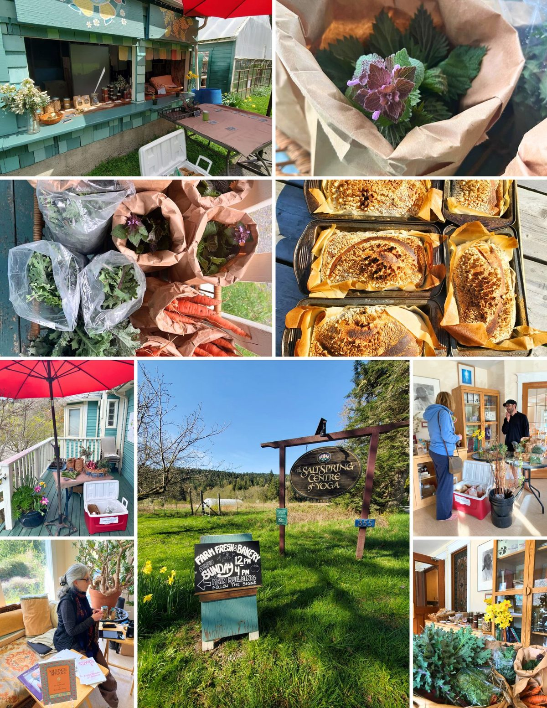
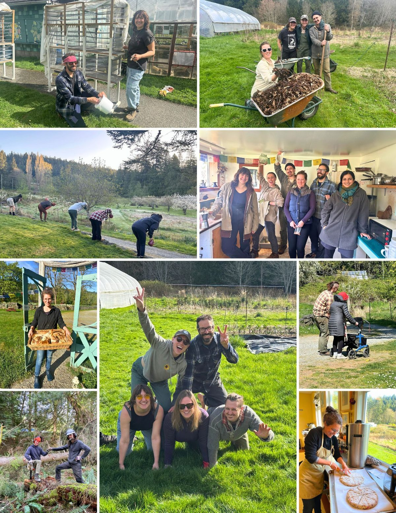
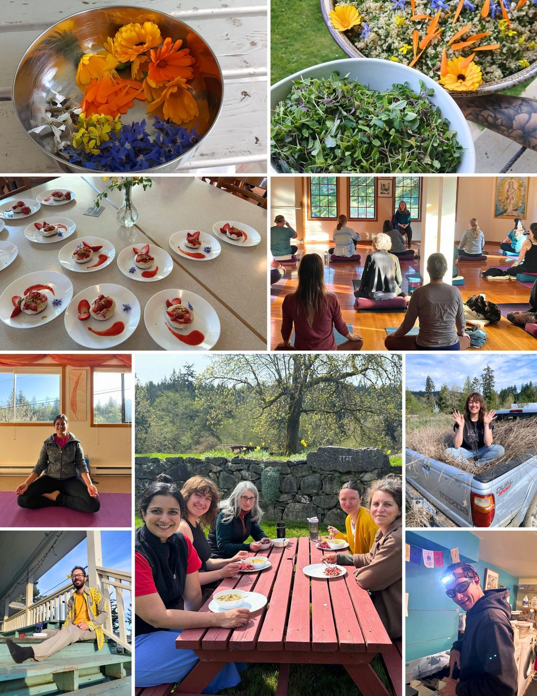

### 🌿 Homage to Earth Day

*The Salt Spring Centre’s farm team held a ceremony for the community as well as some members of the Satsang to honour the land and to unofficially launch our 2025 farm season. On a glorious, sunny Wednesday morning replete with possibilities, all the attendees summoned up our ancestors of springtimes past and still to come, holding a stone in each hand to represent someone who has inspired us and to set an intention for the upcoming season. Dan Jason, the original farmer at the Centre and a long-time steward of the land here was also present at the ceremony and arrived with several stones collected by his late wife Aradhna (Celeste), who passed away last year.*

*The ceremony began with everyone gathering in the orchard under the pear blossoms, with Dani leading the circle in a grounding practice steeped in a sense of safety and belonging. Paz followed with a land acknowledgment recognizing the First Nations who were the original guardians of the land on the island, including the SENĆOŦEN & Hul'q'umi'num speaking peoples, and a poignant reminder of the importance of relationality in our interactions with all living things. Then I spoke briefly about what I had collected as part of our land offering to express gratitude for and seek continued abundance from these fields that have sustained the Centre and its Satsang for more than 40 years.*

*After going around the circle to give everyone the opportunity to share the symbolism of the stones they carried with them, Dani pulled out her guitar and led the group in singing a rendition of the famous tune “Turn, Turn, Turn”. We sang in unison as we strode from the orchard towards the memorial garden for Anastasia, a former karma yogi who passed away at the Centre in the spring of 2023. Here at the heart of the new site of Ana’s garden, we each laid down our stones in a circle, while Paz embedded a monolith at the top of the circle. I dug into the earth inside the circle with my hands and placed my offerings there—a few roots, seeds, leaves, and flowers as well as some compost and water, all the components that give life to a plant.*

[*By Daniel Naccarato - Farm Coordinator*.](https://saltspringcentre.com/sscy_team/daniel-naccarato/)

[vcex\_divider color="#ffffff" width="100%" height="1px" margin\_top="10" margin\_bottom="10"]

### Behind the scenes  📸

April was a month of devotion, celebration, and service. From Ram Navami, Babaji’s birthday, and Hanuman Jayanti, to Earth Day gatherings, nourishing retreats, and community meals, the energy was alive. Behind the scenes, dedicated hands kept the grounds thriving and the Centre running beautifully.

### 

[vcex\_divider color="#ffffff" width="100%" height="1px" margin\_top="10" margin\_bottom="10"]

[vcex\_divider color="#ffffff" width="100%" height="1px" margin\_top="10" margin\_bottom="10"]

[vcex\_divider color="#ffffff" width="100%" height="1px" margin\_top="10" margin\_bottom="10"]

[vcex\_divider color="#ffffff" width="100%" height="1px" margin\_top="10" margin\_bottom="10"]

[vcex\_divider color="#ffffff" width="100%" height="1px" margin\_top="10" margin\_bottom="10"]

[vcex\_divider color="#ffffff" width="100%" height="1px" margin\_top="10" margin\_bottom="10"]
Jai Babaji, Jai Satsang! 💖
OM, Peace, Peace, Peace 🕉️ 🙏 🌿
