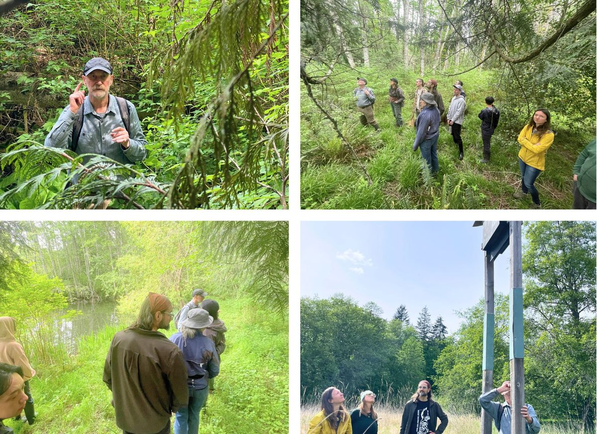
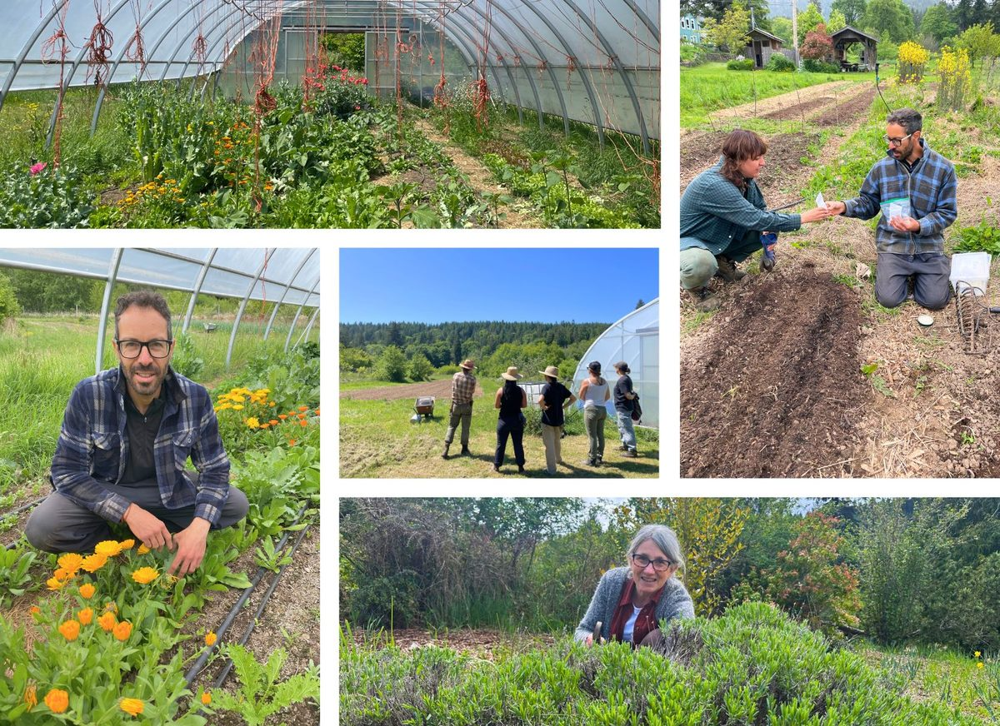
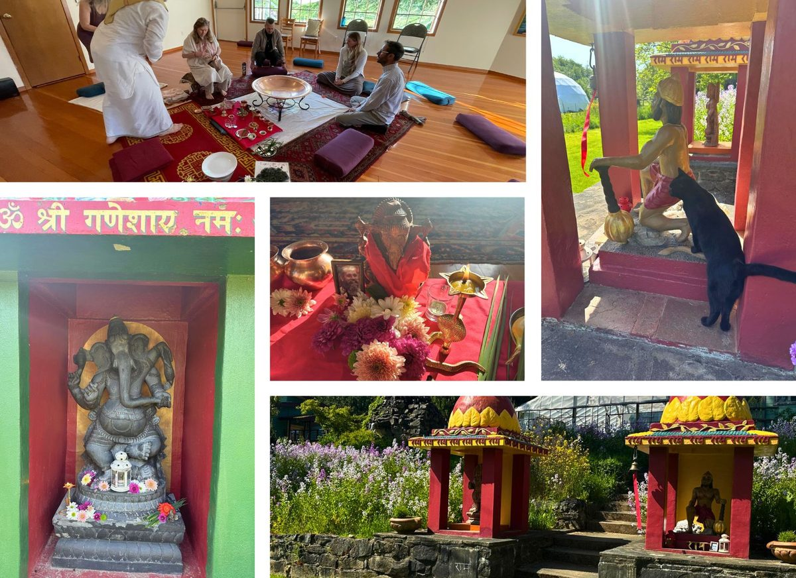
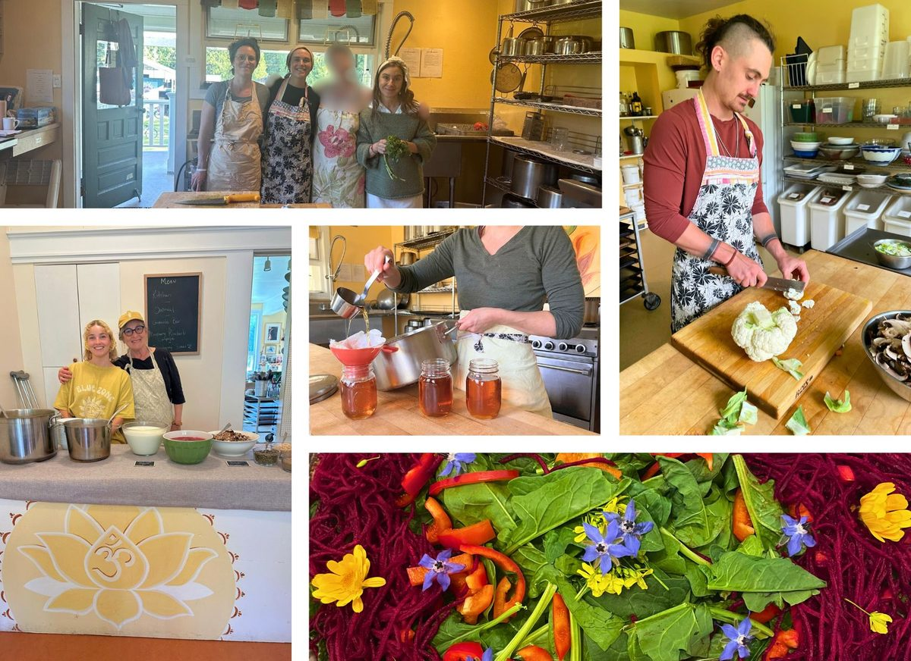
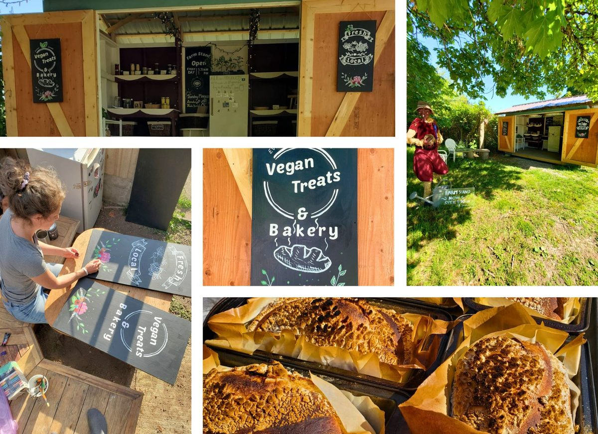
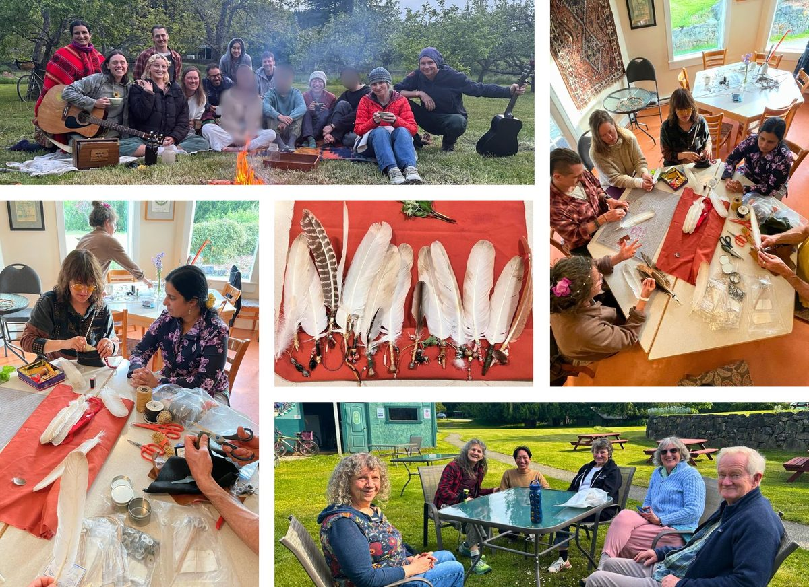
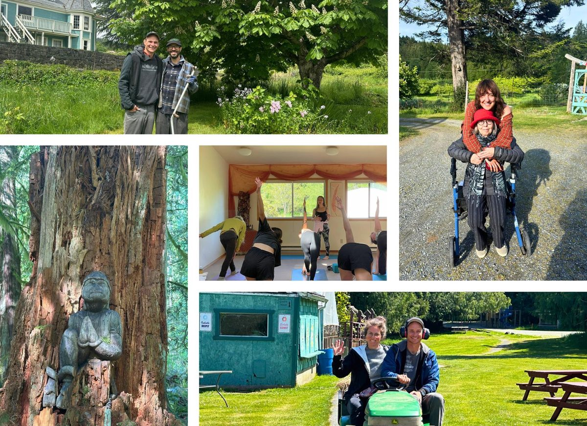

### 🦇 A Walk in Dandaka

*Long time member of the Satsang, Raghunath, invited the residential community to step into Dandaka forest behind the Centre for a tour with him.
This very special forest was protected from being disturbed at Babaji’s direction. And for good reason, it is one of the only wetlands of its kind left in all North America! It is home to many species of frogs, birds and bats, several of which are endangered and very important in keeping the ecosystem in check. The forest also serves as a filter for the water flowing into Blackburn and Cushion Lakes, which serves as drinking water to the surrounding community. Raghunath has been working in partnership with the Salt Spring Conservancy and UBC researchers to keep it protected indefinitely. We are so grateful for wisdom holders willing to share all their years of experience and dedicated work with us. Thank you Ragunath!*

### ✨ Hopes and dreams for the future of the centre

*From May 19-22, community members took part in a 3 day visioning session to share their hopes and dreams for the future of the Centre.*

### 

*As a closing ceremony, all who took part in the 3 days of visioning were invited to come to the garden to plant a sapling cedar tree together, in honour of Satsang member, Chandra Prabhā, Avi's mother. Avi has been a huge help in supporting the Centre over the years and in particular over the last few months. We're grateful to him, Daniela, Pearson and everyone for their work in putting this visioning week together. It was a beautiful time to connect to the roots of the Centre, and to dream into what its future can look like.*

###

### Behind the scenes  📸

May was a beautiful month here at the Centre, full of meaningful moments. We had our regular yoga classes and yoga rituals, and the farm stand opened with the first goodies from the garden (always such a treat!). A lot of love went into making handmade gifts for Elders attending the Q’ushin’tul Gathering. There’s been lots of karma yoga happening, preparing meals straight from the garden, tending the land, caring for the buildings, and keeping things flowing with heart. Our Yoga & Wellness Retreat brought a lovely group together for a weekend of rest and connection. All in all, May was full of quiet joy, shared service, and moments that reminded us why this place feels so special.

Jai Babaji, Jai Satsang! 💖
OM, Peace, Peace, Peace 🕉️ 🙏 🌿
