### Yoga Study & Service Immersion Program

Our recent Yoga Study & Service Immersion Program brought together a beautiful group of dedicated people who embraced daily practice, selfless service, and community life at the Centre. From serving in the garden and kitchen to deep study and heartfelt connection, their presence uplifted us all.
The closing ceremony was a joyful celebration of their journey, rooted in yoga, community, and transformation. We’re so grateful for all they brought to this spiritual home.

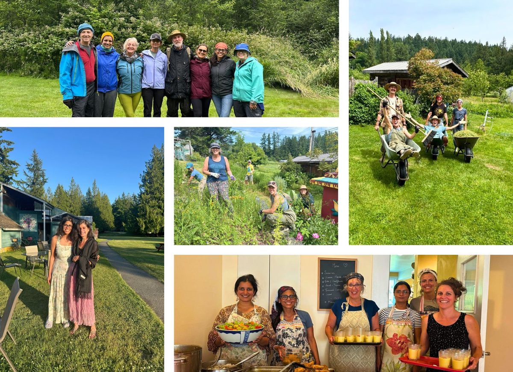

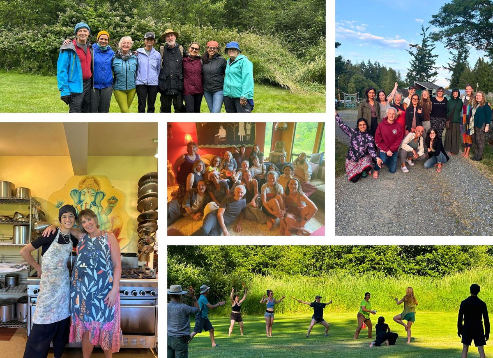

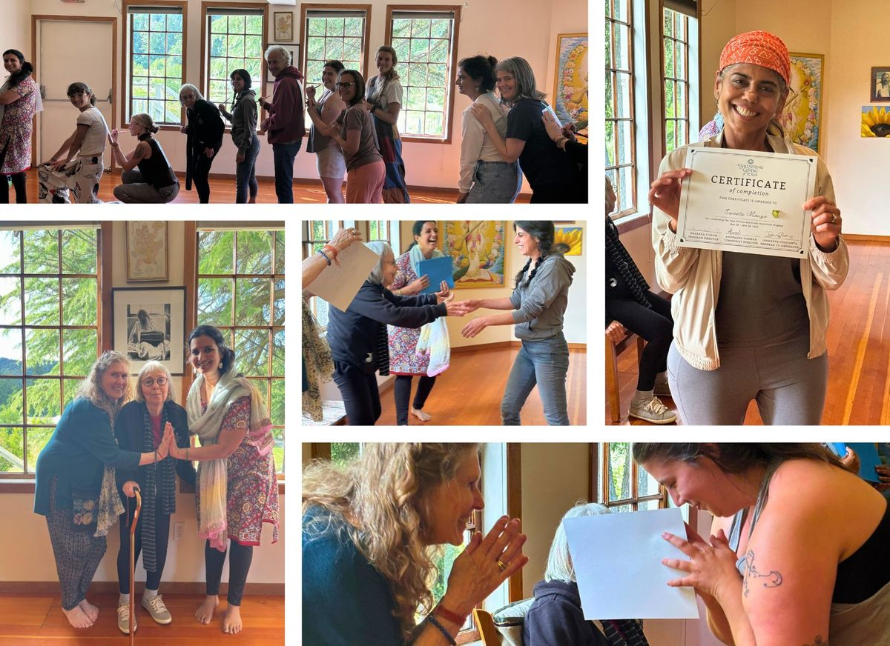

### Podluck Blackburn Pod

In conjunction with the Neighbours Feeding Neighbours initiative on the Island, we hosted a "Podluck" this month with residents residing in the Blackburn Pod. This gathering had intentions of addressing local food security, emergency preparedness, and at its core: coming together and connecting as neighbours.

### 

### Behind the scenes  📸

Over the past month, life at the Centre has been rich with quiet dedication and meaningful rhythm. Behind the scenes, community members have been tending the land, harvesting from the farm, preparing nourishing meals, and holding space for daily practices and rituals.
The kitchen has been alive with the scent of fresh, garden-grown ingredients. The farm crew worked with heart and hands in the soil. All of this energy came together to welcome guests for our recent Yoga & Wellness Weekend Retreat, a few peaceful days of reconnection and rest.
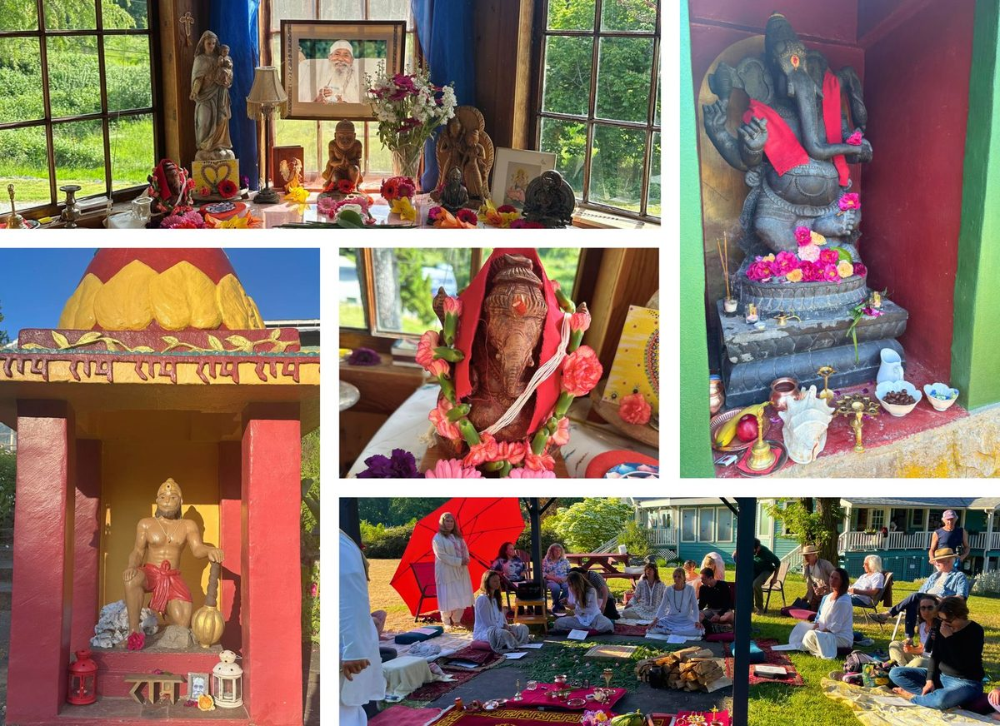

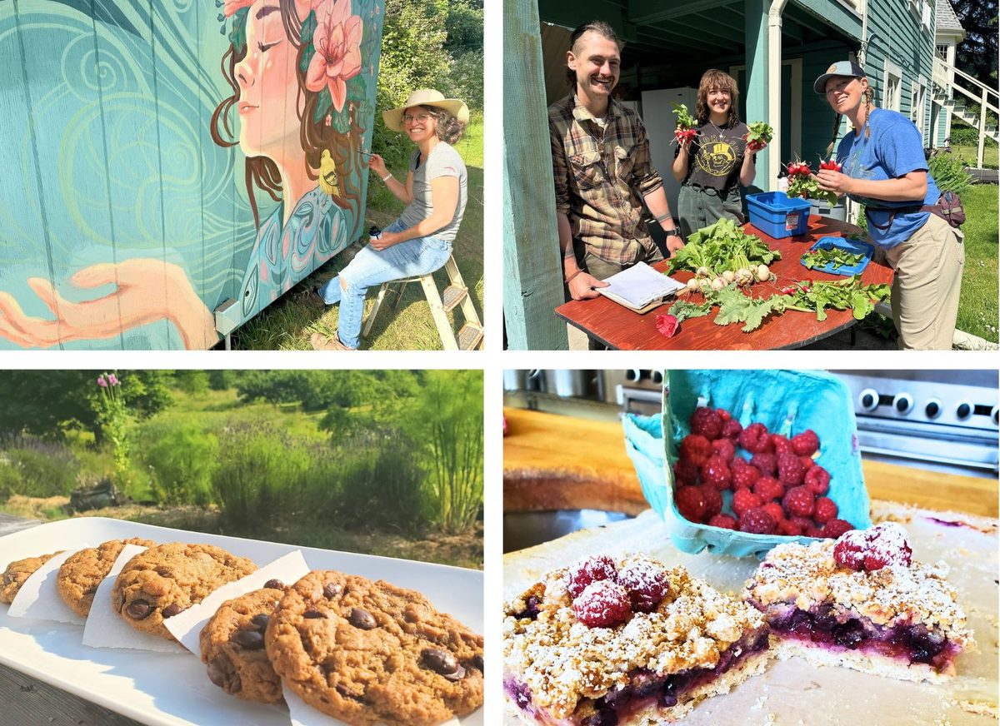

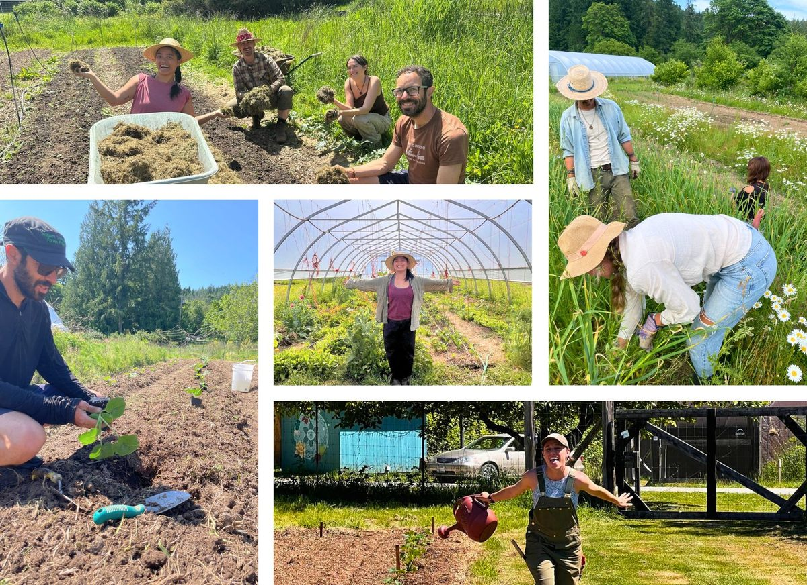

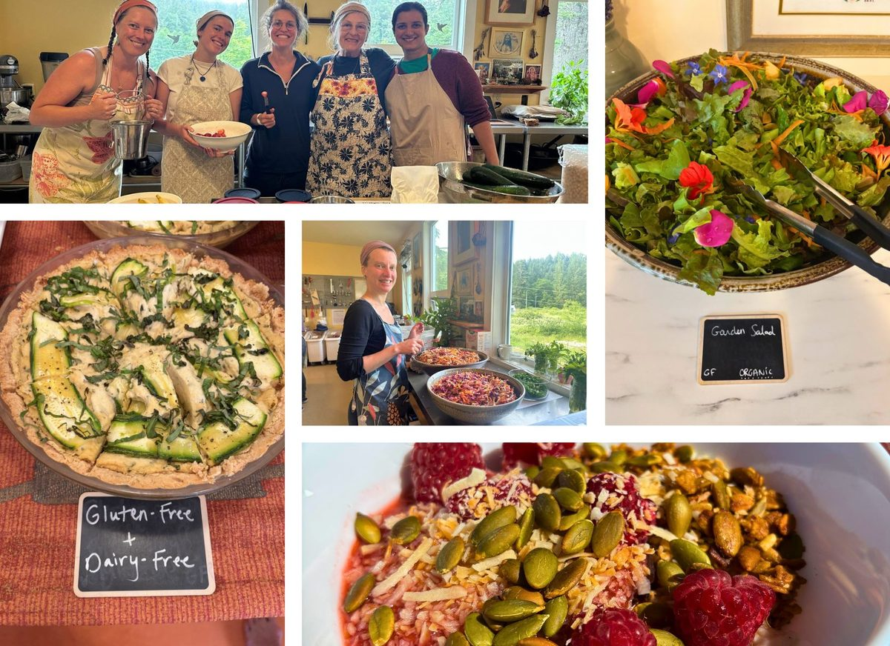

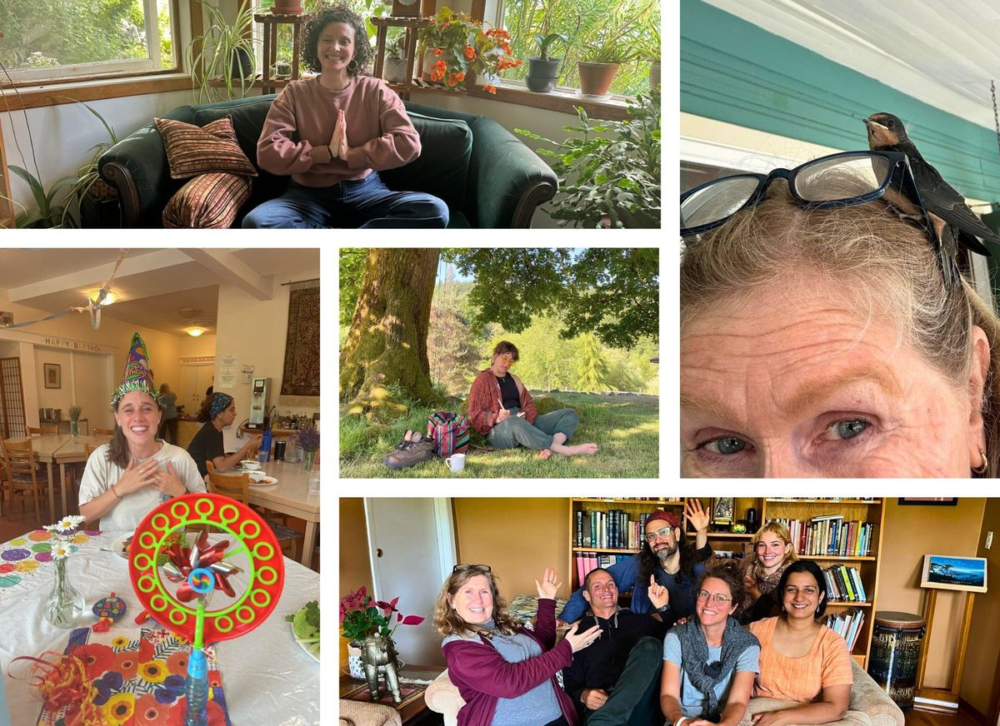

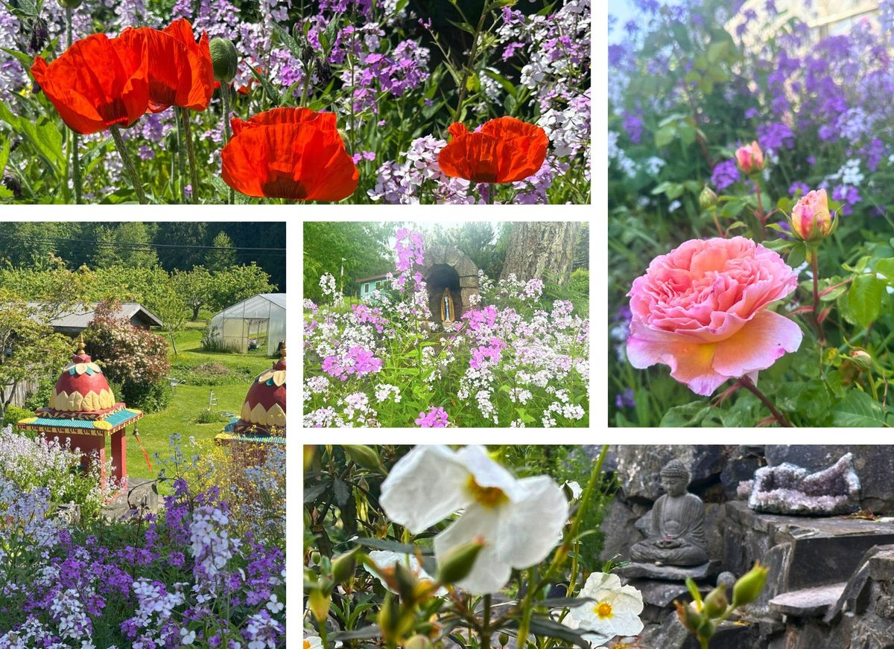

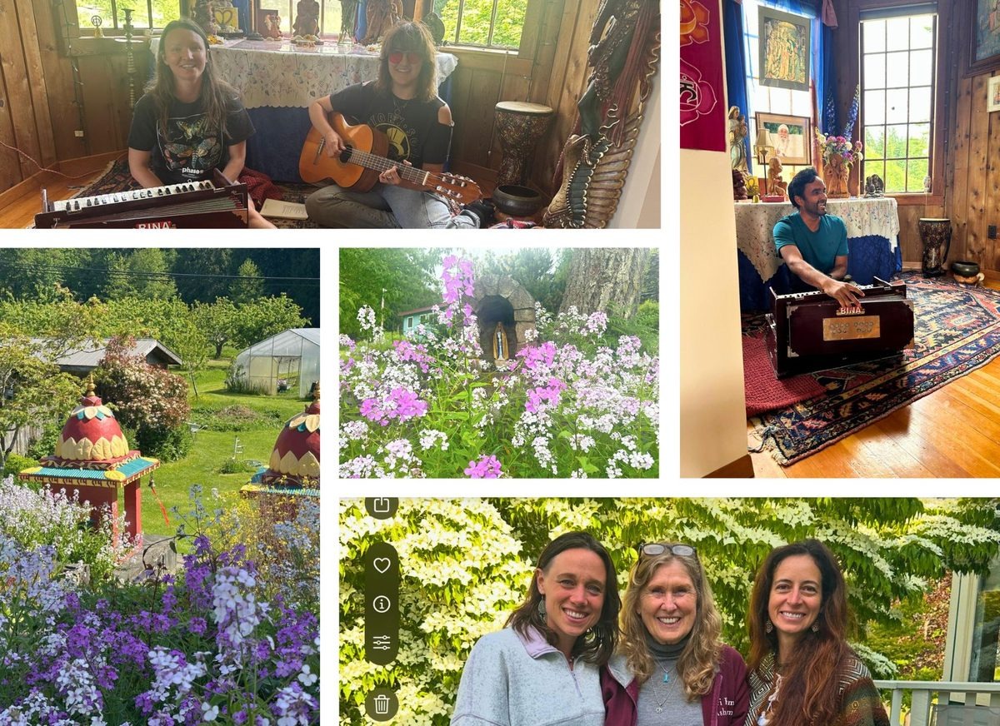

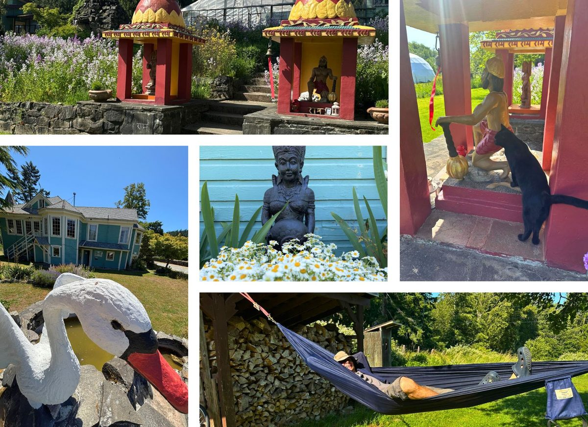

Jai Babaji, Jai Satsang! 💖
OM, Peace, Peace, Peace 🕉️ 🙏 🌿
