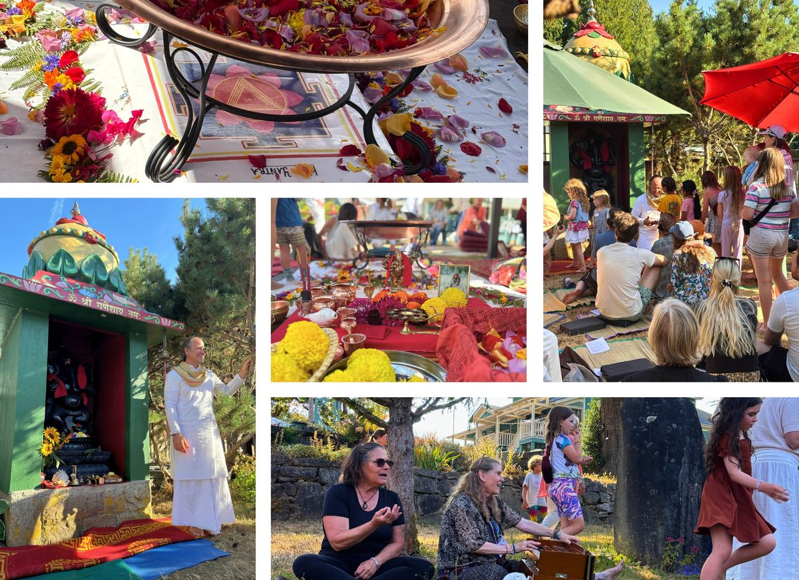
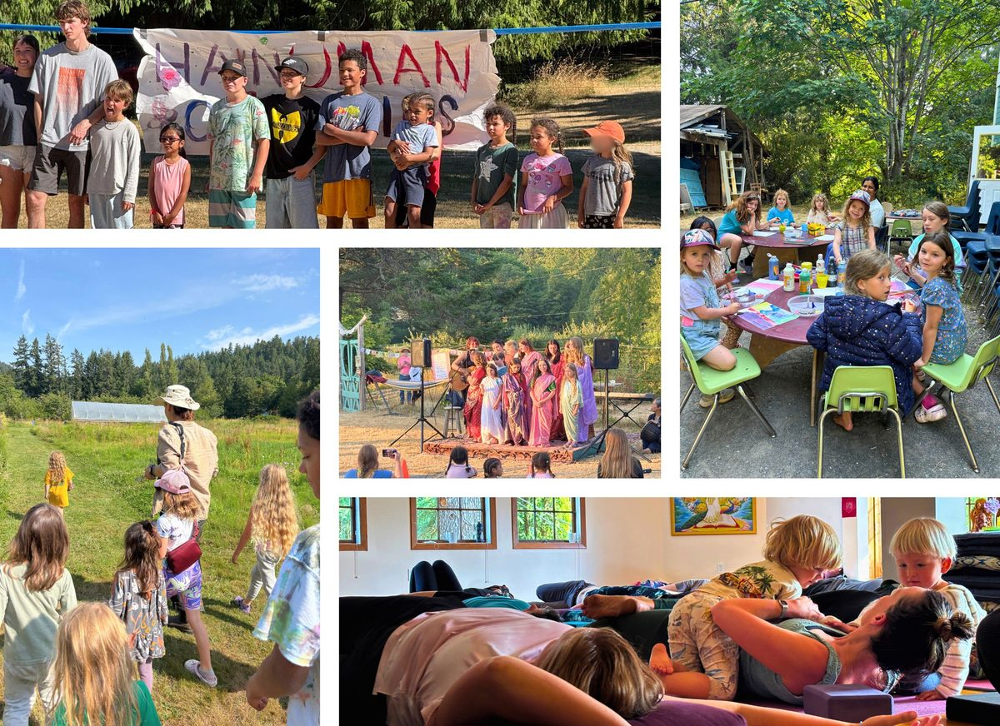
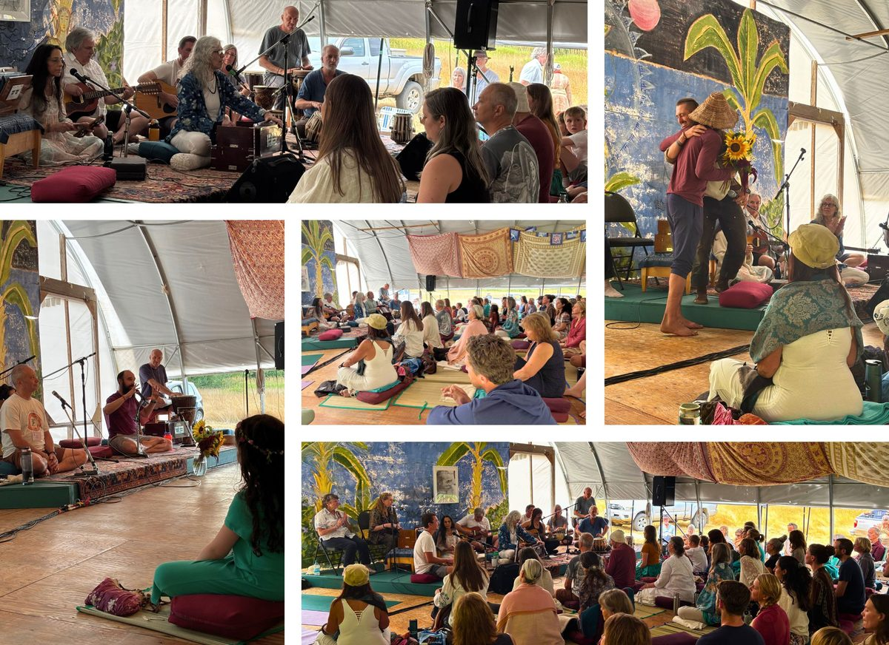
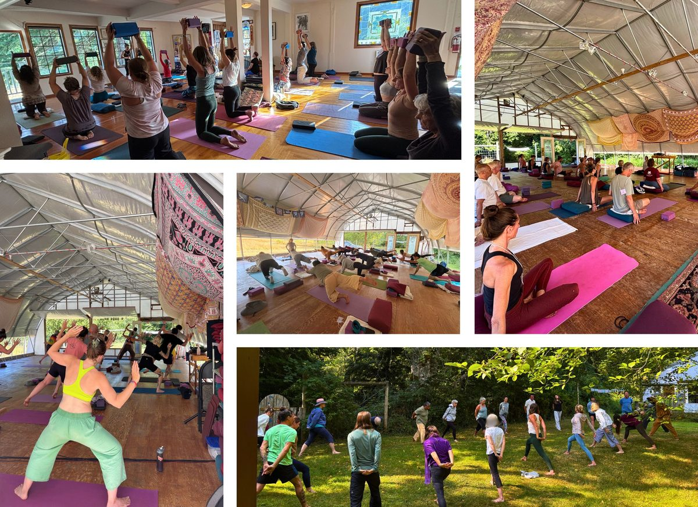
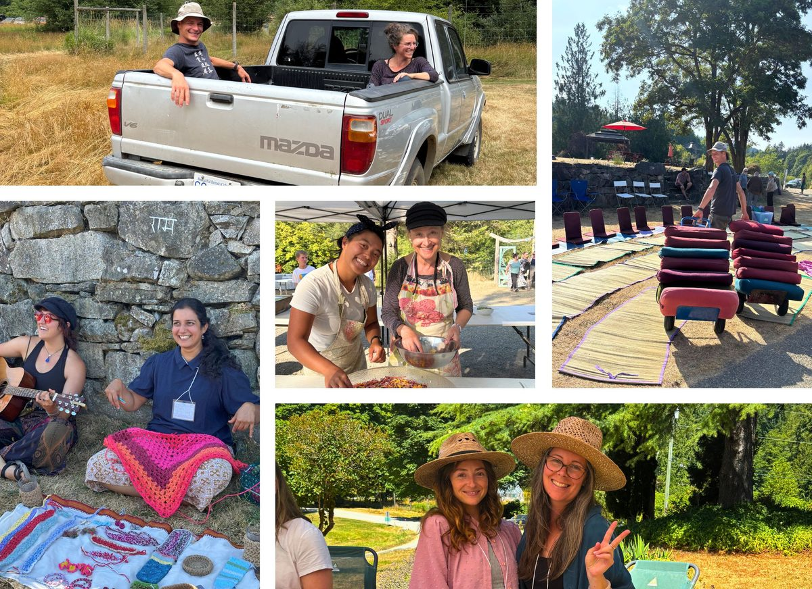
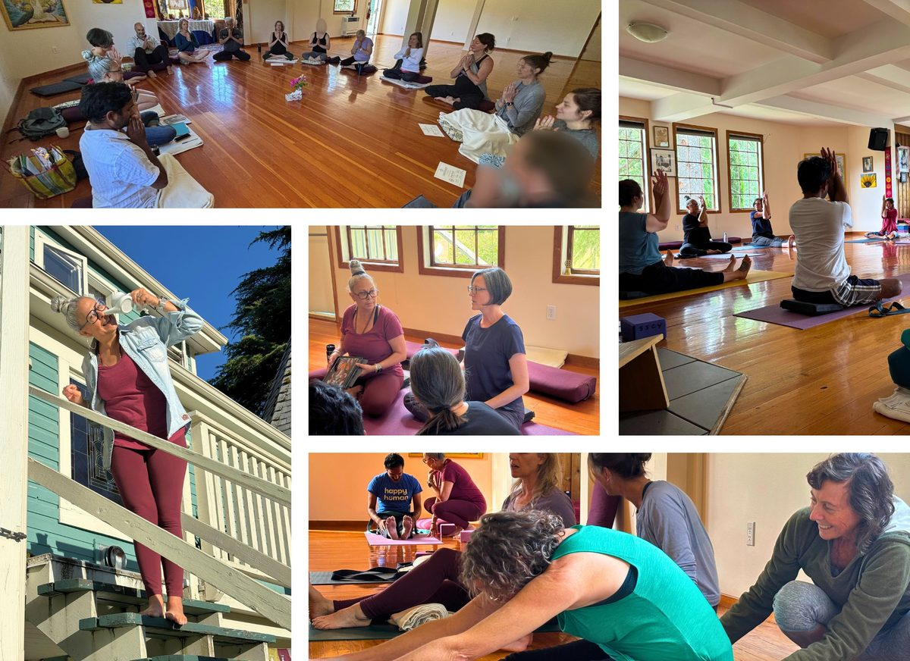
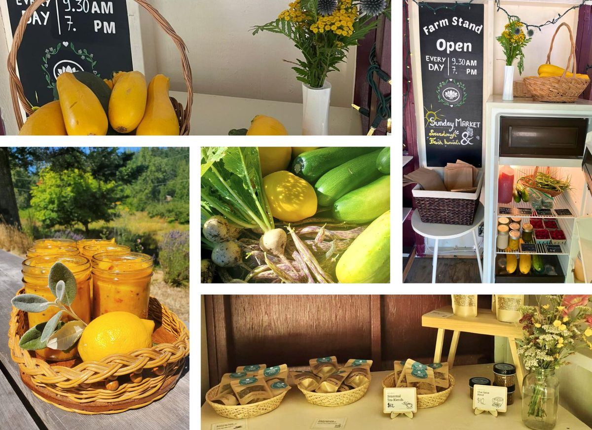

### 51 st Annual Community Yoga Retreat

*Jai Sita Ram!* We had a wonderful gathering on the land over the long weekend. All ages coming together to Work honestly, meditate everyday, meet people without fear, and play! In celebration of Babaji, the teachings and connecting with one another. After the 50th, we weren't sure what to expect for the 51st retreat. Although smaller, it exceeded our expectations and there was a sweet sense of family and togetherness. The theme of Reunion and Renewal was felt by all. Big, big thank you to everyone who came. Coming together is what makes it all possible.
*Jai Babaji, Jai Satsang, Jai Hanuman!*
*With love, Anuradha, Haripriya and the ACYR Team*
[vcex\_divider color="#ffffff" width="100%" height="1px" margin\_top="10" margin\_bottom="10"]

[vcex\_divider color="#ffffff" width="100%" height="1px" margin\_top="10" margin\_bottom="10"]

[vcex\_divider color="#ffffff" width="100%" height="1px" margin\_top="10" margin\_bottom="10"]

[vcex\_divider color="#ffffff" width="100%" height="1px" margin\_top="10" margin\_bottom="10"]

[vcex\_divider color="#ffffff" width="100%" height="1px" margin\_top="10" margin\_bottom="10"]

[vcex\_divider color="#ffffff" width="100%" height="1px" margin\_top="10" margin\_bottom="10"]

### Guru Purnima

“I love you whether you know it or not. You asked about our relationship. It’s a relationship of guru and disciple in which all relationships merge. You will know me through Sadhana.” - Babaji
Here is a glimpse of the beautiful Guru Purnima Celebration that happened last month, where we honoured Master Yogi Baba Hari Dass (Babaji) and all spiritual teachers through an ancient Vedic ceremony (Yajña).
Jai Babaji!
[vcex\_divider color="#ffffff" width="100%" height="1px" margin\_top="10" margin\_bottom="10"]

#### 

[vcex\_divider color="#ffffff" width="100%" height="1px" margin\_top="10" margin\_bottom="10"]

### Yoga Intensive Program

We wrapped up our first Yoga Intensive Program! 💛 Last month, we welcomed participants from all walks of life for a 5-day immersion into the heart of yoga, guided by Chetna and Gita with wisdom, compassion, and joy. From morning meditations and asana clinics to deep dives into yoga philosophy, it was a beautiful gathering. We're so grateful for this first edition and look forward to offering this program again in the future, for yoga enthusiasts and teachers alike, ready to reconnect with the roots of yoga.
✨ [Here’s a beautiful poem one of our participants shared about their experience.](https://saltspringcentre.com/in-gratitude-yoga-intensive-program/)
[vcex\_divider color="#ffffff" width="100%" height="1px" margin\_top="10" margin\_bottom="10"]

[vcex\_divider color="#ffffff" width="100%" height="1px" margin\_top="10" margin\_bottom="10"]

### Behind the scenes: July highlights  📸

July was alive with summer energy at the Centre! In addition to launching our first-ever Yoga Intensive Program, we had the joy of hosting several retreats and programs, including our beloved Yoga & Wellness Weekend Retreat and The Wild Within nature immersion. Music filled the air with a magical Masterplant concert in the Pond Dome.
The kitchen team nourished us with delicious meals, and the farm stand overflowed with fresh goodies, prepared and harvested with love. Meanwhile, everyone at the Centre has been actively preparing for the 51st Annual Community Yoga Retreat, tended to the grounds, cleaned, beautified, and made sure everything was ready to welcome the extended Centre family back home.
What a full and beautiful month it’s been!
[vcex\_divider color="#ffffff" width="100%" height="1px" margin\_top="10" margin\_bottom="10"]

#### 

[vcex\_divider color="#ffffff" width="100%" height="1px" margin\_top="10" margin\_bottom="10"]

#### 

[vcex\_divider color="#ffffff" width="100%" height="1px" margin\_top="10" margin\_bottom="10"]

[vcex\_divider color="#ffffff" width="100%" height="1px" margin\_top="10" margin\_bottom="10"]

Jai Babaji, Jai Satsang! 💖
OM, Peace, Peace, Peace 🕉️ 🙏 🌿
