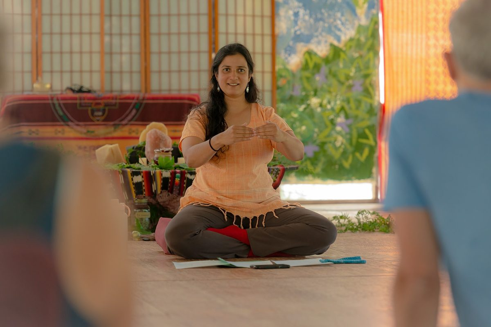
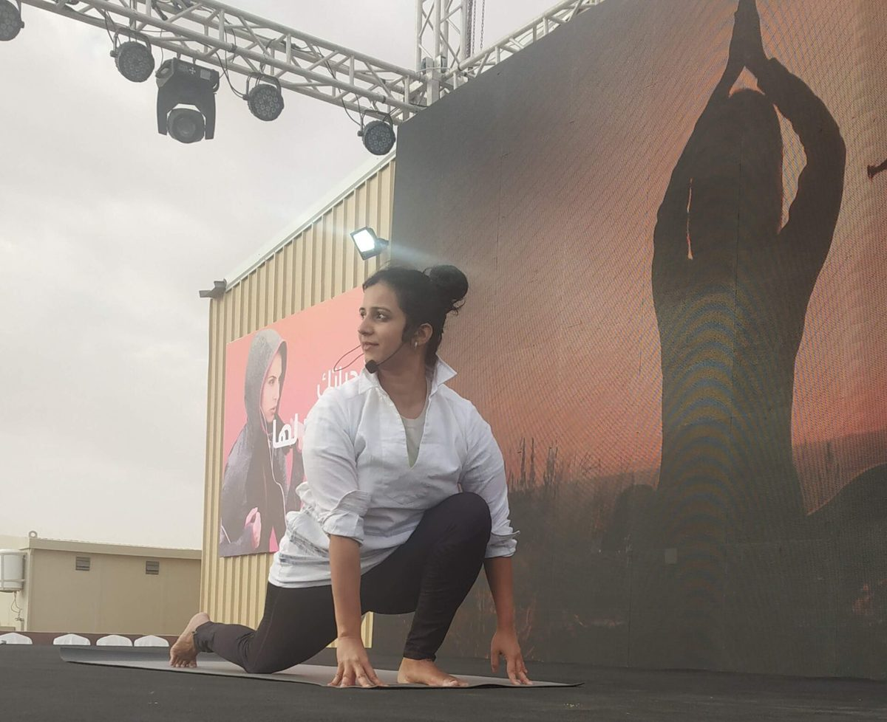

> *“In the forest, everything looks messy and chaotic—yet everything coexists in harmony. That’s the balance yoga invites us to find within.” ~Ishwarya Chaitanya*

This week, I sat down with Ishwarya to chat about her upcoming [Nature and Nurture Retreat](https://saltspringcentre.secure.retreat.guru/program/nature-and-nurture-retreat-heal-through-yoga/?lang=en). We sat at a picnic table on the mound here at the Salt Spring Centre of Yoga where we experienced the wind through the gentle dance of the maple leaves; their chroma-shift colours proudly on display. I have attended her Tuesday afternoon classes; they offer a therapeutic approach that promises to leave your muscles stretched and awakened and your mind calm. And, I was curious about how she will structure her 2-night retreat to give participants a deeper connection to the practice of yoga.
So many of us try to squeeze in an asana class between making breakfast, a morning walk or run and our commute to the office. But is this truly serving us? And, is rushing from one obligation to the next really conducive to finding a sense of peace, balance, and clarity? I’m thinking not.
So, what does it mean to truly slow down so that we can cultivate - with the right guidance and environment - a deeper connection to nature, yoga, and ourselves? Ishwarya had incredible insight. 

### **From Dancer to Yogi and Yogi to Dancer**

Ishwarya’s background in classical Indian dance informs her approach to teaching yoga in surprising ways. Dance, she explains, is not only physical but also emotional and spiritual. It demands creativity, openness, and the ability to embody and express many dimensions of being. These same qualities infuse her yoga classes: she adapts practices to meet each student where they are. This creative, holistic approach allows her students to experience asana not as a static shape, but as a living practice full of discovery, nuance, and transformation.

### **Nature as Teacher**

One of the unique aspects of the retreat is its location in a rare forested ecosystem. The Centre sits on 69 acres of protected land, including organic farmland, orchards, a permaculture food forest, streams, and the rare Dandaka Forest - one of the most untouched, primordial cedar-swamp wetlands of its kind found in North America. The Centre is also adjacent to a nature reserve,The Salt Spring Conservancy, and home to a number of endangered species. 
Ishwarya believes that immersion in nature profoundly deepens yoga practice. Unlike the controlled greenery of cities, a forest shows life in its full, messy, and harmonious form—trees, plants, animals, and insects all coexisting. In this wildness, she says, we rediscover balance and connection: 
“*Your loneliness goes away, your needs reduce, and you begin to see what life is really for.*” 
Practicing yoga in such a setting helps participants arrive grounded, expansive, and more open to inner stillness.

### **The Elements Within and Without**

The retreat draws on the five elements—earth, water, fire, air, and space—as gateways to inner healing. Ishwarya offers the breath as the simplest example: by observing the flow of air within, we can notice blockages, tensions, or pain, and begin to release them. In this way, yoga becomes a dialogue between mind and body, guided by awareness.
*“Your breath is the gateway. By observing the movement of air within, you begin to release tension and discover your power to heal.”*
She emphasizes that symptoms, whether physical or emotional, are not the end point—they are signals. Through focused practice, we can reorient the mind, shift our perspective, and access our natural power to heal and rebalance.

### **Your takeaway: The Power of Deep Relaxation**

If there is one essential gift Ishwarya wants you to take away from the retreat, it is the technique of deep relaxation. In yoga, this state is more than rest—it is conscious rest, where the body unwinds, the mind becomes still, and awareness shines forth. Mind and intellect can sharpen or dull but awareness just is. Unchanged.sharpens
*“Even in challenge, even in danger, you can remain in balance. In that awareness, you instinctively know what to do.”*
Over time, this state can extend beyond the mat: into work, relationships, and even moments of challenge. “When you can carry that state into daily life,” she explains, “you remain in full awareness, and instinctively know how to respond with balance.”

### **Yoga as Individual Journey**

While many speak of yoga as something the whole world needs, Ishwarya reframes it: yoga is not about collective prescription, but about individual liberation. “If you are content living within your limitations, you don’t need yoga. But if you are longing for something more—greater freedom, resilience, and joy—then yoga offers the tools to expand into that unlimitedness.”
Through yoga, she says, we stop identifying with labels, diagnoses, and limitations, and instead begin to see our true nature—not as one small fragment of life, but as vast as the ocean itself.

### **An Invitation**

The *Nature and Nurture: Heal Through Yoga* retreat invites participants into this process of discovery. With the guidance of an experienced teacher, the support of nature, and the practices of movement, breath, and deep rest, Ishwarya promises an experience that meets you wherever you are on your path.
Whether you are seeking a first step, a renewed commitment, or mastery of your practice, this retreat offers tools you can carry into every aspect of life: peace, balance, and focus—qualities that remain steady, even in an unsteady world.
Join us for this incredible weekend where you can gain practical tools to begin, sustain, or deepen your yoga journey. 
Register now:<https://saltspringcentre.secure.retreat.guru/program/nature-and-nurture-retreat-heal-through-yoga/?lang=en>

Written by Christie Roome

