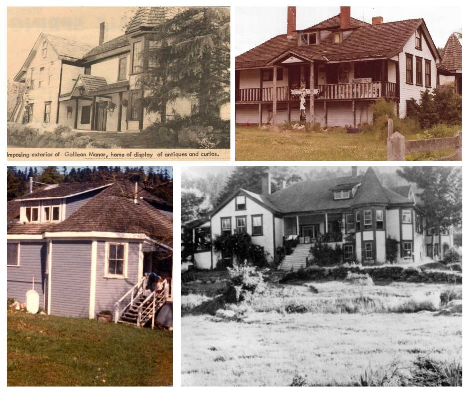
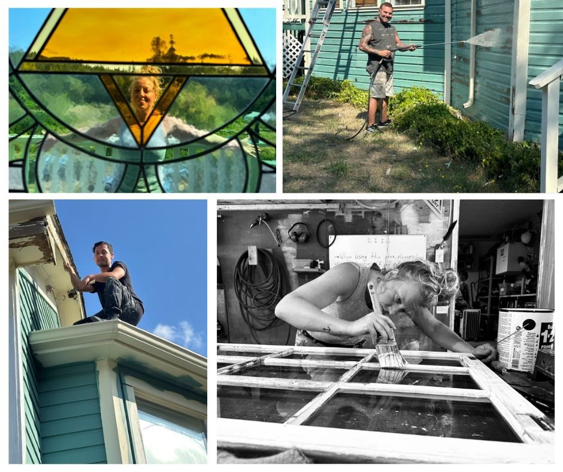
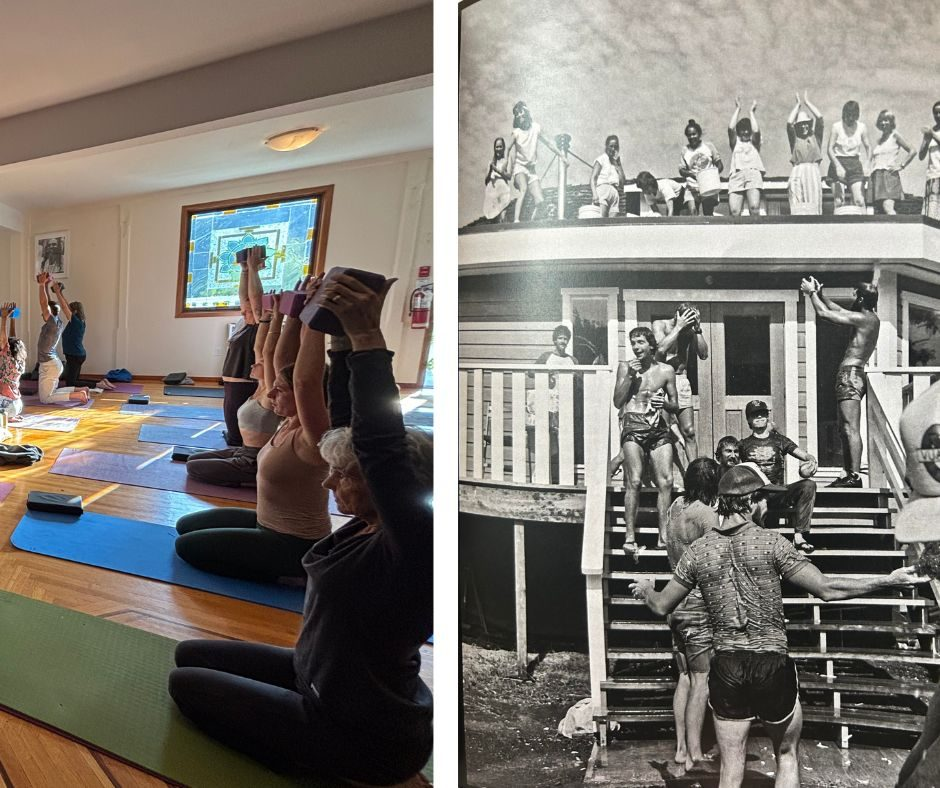
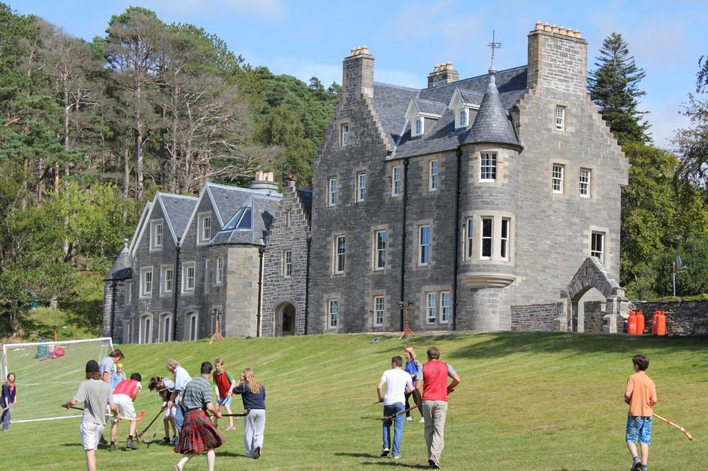
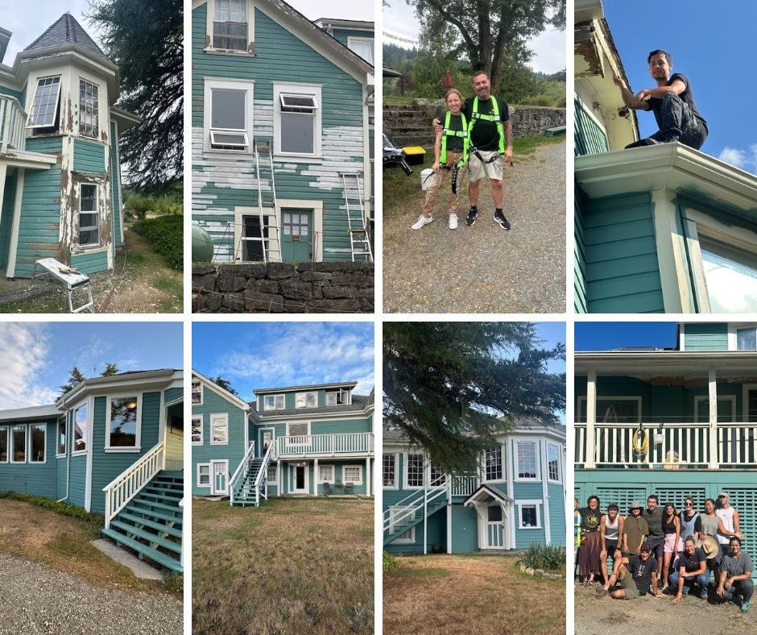

**Renewal Through Community Generosity**
Thank you for the amazing success of this year’s Paint the House fundraiser!! It revealed something so beautiful and very profound. At its essence, the renewal of the Program House reflects the vision of Baba Hari Dass, whose teachings gave rise to this Centre more than forty years ago. It showed how deeply so many care about the Centre’s Program House, about Babaji’s vision of “a place to practice and teach yoga, a place where people can attain peace.” And, that people were willing to give without expectation of return. 
These gifts were not motivated by tax credits or material rewards, for the Society can’t issue tax receipts. Instead, they came freely, from the goodness of our hearts. A very special thank you to the anonymous donor who pledged $15,000 to match every donation to that amount, inspiring and motivating us to give what we could. The response showed that the Program House is much more than just a building on the property. It is a place of special memories and/or meaning to everyone. Every donation, whether small or large, was an affirmation of that. And together, these gifts secured the renewal of a house that serves us and has served for more than a century, continuing to welcome all who enter. This success is a living testament to the enduring role of the Program House in our community. 
**A New Beginning in 1981 Rooted in Babaji’s Teachings**
When the Dharma Sara Satsang Society acquired the property, and the Program House in 1981, it all needed so much work. We began to clean up all the slash on the property, work parties happened with Babaji that summer. Through the year, we worked with the building inspector and fire marshal, the renovations began that would allow us to have public gatherings and people attend weekend programs. This introduced us to the Island businesses and gave us a good name for our hard work and paying our bills on time. Babaji’s guidance was simple and  covered everything:**” Work honestly, meditate every day, meet people without fear, and play.”**

Reimagined as the Program House, it became something new altogether, the living heart of a yoga community. A dream come true and a place where retreats, classes, and gatherings could unfold. From the beginning, it has been a space where seekers come together to live, to practice, to learn, and to be transformed. 
Since that time, the Program House has carried the Society’s spirit. It has been Babaji’s Centre in Canada, with summer retreats and teacher trainings, community gatherings and celebrations, quiet mornings of meditation, and evenings of song, special fundraising dinners and entertainment, and host to some very auspicious guests and teachers. In its rooms, silence and laughter mingle, the presence of history is felt not as a burden but as a foundation. 
**Beeluxe Painters: Falling in Love with a House**
In good faith and optimism that the fundraiser would have success, the job for painting the house was posted. After interviews, with the support of Painter Bob, we secured [Beeluxe Painters](https://www.beeluxepainting.ca/). ‘Bee’ had grown up in a painter’s family and took on the business from her dad. She learned the trade very well, and her team, Glenn and Kevin, did much more than repaint a heritage building. 

They came to know the Program House, to admire its history and character, and in their own way, to fall in love with it. Their attention to detail and their respect for the spirit of the house shines through in the work they completed. Windows were repaired, rotten wood replaced and even the gutters were cleaned while they were up on their ladders. The exterior now gleams with fresh life, its strength renewed for the years ahead. 
**More than a Building**
Today, freshly painted, the Program House stands ready for its next chapter. As the heart of the Salt Spring Centre of Yoga, it continues to gather people from near and far, offering shelter, inspiration, and community. It is a house that has known devotion, resilience, and transformation and continues to remind us of what can endure when we come together in care and in love. It is a living embodiment of Babaji’s teachings, a reminder that when we serve in love, we build not only for ourselves but for generations to come.

It is a bridge between a Scottish family’s longing for home, and the seekers who find belonging here today. It is a reminder that places, like people, carry stories. And when we care for them, those stories are not lost. They become part of us. 
**History - A House with Roots in Scotland**

The Program House was begun in 1907 and completed in 1911, designed by Alan and Esther Blackburn as a reflection of their ancestral home, Roshven (Blackburn) Castle in Scotland. After converting to Catholicism, Alan and his family were exiled from their Protestant home in Scotland. In their longing for that home, they carried with them a vision of it to Canada and recreated it here on Salt Spring Island. 
Although built of wood in the North American style, the house carried with it a distinctly European presence. The turret and semicircular apse were not simply architectural flourishes. They held within them a private consecrated chapel, the only one of its kind on the island. For many years, priests traveled from Vancouver Island to celebrate Mass there each month. The Program House was thus not only a family dwelling but a place of devotion, where faith and exile intertwined. 
Sometime after Alan Blackburn’s death in 1925, Esther Blackburn was notified that their son was the only heir left to the Blackburn estate and castle (Roshven). She packed their bags and returned to Scotland as Lady Blackburn. When the Canadian government realized the property taxes were not being paid, they took over the land. 
During the depression, the house was home to single men. They learned cooking, hygiene, vegetable gardening, and hand-saw logging, the marks of which are still visible in the surrounding forest. Later, in the 1960s, it became known as Galleon Manor, a museum of curiosities curated by the Luton family. By then, the house had worn many masks: homestead, chapel, school, museum. At times it thrived, and at times it languished. When the property was purchased in 1981 it was called Blackburn Manor and had sat empty for at least 5 years, the owners living elsewhere in the valley.

For us all, it’s a dream come true, a property that is home for the Dharma Sara Satsang Family and Friends, for yoga classes, programs, ceremonies, community, many land projects, and the annual Summer Retreat (now ACYR). 
We are deeply grateful: to the generous donors who gave freely from the heart, and to Beeluxe Painters, who approached the Program House not only as a project but as a treasure. Because of all of you, this beloved home continues to stand strong, carrying its story, and ours, into the future.
