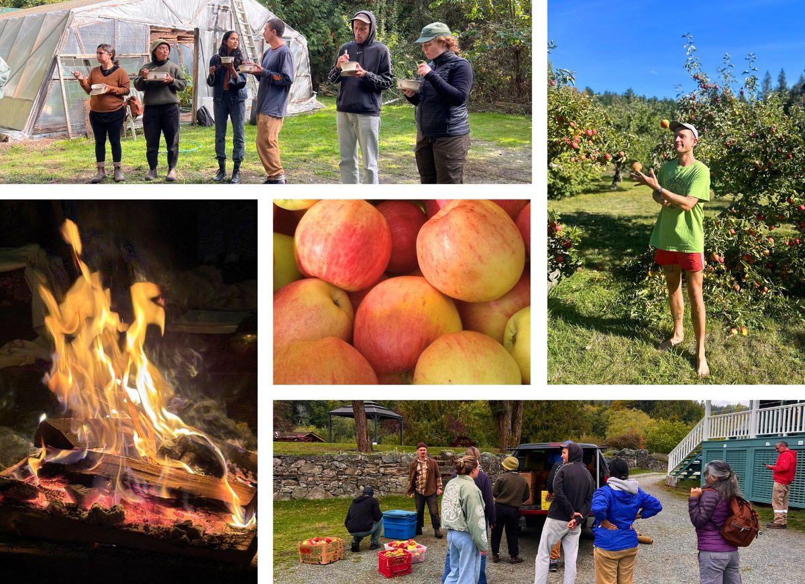
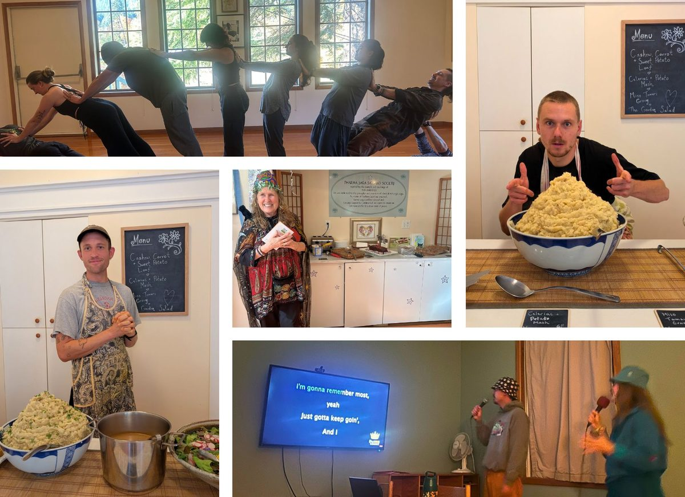
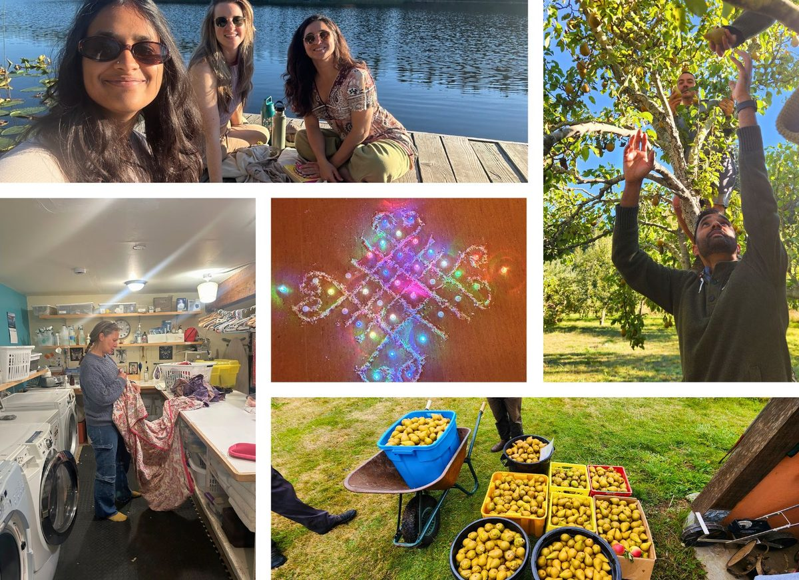
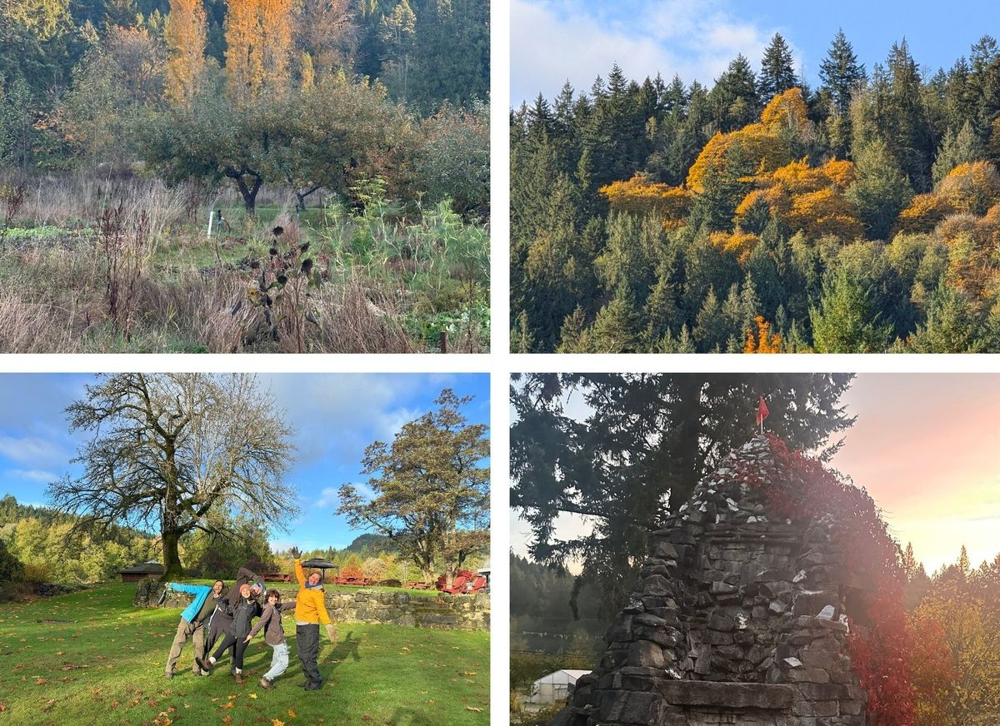
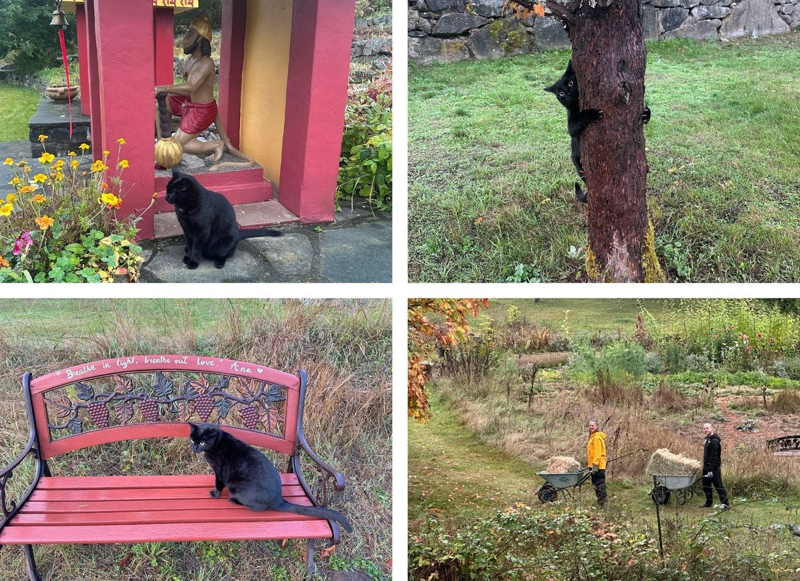
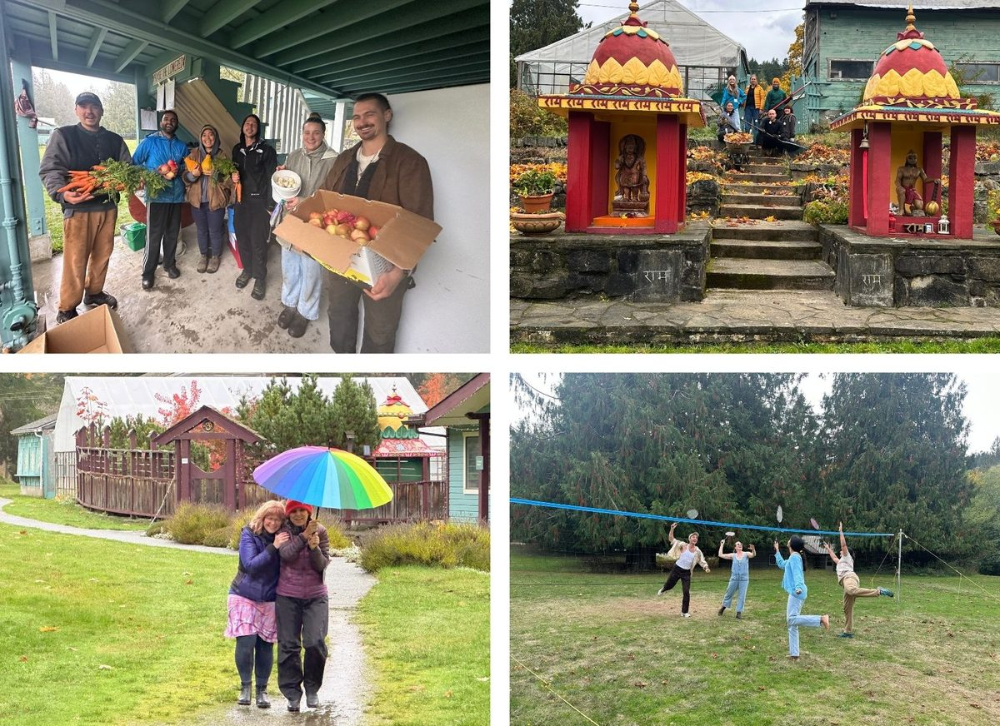
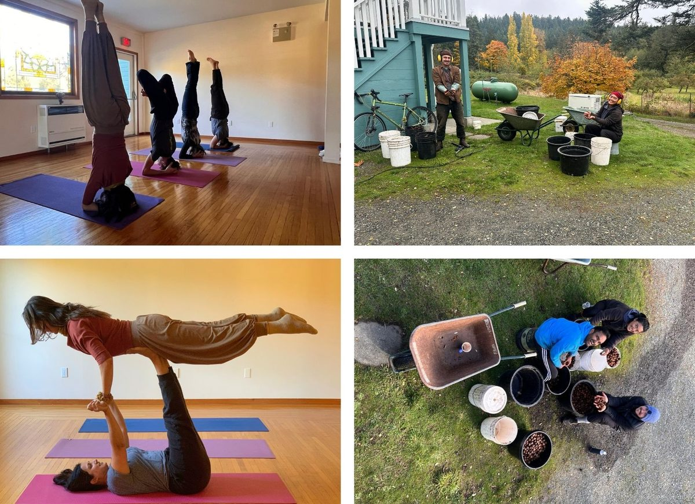
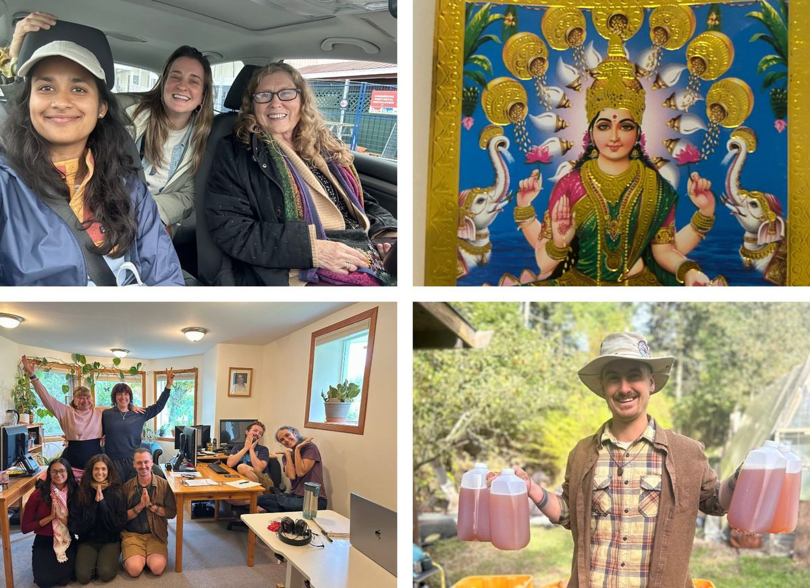

### Life at the Centre - October  2025

As autumn settled over the island, the Centre glowed with gratitude, song, and community spirit. 🍂✨
October unfolded with music, colour, and heartfelt connection at the Salt Spring Centre of Yoga. Under the luminous full moon, we gathered in devotion for the Pūrṇimā Yajña - an evening of chanting, fire, and collective prayer for peace and renewal. 🔥🌕
Throughout the month, our community classes continued to bring together students, teachers, and Karma Yogis, deepening our shared practice of yoga and service. The energy of community carried into music jams and karaoke nights, where laughter and spontaneous song filled the Program House. 🎶💫
We celebrated Anuradha’s birthday, honouring her decades of service and steadfast love for Babaji’s teachings, and offered prayers during a joyful Ganesh Puja, invoking the remover of obstacles as we entered the final stretch of the season. 🕉️🐘
As Diwali approached, the Centre shone even brighter with a beautiful Lakshmi Puja, honouring the goddess of abundance, harmony, and light — a reminder of the inner radiance that guides our paths. ✨🌸🪔
Out on the land, apple juicing days brought hands, hearts, and harvest together — the orchard buzzing with activity and the sweet scent of autumn in the air. 🍏💛 The freshly painted Farm House and community spaces added a touch of brightness and care to the Centre’s landscape, symbolizing renewal and gratitude. 🎨🏡
We gathered for Thanksgiving, sharing food, stories, and laughter around the table — a heartfelt reminder of community, abundance, and the spirit of seva that lives through us all. 🌻🙏🏽
[vcex\_divider color="#ffffff" width="100%" height="1px" margin\_top="10" margin\_bottom="10"]

 
[vcex\_divider color="#ffffff" width="100%" height="1px" margin\_top="10" margin\_bottom="10"]

[vcex\_divider color="#ffffff" width="100%" height="1px" margin\_top="10" margin\_bottom="10"]

 
[vcex\_divider color="#ffffff" width="100%" height="1px" margin\_top="10" margin\_bottom="10"]
Jai Babaji, Jai Satsang! 💖
OM, Peace, Peace, Peace 🕉️ 🙏 🌿
[vcex\_divider color="#30646a" width="100%" height="1px" margin\_top="20" margin\_bottom="20"]

