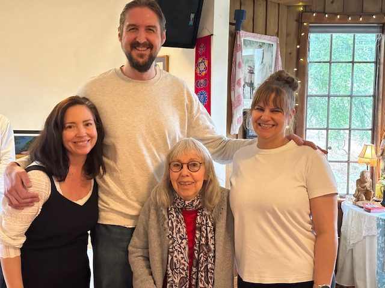
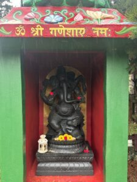
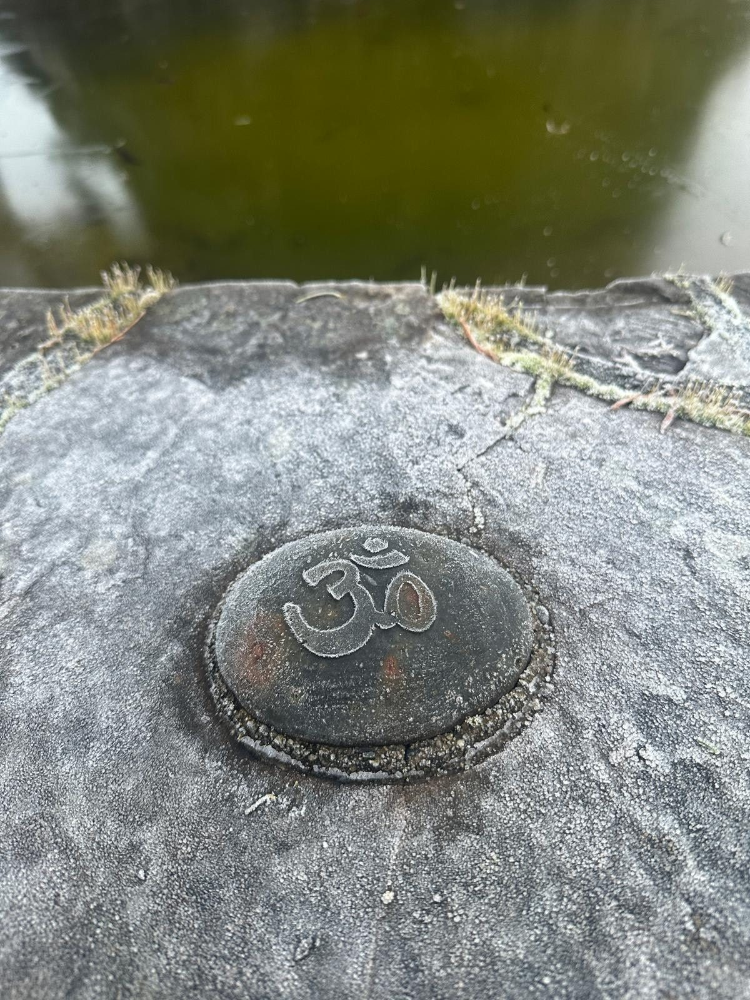
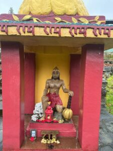
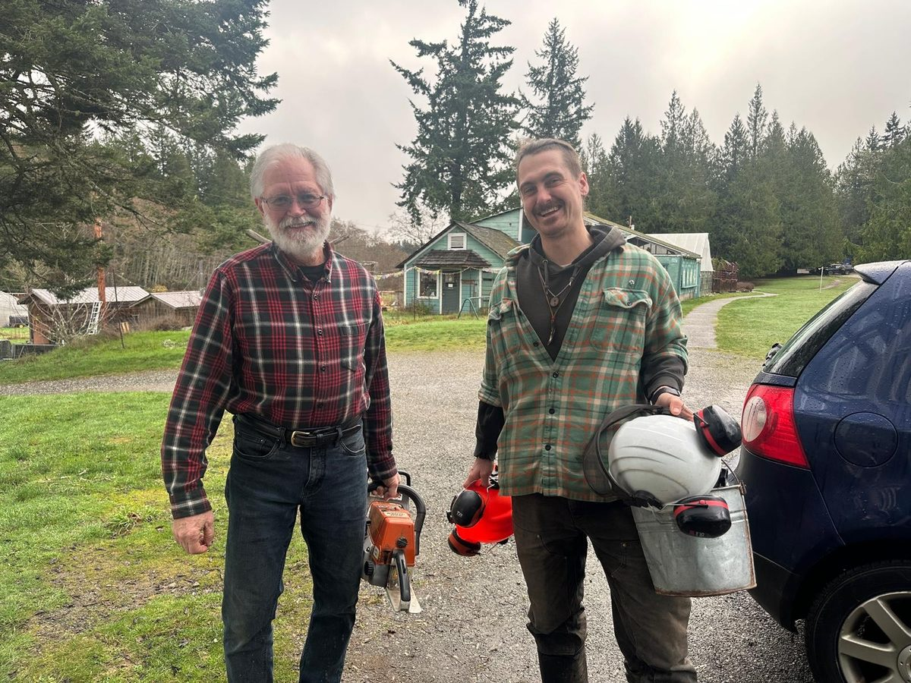
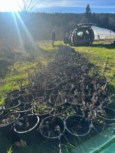
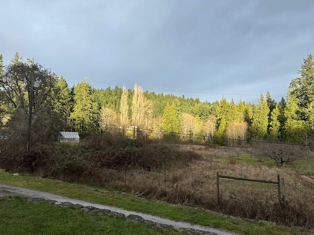

### Winter Stewardship and Continuity

January held a special quality of stillness and remembrance at the Centre. The month included the honouring of two lives transitioning to the spirit realm, marked through traditional ceremonies rooted in Babaji’s teachings. Frost covered mornings and gradually earlier sunrises reflected the quiet turning of the season.

Prince doing Daily Nidra <3

Throughout the winter, yogic study and practice continued steadily. Yoga classes were offered on Mondays, Wednesdays, and Saturdays with Dorothy, alongside Sutra and Gita classes held both online and in person with Yogeshwar and Mahavir.

The Celebration of Life for Lakshmi McPhee brought together a large gathering of friends and family, reflecting the many circles she shared her life with and the depth of connection she fostered within the community.
January also welcomed new guests through gatherings such as the Island’s Farmland Trust meetings, where Usha presented on the history of growing food on the island.

Behind the scenes, winter work continued across the Centre. Maintenance projects, housekeeping, farm preparations, community coordination, and office planning are all underway in preparation for programs and events through 2026. The school space remained lively with 24 children joyfully learning in nature through Nature’s Education Academy. Mother Nature is already offering signs of spring, with early flowers, swelling buds, and an increasing chorus of birdsong.

With March approaching, the Centre moves forward into the next season of shared practice, retreats, and gatherings.

### Jai Babaji, Jai Satsang! 💖

OM, Peace, Peace, Peace 🕉️ 🙏 🌿
