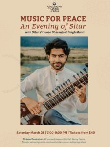

At the Salt Spring Centre of Yoga, music has always been more than performance. It is a form of practice , a way of listening that softens the mind, steadies the nervous system, and brings us back into relationship with ourselves, one another, and the world around us.
Music for Peace is a new concert series devoted to this kind of listening.
Rooted in Indian classical music and other contemplative traditions, the series offers intimate evenings of sound as a shared, meditative experience. These concerts are not designed for distraction or entertainment alone, but for presence, for slowing down, tuning in, and allowing sound to unfold in its own time.
In a world shaped by urgency, fear and noise, Music for Peace is an invitation to pause.

### Why Music for Peace

Indian classical music is traditionally experienced as a living dialogue between silence and sound. Ragas are not rushed; they emerge gradually, creating space for breath, attention, and inner stillness. Listening itself becomes an active practice — one that cultivates patience, sensitivity, and awareness.
At the Centre, we see these concerts as an extension of yoga and meditation:
a practice of deep listening, shared in community.
Each event in the Music for Peace series is offered as a ticketed fundraiser, supporting both the visiting artists and the Centre’s ongoing work in yoga, meditation, and contemplative arts.

## 2026 Music for Peace Concert Series

### March – November

We are honoured to welcome a remarkable group of artists this season, each carrying a living lineage of sound.

### March 28, 2026

## Music for Peace – An Evening of Sitar

with Sharanjeet Singh Mand
The inaugural concert of the series features Juno-recognized sitarist Sharanjeet Singh Mand, known for his deeply expressive gayaki ang (voice-led) approach to the sitar. Rooted in the Vilayatkhani gharana, his playing invites the listener into a spacious, meditative relationship with sound.
More information and tickets [here.](https://saltspringcentre.com/events/music-for-peace-sitar-concert-salt-spring-island/)

### May – August 2026

#### Additional Concerts & Guest Artists

Further Music for Peace concerts will take place throughout the late spring and summer months, featuring visiting artists from Indian classical and contemplative music traditions exploring Flute, Tabla, Hindustani Vocals and Fusion music.
These events will continue to explore sound as a pathway to stillness, presence, and connection. Full details for each concert will be shared as the season unfolds.

June 27 - Hindustani Vocal - Akhil Jobanputra <https://saltspringcentre.com/events/music-for-peace-akhil-jobanputra-tihai-ensemble/>

August 1 - Flute/ Bansuri - Deepak Ram <https://saltspringcentre.com/events/music-for-peace-deepak-ram-bansuri-flute-indian-classical-concert-salt-spring-island/>

August  8 - Tabla and Ghazal - Cassius Khan<https://saltspringcentre.com/events/music-for-peace-cassius-khan-amika-kushwaha-tabla-and-ghazal/>

September  19 - Hindustani Vocal - Rishima Bahdoor <https://saltspringcentre.com/events/music-for-peace-classical-indian-concert-with-rishima-bahadoorsingh/>

October 17- Indo Fusion Multi Instrument-  Prashant John <https://saltspringcentre.com/events/music-for-peace-prashant-michael-john/>

## An Invitation

You do not need to be familiar with Indian classical music to attend these concerts. You only need a willingness to listen.
Come as you are.
Sit, listen, and allow the music to do its work.

### Tickets & Participation

All Music for Peace concerts are offered as ticketed fundraisers, with tickets starting at $40 and the option to contribute more if you are able. Seating is limited to preserve the intimacy of the listening experience.
