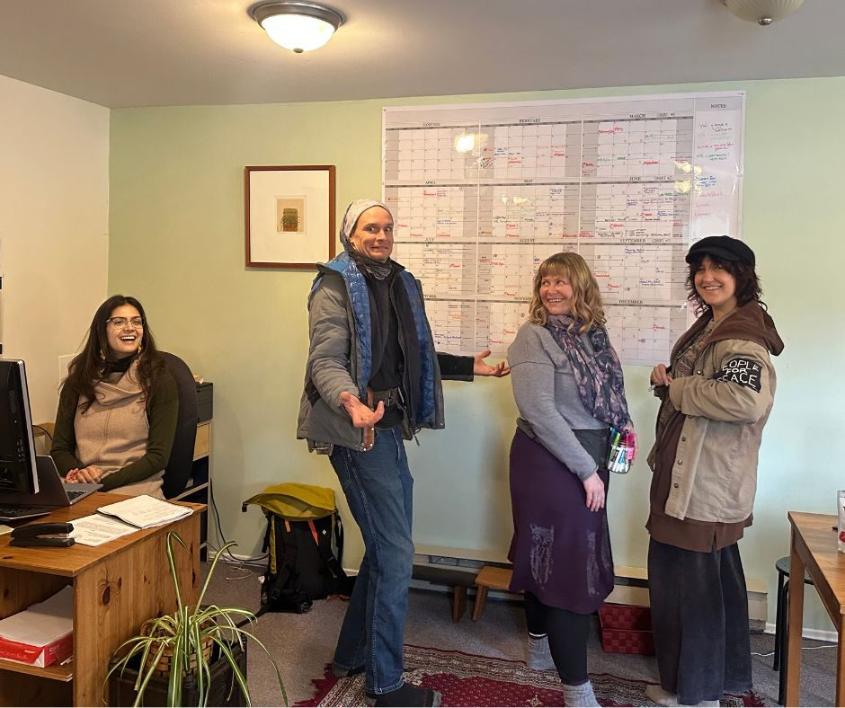
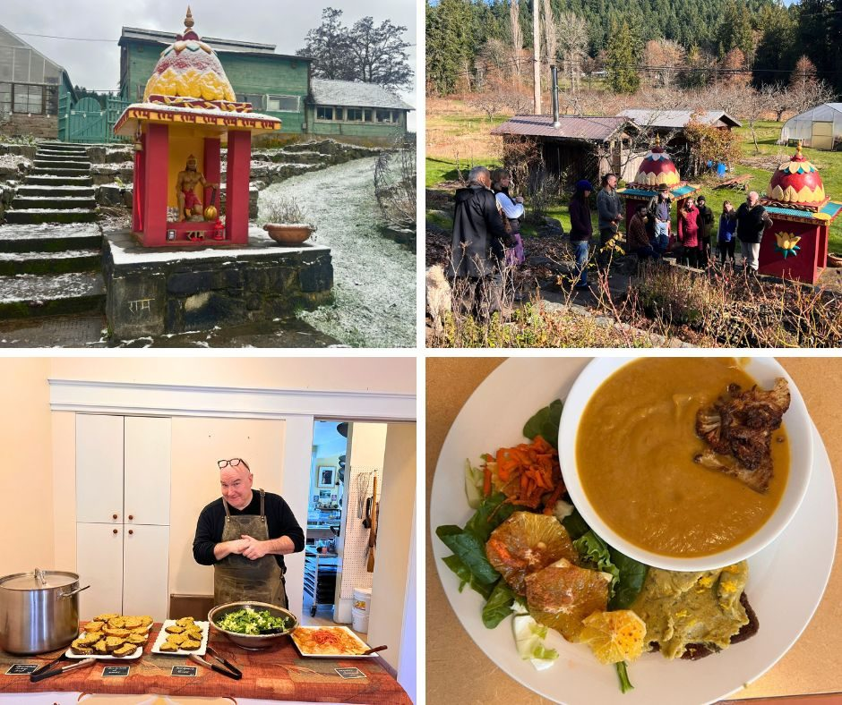

### Seeds in the soil and the Centre coming back to life

February has been a quiet but meaningful month at the Salt Spring Centre of Yoga. After the stillness of winter, the land and community are slowly beginning to stir again.

#### Farm Update

Winter may still be with us, but the first seeds of the season are already in the soil.
This month, our farm team and volunteers planted 1,008 leek seeds, 600 lettuce seeds, and many broccoli and cauliflower seeds that will grow slowly through the early spring.
There is something quietly magical about placing a seed so small into the soil and trusting that, with care and time, it will grow into food that nourishes our community.
Hooray for the start of a new growing season.

#### 

#### The Office Reopens

By mid-February, the Centre began to feel alive again as staff returned and the office reopened after the winter break.
The team has been preparing for the season ahead, coordinating programs, welcoming guests, and laying the groundwork for retreats, workshops, and events throughout the year.

#### Preparing for Spring Programs

March marks the beginning of this year’s programs and events.
We are especially excited to launch Music for Peace, a new concert series bringing Indian classical musicians to the Centre throughout the year. These evenings are an invitation to pause, listen deeply, and experience music as a space for reflection and connection.
At the same time, Rupert Adams of Akasha Seeds has brought a variety of medicinal plants to the Centre, which will soon find their place in the gardens as we continue caring for the land.

#### 

#### Looking Ahead

As winter slowly gives way to spring, the Centre is once again becoming a place of activity, with seeds planted in the soil, new team members joining the community, and programs beginning to unfold.
We look forward to welcoming many of you back to the Centre in the months ahead.

### Jai Babaji, Jai Satsang! 💖

OM, Peace, Peace, Peace 🕉️ 🙏 🌿
