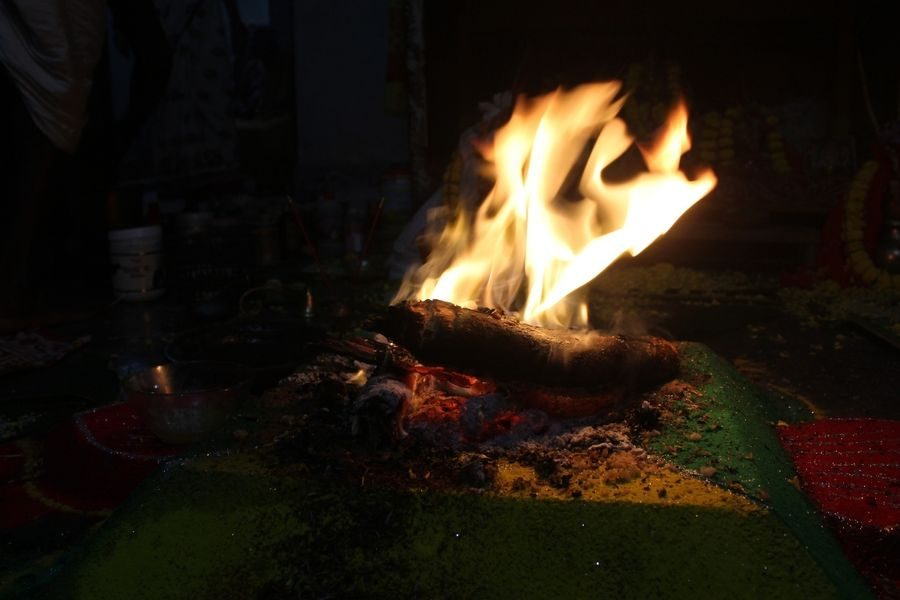

If months of grey skies, long workdays, and winter heaviness have left you feeling foggy or run down, your body may simply be asking for a reset.
Our digestion slows, energy drops, and the body begins to carry the residue of months spent indoors.
In Ayurveda, the ancient science of life that developed alongside yoga over 3,000 years ago — spring is considered the most important time of year to cleanse and reset the body.
As nature begins to thaw and move again, our bodies are naturally ready to release accumulated heaviness from the winter season.
This seasonal transition is the inspiration behind the Ayurvedic Spring Cleanse Retreat, happening April 2–6, 2026 at the Salt Spring Centre of Yoga.
Guided by long-time teacher and Ayurvedic practitioner Savita Leah Young, this retreat offers five days of structured support to help participants gently reset their digestion, energy, and mental clarity.
Savita brings over four decades of yoga practice and deep study in Ayurveda, integrating traditional teachings with practical tools that can support modern life.

### What Happens During the Cleanse

Over the five days, participants follow a gentle and structured daily rhythm that supports the body’s natural detoxification processes.
The retreat includes:
• Morning cleansing practices such as neti and breathwork
• Daily yoga and meditation sessions
• Nourishing Ayurvedic meals designed to support digestion
• Herbal support and digestive teas
• Sauna and optional Ayurvedic therapies
• Workshops on Ayurveda, daily routines, and seasonal wellness
Meals during the cleanse focus on khichadi, a traditional Ayurvedic dish made with mung dal, basmati rice, and digestive spices. This simple yet nourishing meal gives the digestive system a rest while supporting detoxification.
Participants also learn practical tools they can take home, including Ayurvedic daily routines, diet guidelines, and lifestyle practices to maintain balance throughout the year.
[Learn more and register](https://saltspringcentre.com/programs-retreats/spring-cleanse-retreat/)

### Why People Do a Spring Cleanse

Many people come to this retreat because they are feeling:
• mentally foggy or low energy
• bloated or experiencing digestive discomfort
• overwhelmed by stress
• out of rhythm after winter
A seasonal cleanse can help restore clarity and balance.
Participants often report benefits such as:
• improved digestion
• deeper sleep
• renewed energy
• mental clarity
• a stronger connection to nature and community

### A Unique Setting for Renewal

 
The Salt Spring Centre of Yoga sits on 69 acres of forest and farmland on Salt Spring Island, creating a peaceful and supportive environment for retreat and reflection.
Participants spend their days practicing yoga, walking forest trails, enjoying nourishing meals, and reconnecting with natural rhythms.
 
'
 
[Learn more and register](https://saltspringcentre.com/programs-retreats/spring-cleanse-retreat/)

### Who This Retreat Is For

 
This retreat is ideal for people who:
• feel tired or out of rhythm after winter
• are curious about Ayurveda but don’t know where to start
• want a structured and supportive reset
• love yoga, nature, and community
• are ready to invest in their wellbeing

### Retreat Details

 
Ayurvedic Spring Cleanse Retreat
April 2–6, 2026
Salt Spring Centre of Yoga
Salt Spring Island, BC
Spaces are limited.
[Learn more and register](https://saltspringcentre.com/programs-retreats/spring-cleanse-retreat/)
