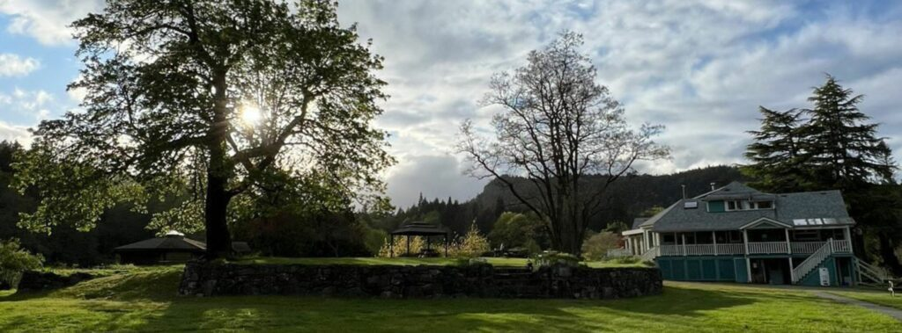
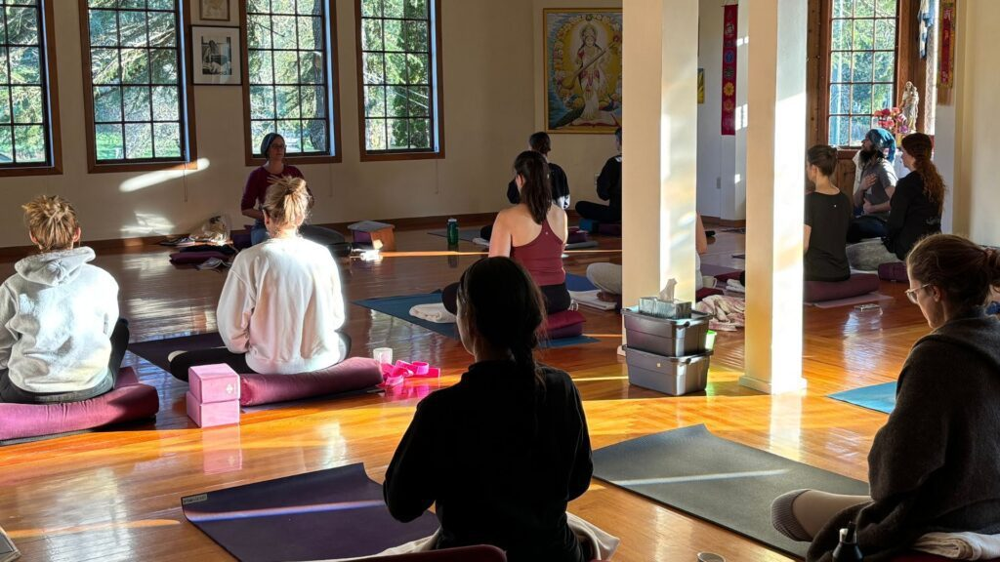

If winter has left you feeling heavy, foggy, or run down, nature has a solution. Spring is the season of renewal, and Ayurveda has been guiding seasonal cleansing for over 3,000 years.
Spring on Salt Spring Island arrives like a quiet invitation. The earth softens, buds unfurl, and the body begins to crave renewal and movement after the stillness of winter.
This season of transition is the inspiration behind our second annual Ayurvedic Spring Cleanse Retreat, guided by long-time Salt Spring Centre of Yoga teacher and Ayurvedic practitioner, [Savita Leah Young.](https://saltspringcentre.com/sscy_team/savita-leah-young/)
Savita brings together over four decades of yoga practice, deep study in Ayurveda, and a lifetime of devotion to Vedic teachings. Her approach is grounded in tradition while remaining deeply relevant to the rhythms of modern life.
[***Join Savita for five days of guided cleansing and Renewal***](https://saltspringcentre.secure.retreat.guru/program/salt-spring-centre-of-yoga-spring-cleanse-2026/?lang=en)

### ***Ayurveda is Yoga’s Sister Science***

Most people today are familiar with yoga’s stretches, breathing, and meditation practices. But yoga is only part of a much larger tradition.
Ayurveda, the science of life, originated in India and has been practiced for over 3,000 years and extends the wisdom of yoga into everyday living.
It asks simple but profound questions:
How do we live?
What do we eat?
When do we rest?
How do we move through the world?
Savita explains that Ayurveda is not only about techniques or remedies.
***Ayurveda is about what we do, how we do it, and when we do it. Ultimately, it’s about the attitude just as much as the method.***
In this way, Ayurveda becomes less of a health system and more of a way of living in harmony with nature.

### ***Why People Love This Retreat***

- Waking to birdsong and morning cleansing practices
- Moving through gentle yoga designed to stimulate detoxification
- Sitting in the sauna as the body releases winter heaviness
- Sharing nourishing seasonal meals in community

### ***This Renewal Retreat is perfect for you if…***

- You feel tired, foggy, or out of rhythm after winter
- Your’re curious about Ayurveda but don’t’ know where to start
- You want structured support for a seasonal reset
- You love yoga, nature, and meaningful community
- You are ready to invest in your wellbeing

### ***What You’ll take home***

- A deeper understanding of your own Ayurvedic constitution
- Practical diet and lifestyle tools for balance
- Renewed energy and mental clarity
- A seasonal approach to wellness
- A supportive connection to community

### [**Spaces for this retreat are limited. Reserve your spot today.**](https://saltspringcentre.secure.retreat.guru/program/salt-spring-centre-of-yoga-spring-cleanse-2026/?lang=en)
